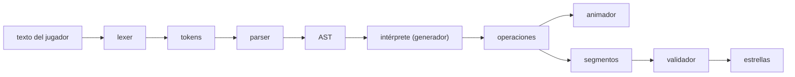
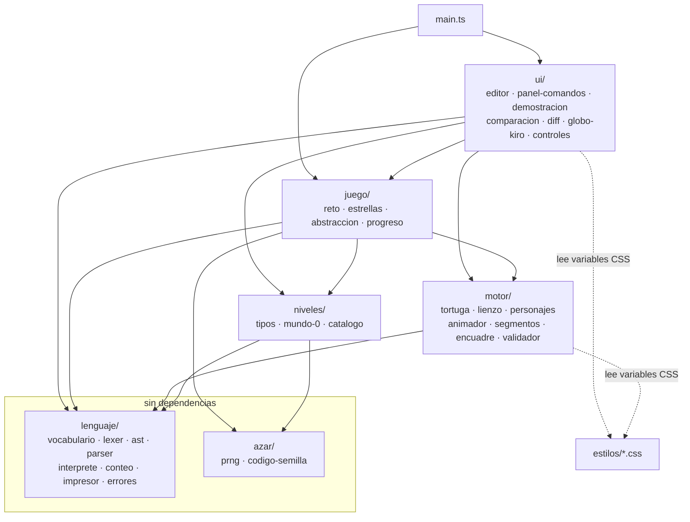
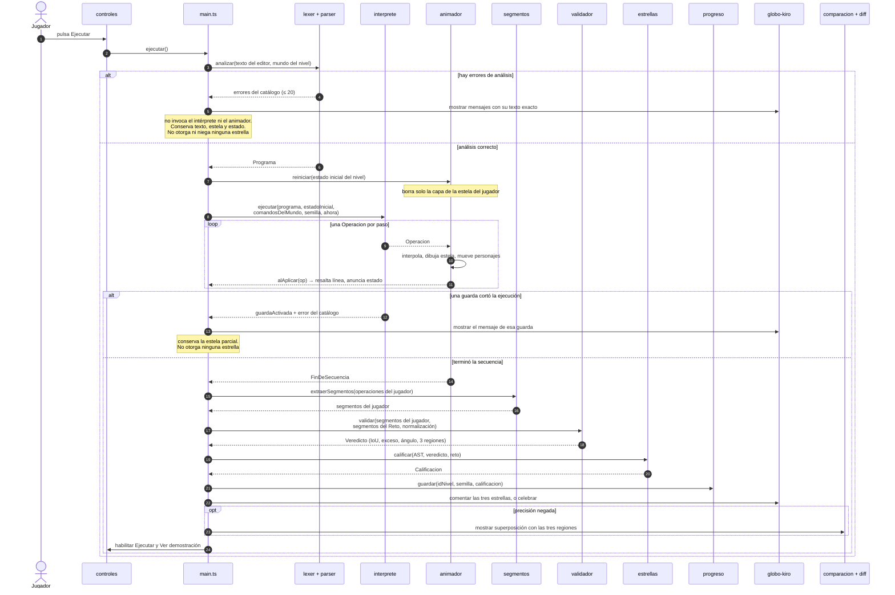
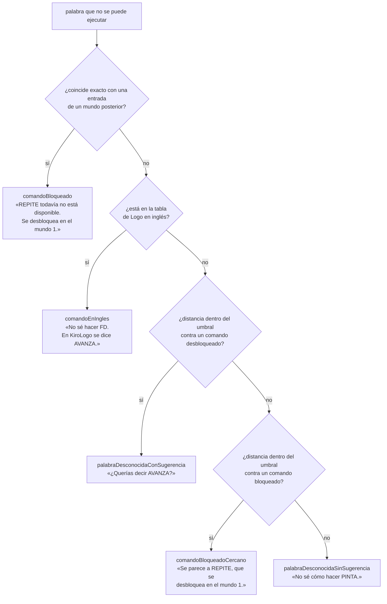
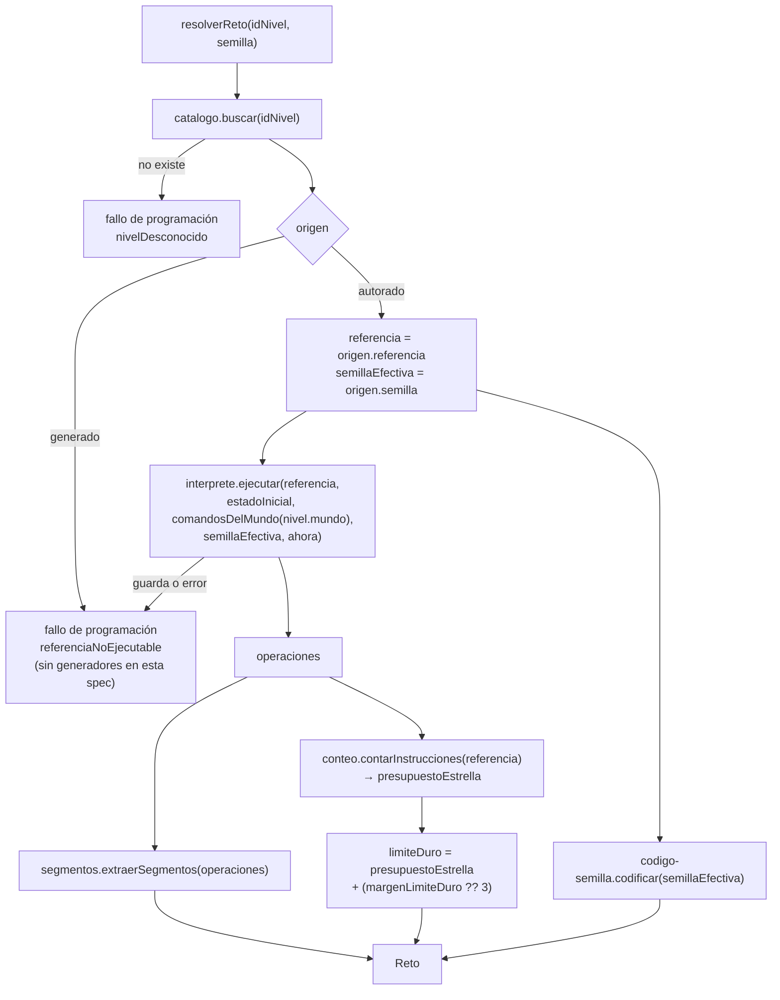
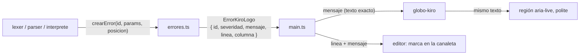

# Design Document

**KiroLogo · Spec 00 · Cimientos**

## Overview

### 1. Visión general y decisiones

#### 1.1 Qué construye esta spec

Una **rebanada vertical completa** del juego: el nivel autorado `0.1` jugable de punta a punta en el
navegador. La spec levanta el proyecto, escribe la cadena completa del lenguaje, el motor de dibujo y
validación, el azar determinista, la calificación con tres estrellas, la persistencia y la interfaz
mínima que hace falta para jugar.

El pipeline es una sola dirección, sin atajos:



El **mismo** flujo de `Operacion` alimenta cuatro consumidores: la demostración de Kiro, la animación
del programa del jugador, el modo paso a paso y el extractor de segmentos que valida. No hay una
segunda implementación de la ejecución en ninguna parte, y el programa de referencia del nivel se
ejecuta con ese mismo intérprete que el del jugador.

*Satisface: Requisitos 5.1, 7.1, 7.4, 14.1, 15.1, 22.5, 27.3.*

#### 1.2 Versiones fijadas

Verificadas contra el registro de npm el día de escritura de este diseño (`npm view <paquete>
version`), no tomadas de memoria:

| Paquete | Versión fija | Licencia | `engines` declarado |
|---|---|---|---|
| `vite` | `8.2.2` | MIT | `^20.19.0 \|\| >=22.12.0` |
| `vitest` | `5.0.0` | MIT | `^22.12.0 \|\| ^24.0.0 \|\| >=26.0.0` |
| `typescript` | `7.0.2` | Apache-2.0 | `>=16.20.0` |
| `fast-check` | `4.9.0` | MIT | — |
| `@types/node` | `26.4.1` | MIT | — |

Node local: `v24.20.0`, npm `11.19.0`, `.nvmrc` con `24`. Los tres `engines` de arriba admiten Node 24,
así que el rango `>=24` de `package.json` no entra en conflicto con ninguna dependencia.

Apache-2.0 y MIT son compatibles para redistribuir el repositorio bajo MIT, y el requisito 1.10 nombra
Apache-2.0 explícitamente como compatible. No entra ninguna dependencia con copyleft fuerte.

**Nota sobre TypeScript 7.** Es el port nativo del compilador, publicado como paquete `typescript`
estable; en la versión estable el binario sigue llamándose `tsc` y no hay un `tsgo` aparte
([guía de migración a 7.0](https://gist.github.com/nafiskabbo/01ccb4970515413076f3759486c39755),
[repo del port nativo](https://github.com/microsoft/typescript-go)). El lenguaje es el mismo, así que
`strict`, `noUncheckedIndexedAccess` y `noImplicitOverride` del requisito 1.4 siguen disponibles, y
`tsc --noEmit` sigue siendo la forma de comprobar tipos sin emitir. Contenido reformulado por
restricciones de licencia de las fuentes.

Riesgo asumido y su salida: si aparece fricción entre TypeScript 7 y Vitest 5 o el plugin de tipos de
Vite, la salida es fijar la última 5.x del compilador. Lo no negociable es que la versión quede fija,
no cuál es. Esa sustitución no toca ningún módulo de `src/`: solo `package.json`, `package-lock.json`
y, si hiciera falta, `tsconfig.json`.

*Satisface: Requisitos 1.2, 1.3, 1.10.*

#### 1.3 Decisiones de arquitectura

Las cinco decisiones que el prompt dejó abiertas quedaron cerradas en requisitos (D1 a D5). El diseño
las concreta y agrega una sexta que aparece al bajar al detalle.

| # | Decisión | Resolución | Razón |
|---|---|---|---|
| D1 | Representación de una `Operacion` | Unión discriminada por `tipo` con seis casos; **toda** operación lleva `paso`, `linea`, `profundidad`, `estadoAntes` y `estadoDespues` completos | La reproducción en paralelo de una spec posterior compara posición y rumbo paso a paso. Si el estado no viaja en cada operación, ese consumidor obliga a cambiar el tipo y a reejecutar. Cuesta ~9 números por operación y ahorra un rediseño |
| D2 | Rasterizado del validador | `Uint8Array` propio de 800 × 800, sin `OffscreenCanvas` ni `document` | La invariancia a rotación prueba 360 ángulos y las pruebas corren en Node sin DOM. Un arreglo tipado además permite decidir el algoritmo de dilatación, cosa que una API de Canvas no deja hacer |
| D3 | Forma del tipo `Nivel` | `origen` como unión discriminada `autorado` / `generado`; `normalizacion`, `abstraccion` y `pistas` declarados; **ningún presupuesto almacenado** | Los presupuestos se calculan del programa de referencia con `conteo.ts`. Un número escrito a mano en `niveles/` puede desincronizarse del que evalúa la estrella |
| D4 | Editor | `textarea` nativo con canaleta de números de línea; 200 líneas y 10 000 caracteres; **sin resaltado de sintaxis** | El resaltado exige un editor con capas o un componente externo. Ninguno aporta a la lección de esta spec, y el `textarea` nativo ya da navegación por teclado correcta sin trabajo extra |
| D5 | Personajes | Conjunto tortuga + Kiro + lápiz inscrito en un círculo de 40 unidades del lienzo lógico; el rumbo se lee por forma, nunca por color | Un lienzo lógico de 800 × 800 con figuras cuya caja envolvente mide ≥ 200 unidades tolera un personaje de 40 sin taparla. La sección 7.4 baja esto a coordenadas concretas |
| D6 | Alcance del intérprete frente a los nodos reservados | Ejecuta `DefinicionProcedimiento` e `InvocacionProcedimiento` **sin parámetros**; los otros siete nodos reservados reportan error | El requisito 8.2 pide nombrar «el procedimiento cuya invocación excedió el límite» y el 8.7 pide probar la guarda de recursión con ASTs sintéticos de 100 y 101 niveles. Sin marcos de invocación reales, esa guarda sería código muerto y no probado. El parser de esta spec nunca produce esos nodos —`PARA` se rechaza como comando bloqueado del mundo 2—, así que el jugador no puede alcanzar ese camino |

#### 1.4 Restricciones que el diseño no puede violar

Se repiten aquí porque cada sección posterior las da por sentadas:

- **Nunca `eval` ni `new Function`.** El intérprete se escribe a mano, y eso habilita gratis una CSP
  estricta sin `unsafe-eval`. Una prueba de la suite recorre `src/` buscando esas cadenas.
- **Todo el azar por `azar/prng.ts` con semilla explícita.** Ni un `Math.random` en `src/`, verificado
  por la misma prueba de recorrido.
- **La tortuga es pura.** Posición, rumbo, lápiz, visibilidad. No conoce el Canvas y su prueba corre en
  Node sin ningún doble del DOM.
- **Dirección de las dependencias.** `lenguaje/` no importa de nadie; `azar/` tampoco. `motor/` importa
  de `lenguaje/` y nunca de `ui/`. `niveles/` solo de `lenguaje/` y `azar/`. `ui/` consume todo lo
  demás y nadie la consume.
- **Fuentes únicas de verdad.** `vocabulario.ts` para los comandos, `conteo.ts` para el presupuesto,
  `errores.ts` para los mensajes de error visibles al jugador.
- **Nada de imágenes en `src/`.** Los personajes son trazos de Canvas 2D.
- **Los niveles son datos.** Agregar un nivel es agregar un objeto a un arreglo.

*Satisface: Requisitos 1.9, 1.11, 2.10, 3.4, 9.6, 10.1, 11.3, 13.1, 17.3, 18.10, 29.6.*

#### 1.5 Costuras inyectables

Cinco dependencias que normalmente serían globales entran como parámetro, para que el módulo se pruebe
en Node y para que el determinismo sea comprobable en lugar de prometido:

| Costura | Tipo | Quién la recibe | Por qué |
|---|---|---|---|
| Fuente de tiempo monótona | `() => number` | `interprete.ts` | La guarda de 5 s se prueba sin esperar 5 s reales ni depender del reloj de la máquina (req. 8.8) |
| Semilla | `number` | `interprete.ts`, generadores futuros | Todo valor aleatorio sale de un PRNG sembrado, nunca de una fuente global (req. 7.6) |
| Comandos permitidos | `readonly EntradaVocabulario[]` | `interprete.ts`, `parser.ts` | El intérprete no mantiene lista propia ni lee un valor predeterminado (req. 7.10) |
| Contexto de dibujo | `ContextoDibujo` | `lienzo.ts`, `personajes.ts`, `diff.ts` | Subconjunto estructural de `CanvasRenderingContext2D`. Un doble en Node registra y rasteriza las llamadas, así que la geometría de los personajes se prueba sin DOM (req. 13.3, 13.6, 13.9) |
| Reloj de animación | `Reloj` | `animador.ts` | `programar`/`cancelar`/`ahora`. Con un reloj falso, las cuatro velocidades y el paso a paso se prueban en Node sin `requestAnimationFrame` (req. 14.2) |

*Satisface: Requisitos 7.6, 7.10, 8.8, 13.9, 14.2, 29.10.*

## Architecture

### 2. Estructura de archivos

Solo se crean rutas declaradas en `estructura.md`. Los módulos que ese documento lista pero esta spec no
necesita —`motor/divergencia.ts`, `juego/insignias.ts`, `juego/desbloqueo.ts`, `ui/mapa-insignias.ts`,
`ui/modo-libre.ts`, `niveles/generadores/`, `niveles/mundo-1…5` y `mundo-bonus`— **no se crean vacíos**:
llegan con la spec que los usa.

#### 2.1 Raíz

```
KiroLogo/
├── LICENSE                  ya existe, MIT
├── .gitignore               ya existe, no ignora package-lock.json
├── .nvmrc                   ya existe, contiene 24
├── README.md                nuevo, español, enlaces relativos a .kiro/steering/ y docs/
├── amplify.yml              nuevo, preBuild + build + artifacts + cache
├── index.html               nuevo, lang="es", una sola región aria-live
├── package.json             name KiroLogo, private true, license MIT, engines >=24
├── package-lock.json        versionado, el despliegue usa npm ci
├── tsconfig.json            strict, noUncheckedIndexedAccess, noImplicitOverride
└── vite.config.ts           base '/'
```

`amplify.yml` fija Node leyendo `.nvmrc` sin escribir ningún número literal:

```yaml
version: 1
frontend:
  phases:
    preBuild:
      commands:
        - nvm install "$(cat .nvmrc)"
        - nvm use "$(cat .nvmrc)"
        - node -v
        - npm ci
    build:
      commands:
        - npm run build
  artifacts:
    baseDirectory: dist
    files:
      - '**/*'
  cache:
    paths:
      - node_modules/**/*
```

El directorio `assets/` de la raíz guarda capturas de pantalla de documentación. No es un directorio de
activos del juego, no se importa desde `src/` y `vite build` no lo copia a `dist`, porque Vite solo
copia `public/` y este proyecto no lo tiene.

*Satisface: Requisitos 1.1–1.7, 2.1, 2.4–2.9.*

#### 2.2 `src/`

Cada módulo lleva su prueba al lado con sufijo `.test.ts`. Los módulos de tipos puros (`ast.ts`,
`niveles/tipos.ts`) no llevan prueba propia: se verifican desde las pruebas de quien los consume y con
aserciones de compilación.

```
src/
├── main.ts                        orquesta la pantalla y el ciclo de un intento
├── lenguaje/                      capa base, no importa de ningún otro directorio
│   ├── vocabulario.ts + .test.ts  tabla única de comandos
│   ├── lexer.ts      + .test.ts   texto → tokens, normaliza acentos y mayúsculas
│   ├── ast.ts                     tipos del árbol, 2 nodos vivos + 9 reservados
│   ├── parser.ts     + .test.ts   tokens → AST, recuperación de errores
│   ├── interprete.ts + .test.ts   AST → generador de Operacion, y las tres guardas
│   ├── conteo.ts     + .test.ts   única fuente del presupuesto
│   ├── impresor.ts   + .test.ts   AST → texto KiroLogo
│   └── errores.ts    + .test.ts   todos los mensajes de error visibles al jugador
├── azar/
│   ├── prng.ts           + .test.ts  mulberry32 con semilla explícita
│   └── codigo-semilla.ts + .test.ts  semilla ↔ código de 7 caracteres
├── motor/                         importa de lenguaje/, nunca de ui/
│   ├── tortuga.ts    + .test.ts   modelo puro: posición, rumbo, lápiz, visibilidad
│   ├── lienzo.ts     + .test.ts   800 × 800, cuadrícula de 20, cuatro capas
│   ├── personajes.ts + .test.ts   tortuga + Kiro + lápiz con trazos de Canvas 2D
│   ├── animador.ts   + .test.ts   consume Operacion y la reproduce en el tiempo
│   ├── segmentos.ts  + .test.ts   Operacion[] → Segmento[]
│   ├── encuadre.ts   + .test.ts   caja envolvente, encuadrada, degenerada
│   └── validador.ts  + .test.ts   rasteriza, dilata, IoU, exceso, tres regiones
├── niveles/                       datos, importa solo de lenguaje/ y azar/
│   ├── tipos.ts                   la forma de un Nivel
│   ├── mundo-0-primeros-pasos.ts  el nivel 0.1 como dato
│   └── catalogo.ts   + .test.ts   reúne y ordena los mundos declarados
├── juego/
│   ├── reto.ts        + .test.ts  (idNivel, semilla) → Reto resuelto
│   ├── estrellas.ts   + .test.ts  precisión, economía, abstracción
│   ├── abstraccion.ts + .test.ts  análisis del AST del jugador
│   └── progreso.ts    + .test.ts  persistencia en localStorage
├── ui/                            consume todo lo demás, nadie la consume
│   ├── editor.ts        + .test.ts  textarea + canaleta + contador
│   ├── panel-comandos.ts + .test.ts vocabulario desbloqueado con ejemplos
│   ├── demostracion.ts  + .test.ts  Kiro dibuja el reto en vivo
│   ├── comparacion.ts   + .test.ts  lado a lado y superposición
│   ├── diff.ts          + .test.ts  las tres regiones sobre la superposición
│   ├── globo-kiro.ts    + .test.ts  diálogos, pistas, celebración, aria-live
│   └── controles.ts     + .test.ts  seis acciones y sus estados
└── estilos/
    ├── tema.css                   variables de color y grosor, única fuente
    └── pantalla.css               disposición de la pantalla
```

#### 2.3 Diagrama de dependencias



Aristas prohibidas, verificadas por una prueba que lee los `import` de cada archivo:

- `lenguaje/` → cualquier otro directorio de `src/`.
- `azar/` → cualquier otro directorio de `src/`, salvo `lenguaje/errores.ts` para sus mensajes.
- `niveles/` → `motor/`, `juego/` o `ui/`, sea la ruta relativa o con alias, estática o dinámica.
- `motor/` → `ui/` o `juego/`.

La única flecha que sorprende es `azar/` → `lenguaje/errores.ts`: los requisitos 17.7, 17.8 y 17.9 piden
que el PRNG y el código de semilla reporten errores del catálogo. Es coherente con que `lenguaje/` sea la
capa base y no importe de nadie.

`motor/` lee el tema desde CSS con `getComputedStyle` sobre el elemento del lienzo; no importa ningún
módulo de `estilos/`, así que la flecha es punteada.

*Satisface: Requisitos 1.8, 18.10, 29.2.*

### 12. Interfaz y flujo

Sin framework de UI. Cada módulo de `ui/` es una función que recibe su elemento del DOM y sus dependencias, y
devuelve un objeto con métodos y suscripciones. La comunicación entre módulos va por **callbacks explícitos**,
nunca por eventos globales ni por un estado compartido mutable: un módulo de `ui/` no puede alcanzar a otro
sin que `main.ts` se lo pase.

#### 12.1 Los módulos y sus responsabilidades

| Módulo | Qué hace | Qué no hace |
|---|---|---|
| `editor.ts` | `textarea` nativo + canaleta de números de línea + contador de instrucciones. Aplica los límites de 200 líneas y 10 000 caracteres. Resalta la línea del paso a paso y marca las líneas con error | No resalta sintaxis (D4). No recorre el AST: pide el número a `conteo.ts` |
| `panel-comandos.ts` | Lista los comandos que `comandosDelMundo` devuelve, con nombre, abreviatura, descripción y ejemplo. Al activar uno, inserta su ejemplo en el editor | No mantiene lista propia de comandos. No trunca el ejemplo: lo entrega íntegro y deja que el editor aplique su regla de límites |
| `demostracion.ts` | Dibuja los personajes en el estado inicial, espera, y entrega al animador la secuencia que **ya trae el reto**, sobre la capa de referencia. Repetición ilimitada y control de velocidad | No invoca el intérprete. No vuelve a resolver el reto. No toca la capa del jugador |
| `comparacion.ts` | Vista lado a lado y vista de superposición, con un conmutador de dos estados | No ejecuta ningún programa |
| `diff.ts` | Dibuja las tres regiones que devuelve el validador sobre la superposición | No rasteriza. No invoca al validador |
| `globo-kiro.ts` | **El único** elemento que presenta texto dirigido al jugador: resultado, pistas, mensajes de error y celebración. Publica en la región `aria-live` | No decide si una estrella se otorga. No compone mensajes de error: los recibe del catálogo con el texto exacto |
| `controles.ts` | Las seis acciones: ejecutar, detener, dar un paso, velocidad, reiniciar y volver a ver la demostración | No conoce el intérprete: pide a `main.ts` que ejecute |

#### 12.2 El editor

`textarea` nativo, y esa es la decisión que más trabajo ahorra: la navegación por teclado, la selección, el
deshacer del sistema y el comportamiento con lector de pantalla ya funcionan sin escribir nada. La canaleta es
un elemento hermano cuyo desplazamiento vertical se sincroniza con el del `textarea`.

- **Límites.** 200 líneas y 10 000 caracteres, los dos inclusive. Una escritura, un pegado o una inserción que
  los excedería descarta **solo la parte que sobra**, conserva el contenido admitido, deja el cursor al final
  de él, mantiene el área habilitada y pide al globo un mensaje que nombre cuál límite se alcanzó y su valor.
  Truncar y avisar es mejor que rechazar el pegado entero.
- **Contador.** Tras cada cambio, con 200 ms de espera desde el último, analiza el texto y muestra el entero de
  `conteo.ts`. Si el lexer, el parser o el conteo reportan error, **sigue mostrando el último conteo sin
  errores** con una marca de provisional legible como texto en español además del color, y 0 provisional si
  todavía no obtuvo ninguno. El área de escritura no se bloquea nunca y el cursor no se mueve. Mostrar 0 al
  primer error haría que el contador parpadeara con cada tecla.
- **Marcas de error.** Hasta 20, en la canaleta, distinguibles por forma además de por color, cada una con su
  número de línea y el texto del mensaje. Se retiran de toda línea que ya no exista.
- **Presupuesto al lado.** El `presupuestoEstrella` del reto se muestra junto al contador, con un nombre
  accesible que los nombra por separado. Cuando el contador lo supera, se señala con **texto en español**
  además de cualquier diferencia de color, y el área sigue habilitada porque el `limiteDuro` está inactivo en
  el mundo 0.
- **`Tab` no se captura.** Una pulsación mueve el foco al siguiente elemento interactivo y no inserta ningún
  carácter. Un editor que atrapa el `Tab` deja a quien navega por teclado encerrado.

*Satisface: Requisitos 21.1–21.11, 26.4, 26.6.*

#### 12.3 Accesibilidad, transversal

No es una capa aparte, así que se declara aquí y cada módulo la cumple:

- **Una sola región `aria-live` con cortesía `polite`**, declarada en `index.html`, presente desde que abre el
  nivel. No recibe foco. Es el destino de los anuncios del globo, de la demostración, de la comparación y de
  los cambios de estado de la tortuga. Publica en el orden en que se producen y **funde en un solo anuncio**
  los cambios de estado separados por menos de 500 ms. Nunca `assertive`: una región agresiva interrumpe al
  lector en medio de una frase, y aquí no hay nada tan urgente.
- **Orden de foco = orden visual**, de izquierda a derecha y de arriba abajo. Ningún elemento retiene el foco:
  desde cualquiera, 20 pulsaciones de `Tab` o menos devuelven el foco al área de escritura.
- **Indicador de foco** de 2 píxeles de pantalla o más, rodeando el elemento completo, con contraste ≥ 3:1
  contra el fondo adyacente, con independencia de si el foco llegó por teclado o por ratón.
- **Nunca solo color.** Cada estado de retroalimentación —los tres del diff, cada estrella, el estado
  habilitado de cada control, la línea resaltada, cada línea marcada con error, la identidad de cada figura en
  la comparación y el estado del lápiz— se comunica además con texto en español, forma, patrón de guiones o
  grosor. Presentados en escala de grises, cada par de un mismo grupo sigue distinguiéndose. Y ningún texto ni
  nombre accesible usa el nombre de un color como identificador único de un estado.
- **Contraste**: 4.5:1 para todo texto; 3:1 para controles, indicador de foco, las dos estelas, los tres
  estados del diff y el conjunto de la tortuga con Kiro.
- **Idioma español declarado en el documento**, con acentuación completa en todo texto visible y en todo nombre
  accesible. Las únicas excepciones son los nombres y abreviaturas de comandos del vocabulario y los términos
  técnicos estándar (`aria-live`, `prefers-reduced-motion`, WCAG).

La validación completa de accesibilidad requiere pruebas manuales con tecnologías asistivas y revisión por una
persona experta. Lo que la suite verifica es el piso comprobable por código: las relaciones de contraste de los
valores del tema, la existencia de una única región `aria-live` con cortesía `polite`, un nombre accesible en
español no vacío en cada elemento interactivo, y la distinción en escala de grises de los estados de cada
grupo. La suite lo declara así en su informe.

*Satisface: Requisitos 28.1–28.10, 22.7, 25.5, 26.7.*

#### 12.4 `main.ts` — quién orquesta

`main.ts` es el único módulo que conoce a todos los demás. Mantiene un estado pequeño y explícito:

```ts
interface EstadoAplicacion {
  reto: Reto;
  astJugador: Programa | null;
  operacionesJugador: readonly Operacion[];
  veredicto: Veredicto | null;
  calificacion: Calificacion | null;
}
```

Arranque, en orden:

1. Cargar el progreso desde `localStorage`, con degradación a memoria si falla.
2. Resolver el reto del nivel `0.1` con su semilla fija. Si falla, es un fallo de programación.
3. Crear el lienzo con sus cuatro capas, el animador con el reloj real y la preferencia de movimiento, y los
   siete módulos de `ui/`.
4. Cablear los callbacks: los controles piden a `main.ts`; `main.ts` invoca el pipeline y reparte los
   resultados a editor, globo, comparación y diff.
5. Lanzar la demostración una vez, sin que el jugador active ningún control.
6. Suscribirse al cambio de `prefers-reduced-motion`, para reflejarlo en 1 segundo o menos sin recargar la
   página y sin perder el texto del editor.

#### 12.5 El flujo completo de un intento



Cuatro cosas que el diagrama fija y que son el contrato entre capas:

- **Un error de análisis no llega al intérprete.** No se produce ninguna operación, no se dibuja nada, no se
  otorga ni se niega ninguna estrella, y el texto del editor y la estela anterior quedan intactos. Solo cambia
  el globo.
- **El validador se invoca una sola vez por intento**, y su veredicto viaja a las estrellas y al diff sin
  recalcularse. Es lo que garantiza que el número que evalúa y la región que se dibuja son el mismo cálculo.
- **El guardado ocurre antes de admitir otra ejecución**, y ocurre también cuando alguna estrella se negó.
- **Las tres regiones del diff se dibujan con la traslación y el ángulo del veredicto**, así que quedan
  alineadas con las estelas que el jugador vio dibujar. Sin eso, con la rotación libre, el diff señalaría un
  lugar del lienzo donde no hay nada.

*Satisface: Requisitos 22.1–22.10, 23.1–23.10, 24.1–24.9, 25.1–25.9, 26.1–26.8, 27.3–27.11.*

## Components and Interfaces

### 3. Capa de lenguaje

#### 3.1 `vocabulario.ts` — fuente única de los comandos

```ts
export type TipoArgumento = 'numero' | 'palabra' | 'lista' | 'expresion';
export type Aridad = 0 | 1 | 2 | 3 | 'variable';
export type Mundo = 0 | 1 | 2 | 3 | 4 | 5;

export interface EntradaVocabulario {
  readonly nombre: string;                              // largo, MAYÚSCULAS sin acentos
  readonly abreviatura: string | null;
  readonly aridad: Aridad;
  readonly tiposArgumento: readonly TipoArgumento[];
  readonly mundo: Mundo;
  readonly descripcion: string;                         // español, 1 línea, ≤ 120 caracteres
  readonly ejemplo: string;
  readonly ejecutable: boolean;                         // true solo para el mundo 0 en esta spec
}

export const VOCABULARIO: readonly EntradaVocabulario[];

export function normalizarPalabra(texto: string): string;
export type ResultadoBusqueda =
  | { readonly hallada: true;  readonly entrada: EntradaVocabulario }
  | { readonly hallada: false };
export function buscarComando(palabra: string): ResultadoBusqueda;
export function comandosDelMundo(mundo: Mundo): readonly EntradaVocabulario[];
```

`buscarComando` compara contra **todas** las entradas sin filtrar por mundo. Filtrar aquí haría imposible
el mensaje «`REPITE` todavía no está disponible»: el parser necesita saber que la palabra existe y está
bloqueada, no que no existe. El filtro por mundo vive en `comandosDelMundo`, que devuelve las entradas de
mundo ≤ *n* siempre en el mismo orden (el de declaración en `VOCABULARIO`).

`normalizarPalabra` es la única normalización del proyecto: mayúsculas, y `á é í ó ú ü` → `A E I O U U`.
La `ñ` se preserva como `Ñ` y **nunca** se convierte en `N`, así que `AÑO` y `ANO` son distintos.
Implementación: tabla explícita de reemplazo, no `normalize('NFD')` con borrado de diacríticos, porque
esa vía también descompone la `ñ` y habría que volver a componerla.

`ResultadoBusqueda` es un resultado explícito, no una excepción ni un `null` con mensaje: el catálogo de
errores decide qué decir, no el vocabulario.

##### Tabla del mundo 0 (ejecutable)

| Nombre | Abrev. | Aridad | Tipos | Descripción | Ejemplo |
|---|---|---|---|---|---|
| `AVANZA` | `AV` | 1 | `numero` | La tortuga camina hacia adelante los pasos que le digas. | `AVANZA 100` |
| `RETROCEDE` | `RE` | 1 | `numero` | La tortuga camina hacia atrás sin cambiar de rumbo. | `RETROCEDE 50` |
| `GIRADERECHA` | `GD` | 1 | `numero` | Gira a la derecha los grados que le digas. | `GIRADERECHA 90` |
| `GIRAIZQUIERDA` | `GI` | 1 | `numero` | Gira a la izquierda los grados que le digas. | `GIRAIZQUIERDA 45` |
| `CENTRO` | `CE` | 0 | — | Vuelve al centro del lienzo mirando hacia arriba. | `CENTRO` |
| `BORRAPANTALLA` | `BP` | 0 | — | Limpia el lienzo y vuelve al centro mirando hacia arriba. | `BORRAPANTALLA` |

##### Entradas declaradas y bloqueadas (`ejecutable: false`)

| Mundo | Entradas |
|---|---|
| 1 | `REPITE`/`RP` |
| 2 | `SUBELAPIZ`/`SL`, `BAJALAPIZ`/`BL`, `PONCOLOR`/`PC`, `PONGROSOR`/`PG`, `RELLENA`/`RL`, `PARA`, `FIN`, `OCULTATORTUGA`/`OT`, `MUESTRATORTUGA`/`MT` |
| 3 | ninguna: el mundo 3 no agrega vocabulario, anida el que ya hay |
| 4 | `SUMA`, `RESTA`, `PRODUCTO`, `COCIENTE`, `RESTO`, `AZAR`, `ESCRIBE`/`ES`, `ROTULA`/`RO` |
| 5 | `SI`, `SINO`, `ALTO`, `DEVUELVE`/`DV` |

`PARA` y `FIN` no tienen abreviatura y `PARA` declara `aridad: 'variable'` (nombre más cero o más
parámetros). Los parámetros `:nombre` y los operadores infijos `+ - * /` del mundo 4 **no** son entradas
del vocabulario: son formas léxicas que el lexer ya reconoce (sección 3.3).

Colisiones revisadas: 28 nombres largos y 17 abreviaturas, 45 cadenas distintas tras normalizar. `RE`
(retrocede) no choca con `RL` (rellena) ni con `RESTA`/`RESTO`, que existen solo en forma larga. `ES`
(escribe) no coincide con ningún nombre largo. `SI` y `SINO` son cadenas distintas. Una prueba recalcula
esta comprobación sobre la tabla real y falla nombrando las dos entradas y el texto compartido, para que
agregar un comando en una spec futura no rompa nada en silencio.

*Satisface: Requisitos 3.1–3.8, 4.2, 4.3.*

#### 3.2 `Token`

```ts
export type TipoToken =
  | 'comando' | 'identificador' | 'numero' | 'palabra'
  | 'parametro' | 'corchete_abre' | 'corchete_cierra';

interface TokenBase {
  readonly textoOriginal: string;   // tal como se escribió
  readonly linea: number;           // desde 1
  readonly columna: number;         // desde 1, en caracteres
}

export type Token =
  | (TokenBase & { readonly tipo: 'numero'; readonly valor: number })
  | (TokenBase & { readonly tipo: Exclude<TipoToken, 'numero'>; readonly valor: string });
```

`valor` es el valor normalizado; en `numero` es el número ya convertido, y en el resto la cadena en
mayúsculas sin acentos y sin el `"` ni los `:` iniciales. `textoOriginal` conserva lo que el jugador
escribió, incluido el separador decimal, porque los mensajes de error citan al jugador y no la
normalización: `No sé cómo hacer Avansá.` y no `No sé cómo hacer AVANSA.`

#### 3.3 `lexer.ts`

```ts
export interface ResultadoLexico {
  readonly tokens: readonly Token[];
  readonly errores: readonly ErrorKiroLogo[];   // ordenados por línea y luego por columna
}
export function analizarLexico(texto: string): ResultadoLexico;
```

Autómata de un solo recorrido, sin retroceso, con estas reglas:

| Entrada | Salida |
|---|---|
| Letra del alfabeto español (incluidas `á é í ó ú ü ñ Ñ`) | Acumula palabra. Al cerrarla, `buscarComando` decide entre `comando` e `identificador` |
| Dígito | Acumula número. Un solo separador decimal, coma o punto, con al menos un dígito a cada lado; sin signo; 0 a 999 999; hasta 4 decimales |
| `[` `]` | `corchete_abre` / `corchete_cierra` |
| `"` seguido de letra o dígito | `palabra`, con el valor sin la comilla |
| `:` seguido de letra o dígito | `parametro`, con el valor sin los dos puntos |
| `#` | Descarta hasta el fin de línea (`\n` o `\r\n`) o hasta el fin del texto, sin emitir tokens y conservando la numeración posterior |
| Espacio, tabulador, `\r`, `\n` | Separador, no emite token |
| Cualquier otro carácter | Error `caracterNoValido`, descarta ese carácter y **continúa** |

El lexer nunca se detiene en el primer error: acumula y sigue, porque un jugador que escribe tres cosas
raras merece ver las tres. Devuelve los errores ordenados por línea y luego por columna.

El lexer reconoce `palabra`, `parametro` y los corchetes aunque el mundo 0 no los use. Es intencional: si
el lexer los rechazara, el mensaje que ve un jugador que escribe `REPITE 4 [AV 100 GD 90]` sería sobre el
corchete, cuando el problema real es que `REPITE` está bloqueado. Rechazar el corchete a nivel léxico
mueve el diagnóstico al lugar equivocado.

*Satisface: Requisitos 4.1–4.10.*

#### 3.4 `ast.ts` — dos nodos vivos y nueve reservados

```ts
interface NodoBase {
  readonly linea: number;     // desde 1
  readonly columna: number;   // desde 1
}

// ── Vivos en esta spec ────────────────────────────────────────────────
export interface NumeroLiteral extends NodoBase {
  readonly tipo: 'numeroLiteral';
  readonly valor: number;
}
export interface InvocacionComando extends NodoBase {
  readonly tipo: 'invocacionComando';
  readonly nombre: string;                        // nombre largo del Vocabulario
  readonly argumentos: readonly Expresion[];
}
```

Los nueve tipos reservados llevan en `ast.ts` un comentario que nombra la capacidad del lenguaje y la
spec que la implementa, para que quien abra el archivo en la spec 04 sepa qué le toca sin leer este
documento:

```ts
/** Iteración. `REPITE n [ … ]`. Implementa: spec 02 · mundo 1 · figuras. */
export interface Repeticion extends NodoBase {
  readonly tipo: 'repeticion';
  readonly veces: Expresion;
  readonly cuerpo: readonly Instruccion[];
}

/** Descomposición. `PARA NOMBRE :p … FIN`. Implementa: spec 03 · mundo 2 · composición. */
export interface DefinicionProcedimiento extends NodoBase {
  readonly tipo: 'definicionProcedimiento';
  readonly nombre: string;
  readonly parametros: readonly string[];
  readonly cuerpo: readonly Instruccion[];
}

/** Descomposición. Uso de un comando propio. Implementa: spec 03 · mundo 2 · composición. */
export interface InvocacionProcedimiento extends NodoBase {
  readonly tipo: 'invocacionProcedimiento';
  readonly nombre: string;
  readonly argumentos: readonly Expresion[];
}

/** Generalización. `:largo`. Implementa: spec 05 · mundo 4 · parámetros. */
export interface ReferenciaParametro extends NodoBase {
  readonly tipo: 'referenciaParametro';
  readonly nombre: string;
}

/** Generalización. `360 / :lados`, y también `:n = 0`. Implementa: spec 05 · mundo 4 · parámetros. */
export interface ExpresionAritmetica extends NodoBase {
  readonly tipo: 'expresionAritmetica';
  readonly operador: '+' | '-' | '*' | '/' | '=' | '<' | '>';
  readonly izquierda: Expresion;
  readonly derecha: Expresion;
}

/** Recursión. `SI cond [ … ]`. Implementa: spec 06 · mundo 5 · fractales. */
export interface CondicionalUnaRama extends NodoBase {
  readonly tipo: 'condicionalUnaRama';
  readonly condicion: Expresion;
  readonly entonces: readonly Instruccion[];
}

/** Recursión. `SINO cond [ … ] [ … ]`. Implementa: spec 06 · mundo 5 · fractales. */
export interface CondicionalDosRamas extends NodoBase {
  readonly tipo: 'condicionalDosRamas';
  readonly condicion: Expresion;
  readonly entonces: readonly Instruccion[];
  readonly siNo: readonly Instruccion[];
}

/** Recursión. `ALTO`. Implementa: spec 06 · mundo 5 · fractales. */
export interface Interrupcion extends NodoBase { readonly tipo: 'interrupcion' }

/** Recursión. `DEVUELVE :n * 2`. Implementa: spec 06 · mundo 5 · fractales. */
export interface DevolucionValor extends NodoBase {
  readonly tipo: 'devolucionValor';
  readonly valor: Expresion;
}
```

```ts
export type Expresion = NumeroLiteral | ReferenciaParametro | ExpresionAritmetica;
export type Instruccion =
  | InvocacionComando | Repeticion | DefinicionProcedimiento | InvocacionProcedimiento
  | CondicionalUnaRama | CondicionalDosRamas | Interrupcion | DevolucionValor;
export type Nodo = Instruccion | Expresion;

export interface Programa {
  readonly tipo: 'programa';
  readonly instrucciones: readonly Instruccion[];
}
```

Dos decisiones sobre la forma del árbol que evitan rediseño más adelante:

- **La comparación es una `ExpresionAritmetica`**, no un nodo aparte. Los operadores `= < >` viven en el
  mismo tipo que `+ - * /`, así que la condición de un `SI` es una `Expresion` y el total de tipos
  reservados queda exactamente en nueve, como pide el requisito 5.2.
- **`InvocacionComando` e `InvocacionProcedimiento` son nodos distintos** aunque el jugador no deba
  poder distinguirlos al leer un programa. Eso es lo que enseña el mundo 2, y lo resuelve el parser
  cuando decide a qué nodo va cada palabra: el vocabulario o la tabla de procedimientos definidos. Si
  fueran el mismo nodo, `conteo.ts` no podría contar 0 por la cabecera de un `PARA` y 1 por cada llamada,
  y `abstraccion.ts` no podría distinguir `defineProcedimiento` de `usaRecursion`.

*Satisface: Requisitos 5.1, 5.2, 5.3, 9.1–9.5, 19.6, 19.7.*

#### 3.5 `parser.ts`

```ts
export interface OpcionesAnalisis {
  readonly mundo: Mundo;                    // el del Nivel en curso
}
export interface ResultadoSintactico {
  readonly programa: Programa | null;        // null si hubo al menos un error
  readonly errores: readonly ErrorKiroLogo[];// ≤ 20, ordenados por línea y columna
}
export function analizar(
  tokens: readonly Token[],
  opciones: OpcionesAnalisis,
): ResultadoSintactico;
```

Descendente recursivo, de una pasada, con **recuperación por sincronización**. Al reportar un error
descarta los tokens restantes de la instrucción y reanuda en el siguiente token de tipo `comando`. Esa
regla es lo que hace que la misma lista de tokens produzca siempre la misma secuencia de errores: la
recuperación no depende de heurísticas ni de cuántos errores se acumularon.

El mundo llega como parámetro y no como valor global. Con él, el parser resuelve cada palabra en tres
pasos: `buscarComando` → ¿existe? → ¿su mundo ≤ el mundo en curso? Si existe pero está bloqueada, el
error nombra el mundo que la desbloquea. Si no existe, el catálogo de errores decide entre sugerencia,
equivalente en inglés o mensaje seco (sección 6).

`programa` es `null` cuando hay errores, en lugar de un árbol parcial. Un árbol parcial invitaría a
ejecutar la mitad de un programa roto y a dibujar una estela que el jugador no pidió.

El máximo de 20 errores existe porque un texto de 200 líneas mal escrito puede producir 200 mensajes, y
20 ya son más de los que alguien lee. Los descartados son los de línea mayor.

*Satisface: Requisitos 5.1, 5.4–5.11, 10.9.*

#### 3.6 `impresor.ts`

```ts
export type ResultadoImpresion =
  | { readonly exito: true;  readonly texto: string }
  | { readonly exito: false; readonly error: ErrorKiroLogo };
export function imprimir(programa: Programa): ResultadoImpresion;
```

Reglas de formato, elegidas para que la ida y vuelta sea exacta y el formato idempotente:

- Nombre largo en mayúsculas del vocabulario, nunca la abreviatura.
- Una instrucción por línea, un espacio entre el nombre y cada argumento.
- Sangría de dos espacios por nivel de anidación (relevante desde la spec 02).
- Cada línea termina en un único `\n`, sin espacios finales.
- Números con punto decimal, sin `+`, sin ceros finales, y con las cifras necesarias para que el lexer
  recupere el mismo valor: `String(valor)` de JavaScript ya cumple esas tres cosas para todo número
  finito, y produce la representación más corta que redondea al mismo doble.

Un nodo reservado o un comando que el vocabulario no declara produce un error del catálogo y **ningún
texto parcial**: devolver la mitad de un programa como pista sería peor que no dar pista.

*Satisface: Requisitos 6.1, 6.2, 6.6.*

#### 3.7 `conteo.ts`

```ts
export type ResultadoConteo =
  | { readonly exito: true;  readonly instrucciones: number }
  | { readonly exito: false; readonly error: ErrorKiroLogo };
export function contarInstrucciones(programa: Programa): ResultadoConteo;
```

Una sola función, y todos los consumidores pasan por ella: el contador que el editor muestra mientras el
jugador escribe, el `presupuestoEstrella` que deriva el reto del programa de referencia, y la evaluación
de la estrella de economía. Si hubiera dos implementaciones, el jugador vería un número y sería evaluado
con otro.

Recorrido en profundidad con esta tabla, que es la regla de `lenguaje-kirologo` traducida a nodos:

| Nodo | Cuenta |
|---|---|
| `invocacionComando` | 1, cualquiera sea su aridad y esté donde esté escrita |
| `invocacionProcedimiento` | 1, cualquiera sea el número de argumentos, incluida la llamada escrita dentro del propio cuerpo |
| `repeticion` | 1 + el conteo del cuerpo **escrito**, sin multiplicar por las iteraciones y 0 por la expresión de veces |
| `condicionalUnaRama` | 1 + el conteo de su lista, 0 por la condición |
| `condicionalDosRamas` | 1 + el conteo de las dos listas, 0 por la condición |
| `definicionProcedimiento` | 0 por la cabecera + el conteo del cuerpo, contado una sola vez aunque nunca se invoque |
| `interrupcion`, `devolucionValor` | 1 |
| `numeroLiteral`, `referenciaParametro`, `expresionAritmetica` | 0 |

Consecuencias que valen la pena y que las pruebas fijan como ejemplos:
`REPITE 36 [REPITE 4 [AV 100 GD 90] GD 10]` cuenta **5**. Un `PARA CUADRADO` con cuerpo
`REPITE 4 [AV 100 GD 90]` más dos invocaciones cuenta **5**: 0 por la cabecera, 3 por el cuerpo una sola
vez, 1 por cada llamada. Definir un procedimiento nunca sale más caro que copiar y pegar.

Un discriminante que no pertenece a la unión de `ast.ts` produce error del catálogo y ningún conteo
parcial: un presupuesto a medias es peor que un fallo visible.

*Satisface: Requisitos 6.4, 9.1–9.10, 21.4, 21.6.*

### 5. Guardas de ejecución

El jugador va a escribir una repetición que nunca termina y una recursión sin caso base. No debe poder
colgar la pestaña, y no debe recibir un error genérico: debe recibir una frase que explique qué pasó.

#### 5.1 Los tres límites y dónde se comprueban

| Guarda | Límite | Punto de comprobación |
|---|---|---|
| Pasos | 200 000 operaciones por ejecución | Justo **antes** de emitir cada operación. Si la que va a emitirse sería la número 200 001, se detiene sin emitirla |
| Recursión | 100 niveles de profundidad | En `entrarMarco`, **antes** de ejecutar la primera instrucción del nuevo nivel. El marco raíz es profundidad 0, así que el nivel 101 es el que se rechaza |
| Tiempo | 5 000 ms desde el inicio de la ejecución | Al menos una vez cada 1 000 operaciones emitidas, y una vez antes de cada `entrarMarco`. Se activa en la primera medición que arroje **más** de 5 000 ms; exactamente 5 000 no la activa |

Las operaciones se cuentan desde 1 dentro de la ejecución y **no se descuentan** las `limpiar` ni las
emitidas antes de ellas. `BORRAPANTALLA` borra la estela, no el presupuesto de pasos: un bucle infinito
con un `BORRAPANTALLA` adentro sigue siendo un bucle infinito.

El contador de pasos, la profundidad y el origen de la medición de tiempo se ponen en cero al comenzar
cada ejecución, sin arrastrar valores de ninguna anterior.

#### 5.2 Precedencia determinista

Cuando en un mismo punto se cumplen las condiciones de dos o más guardas se reporta **exactamente una**,
en este orden fijo:

```
pasos  >  recursión  >  tiempo
```

La implementación es una sola función evaluada en cada punto de decisión, que prueba las tres condiciones
en ese orden y devuelve la primera:

```ts
type Comprobacion = { readonly guarda: TipoGuarda; readonly datos: DatosGuarda } | null;

function comprobarGuardas(ctx: ContextoEjecucion, entradaDeMarco: MarcoPropuesto | null): Comprobacion
```

Un solo punto de decisión, un solo orden. Así la misma ejecución reporta siempre la misma guarda, y no
hay un `if` de pasos en un lugar del código y un `if` de tiempo en otro que compitan según el orden en
que el motor los alcance.

Razón del orden: los pasos son el síntoma más frecuente y el más informativo («¿hay una repetición que
nunca termina?»); la recursión es un diagnóstico más específico que el tiempo, y puede nombrar el
procedimiento culpable; el tiempo es la red de seguridad de último recurso, la que atrapa un programa
lento que no encaja en las otras dos.

#### 5.3 Cómo se devuelven las operaciones parciales

Cuando una guarda se activa el generador **termina normalmente**, sin lanzar excepción, y devuelve:

```ts
{
  operaciones: [ … todas las emitidas antes de la activación, en orden … ],
  guardaActivada: 'pasos' | 'recursion' | 'tiempo',
  error: ErrorKiroLogo,   // el mensaje del catálogo para esa guarda
}
```

Invariantes que el consumidor puede dar por ciertas y que las pruebas verifican:

- Las operaciones vienen en su orden de emisión, con `paso` consecutivo desde 0 y sin huecos.
- Ninguna operación está a medias: la que habría activado la guarda no se emitió.
- Ningún campo de las operaciones ya emitidas se modificó.

Terminar el generador en lugar de lanzar es deliberado. Un `throw` obligaría a cada consumidor —animador,
extractor de segmentos, reto, pruebas— a envolver el bucle en un `try`, y perdería las operaciones ya
emitidas en el camino. Con la terminación normal, la estela parcial sigue visible en el lienzo y el globo
de Kiro explica por qué se detuvo, que es exactamente lo que enseña.

#### 5.4 Detención pedida por el jugador

Distinta de una guarda y tratada distinto: los controles simplemente **dejan de pedir** operaciones al
generador, en 100 ms o menos. La estela dibujada se conserva, no se muestra ningún mensaje de guarda y no
se otorga ninguna estrella de ese intento. El jugador pidió parar; no se le informa de un error que no
cometió.

#### 5.5 Cómo se prueban

La guarda de pasos y la de tiempo se prueban con programas sintéticos armados con nodos del AST, sin pasar
por el editor, porque `REPITE` no existe todavía: un `Programa` con 200 000 `invocacionComando` de `AVANZA`
y otro con 200 001. La de recursión se prueba con una `definicionProcedimiento` cuyo cuerpo se invoca a sí
mismo, anidando 100 y 101 niveles; ese camino existe por la decisión D6.

La de tiempo usa una `ahora` falsa que devuelve valores fijados: exactamente 5 000 ms no activa la guarda,
5 001 sí. Sin esa costura, la prueba tardaría cinco segundos y dependería del reloj de la máquina.

Cada caso comprueba dos cosas: el número de operaciones devueltas y el **texto exacto** del mensaje del
catálogo, carácter por carácter.

*Satisface: Requisitos 8.1–8.10, 24.7, 24.9.*

### 6. Catálogo de errores

Un jugador que escribe `AVANSA 100` no cometió un error de sintaxis: le habló a la tortuga con una
palabra que no conoce. El catálogo existe para que la respuesta lo diga así.

#### 6.1 Forma de una entrada

```ts
export type IdError =
  // léxicos
  | 'caracterNoValido' | 'numeroMalFormado' | 'comillaSinPalabra' | 'parametroSinNombre'
  // sintácticos
  | 'palabraDesconocidaConSugerencia' | 'palabraDesconocidaSinSugerencia'
  | 'comandoEnIngles' | 'comandoBloqueado' | 'comandoBloqueadoCercano'
  | 'argumentoFaltante' | 'argumentoDeTipoEquivocado'
  | 'corcheteSinCerrar' | 'corcheteDeMas' | 'corcheteInesperado'
  | 'parametroInesperado' | 'palabraInesperada' | 'numeroInesperado'
  // ejecución
  | 'comandoNoPermitido' | 'nodoNoImplementado' | 'nodoNoImprimible'
  | 'guardaPasos' | 'guardaRecursion' | 'guardaTiempo'
  // interfaz y persistencia
  | 'limiteLineasEditor' | 'limiteCaracteresEditor' | 'progresoNoSeGuarda'
  // azar y semillas
  | 'codigoSemillaLongitud' | 'codigoSemillaSimbolo' | 'codigoSemillaFueraDeDominio'
  | 'semillaFueraDeDominio' | 'rangoInvalido' | 'listaVacia' | 'pasoInvalido'
  | 'rangoSinMultiplo'
  // fallos de programación
  | 'nodoDesconocidoEnConteo' | 'nivelDesconocido' | 'referenciaNoEjecutable'
  | 'solicitudDeErrorInvalida';

export type SeveridadError = 'jugador' | 'programacion';

export interface ErrorKiroLogo {
  readonly id: IdError;
  readonly severidad: SeveridadError;
  readonly mensaje: string;          // ya rellenado, listo para el globo de Kiro
  readonly linea: number | null;     // desde 1, null si el error no tiene posición
  readonly columna: number | null;   // desde 1
}

/** Parámetros exigidos por cada entrada. Un id sin los suyos no compila. */
export interface ParametrosPorError {
  readonly palabraDesconocidaConSugerencia: { escrita: string; sugerencia: string };
  readonly comandoBloqueado: { nombre: string; mundo: number };
  readonly guardaRecursion: { nombre: string };
  // … una línea por id
}

export function crearError<K extends IdError>(
  id: K,
  parametros: ParametrosPorError[K],
  posicion?: { linea: number; columna?: number },
): ErrorKiroLogo;
```

Tres propiedades de la forma:

- **Identificador estable.** Es el que las pruebas comparan y el que la interfaz usa para decidir a dónde
  va el mensaje. No es visible al jugador y no aparece en el texto.
- **Parámetros con tipo.** `ParametrosPorError` es un mapa de id a objeto de parámetros, así que pedir
  `comandoBloqueado` sin `mundo` es un error de compilación, no un `undefined` en el texto.
- **Posición aparte del texto.** `linea` y `columna` viajan como campos y no solo dentro de la frase, para
  que el editor pueda marcar la canaleta sin volver a leer el mensaje.

`severidad` no cambia el texto: **todas** las entradas están en español, en una sola línea de 200
caracteres o menos, con tildes y con `¿` cuando preguntan, y en segunda persona. Lo que cambia es el
destino: `jugador` va al globo de Kiro; `programacion` no llega nunca al globo, va a la consola y hace
fallar la prueba. Esa es la distinción que pide el requisito 10.11, y el requisito 20.7 la aprovecha para
que un fallo de almacenamiento sí informe al jugador sin sonar a error suyo.

Una solicitud con un id no declarado, o con un parámetro ausente o de texto vacío, produce el fallo
`solicitudDeErrorInvalida` y **nunca** un texto con un hueco sin rellenar ni un marcador de plantilla. Es
la única forma de garantizar que el jugador no vea `No sé cómo hacer {escrita}.`

*Satisface: Requisitos 10.1, 10.6, 10.11.*

#### 6.2 Los mensajes

Los textos con forma fija tomada del steering se escriben literalmente. Los demás siguen el mismo tono:
qué pasó, y qué probar.

| Id | Texto de ejemplo con parámetros rellenos |
|---|---|
| `caracterNoValido` | `No entiendo el carácter «&» de la línea 3. En KiroLogo no se usa.` |
| `numeroMalFormado` | `No entiendo el número 10.5.3 de la línea 2. Lleva un solo separador decimal, así: 10.5` |
| `comillaSinPalabra` | `Hay una comilla sola en la línea 4. Después de la comilla va una palabra, así: "naranja` |
| `parametroSinNombre` | `Hay dos puntos sin nombre en la línea 5. Un parámetro se escribe así: :largo` |
| `palabraDesconocidaConSugerencia` | `No sé cómo hacer AVANSA. ¿Querías decir AVANZA?` |
| `palabraDesconocidaSinSugerencia` | `No sé cómo hacer PINTA.` |
| `comandoEnIngles` | `No sé hacer FD. En KiroLogo se dice AVANZA.` |
| `comandoBloqueado` | `REPITE todavía no está disponible. Se desbloquea en el mundo 1.` |
| `comandoBloqueadoCercano` | `No sé cómo hacer REPIT. Se parece a REPITE, que se desbloquea en el mundo 1.` |
| `argumentoFaltante` | `AVANZA necesita un número. Por ejemplo: AVANZA 100` |
| `argumentoDeTipoEquivocado` | `AVANZA necesita un número, pero le diste una palabra: "hola` |
| `corcheteSinCerrar` | `Falta cerrar el corchete que abriste en la línea 2.` |
| `corcheteDeMas` | `Hay un corchete de cierre en la línea 4 que no abriste.` |
| `corcheteInesperado` | `Encontré un corchete en la línea 3 sin un comando que lo reciba.` |
| `parametroInesperado` | `Encontré :largo en la línea 3 sin un comando que lo reciba.` |
| `palabraInesperada` | `Encontré la palabra "hola en la línea 3 sin un comando que la reciba.` |
| `numeroInesperado` | `Encontré el número 100 en la línea 3 sin un comando que lo reciba.` |
| `comandoNoPermitido` | `No puedo ejecutar OCULTATORTUGA en la línea 2: todavía no está disponible.` |
| `nodoNoImplementado` | `Todavía no sé ejecutar la repetición de la línea 4.` |
| `nodoNoImprimible` | `Todavía no sé escribir la repetición como texto de KiroLogo.` |
| `guardaPasos` | `Detuve la ejecución: la tortuga llevaba demasiados pasos. ¿Hay una repetición que nunca termina?` |
| `guardaRecursion` | `Detuve la ejecución: ESPIRAL se llama a sí mismo sin parar. ¿Le falta el caso que lo detiene?` |
| `guardaTiempo` | `Detuve la ejecución: tu programa llevaba más de 5 segundos dibujando. ¿Hay una repetición que nunca termina?` |
| `limiteLineasEditor` | `Tu programa ya tiene 200 líneas, que es el máximo. Borra alguna para seguir escribiendo.` |
| `limiteCaracteresEditor` | `Tu programa ya tiene 10000 caracteres, que es el máximo. Borra algo para seguir escribiendo.` |
| `progresoNoSeGuarda` | `No voy a poder guardar tu progreso en este navegador, pero puedes seguir jugando.` |
| `codigoSemillaLongitud` | `El código ABC no sirve: un código de reto tiene 7 letras y números.` |
| `codigoSemillaSimbolo` | `El código AB1DEFG no sirve: no uso el símbolo 1 en los códigos de reto.` |
| `codigoSemillaFueraDeDominio` | `El código ZZZZZZZ no corresponde a ningún reto.` |
| `rangoInvalido` | `Pediste un número al azar entre 10 y 3, pero el mínimo no puede ser mayor que el máximo.` |

`guardaRecursion` lleva el nombre del procedimiento como único parámetro. Cuando el nodo de invocación no
declara nombre se usa la variante `linea` de la misma entrada, que nombra solo el número de línea, y nunca
queda un hueco vacío en el mensaje.

Una prueba recorre `IdError` completo y falla nombrando la entrada que quede sin caso, así que un id nuevo
sin prueba rompe la suite en lugar de pasar inadvertido.

*Satisface: Requisitos 10.7, 10.8, 8.2.*

#### 6.3 Distancia de edición y umbrales

Levenshtein clásico con programación dinámica, calculado sobre las cadenas ya normalizadas (mayúsculas,
sin acentos, `Ñ` preservada). Se compara contra los nombres largos **y** las abreviaturas.

| Longitud del candidato | Distancia máxima aceptada |
|---|---|
| 4 caracteres o más | 2 |
| 3 caracteres o menos | 1 |

Dos umbrales y no uno porque las abreviaturas tienen dos letras: con umbral 2, `XY` estaría a distancia 2
de casi todas y el juego sugeriría cualquier cosa. Con umbral 1 sobre las cortas, `AC` sugiere `AV` y `XY`
no sugiere nada, que es el comportamiento correcto.

Desempate, en este orden: menor distancia; nombre largo antes que abreviatura; orden de declaración del
vocabulario. Determinista y explicable.

Coste: 45 cadenas por 45 caracteres como máximo, una vez por palabra desconocida. Irrelevante.

#### 6.4 Tabla de comandos de Logo en inglés

Tabla cerrada declarada en `errores.ts`, no un cálculo. Un jugador que escribe `FD` no se equivocó de
letra: sabe Logo en inglés, y el mensaje correcto le enseña la palabra en español en lugar de sugerirle
otra cosa.

| Inglés | Equivalente en KiroLogo |
|---|---|
| `FD`, `FORWARD` | `AVANZA` |
| `BK`, `BACK` | `RETROCEDE` |
| `RT`, `RIGHT` | `GIRADERECHA` |
| `LT`, `LEFT` | `GIRAIZQUIERDA` |
| `HOME` | `CENTRO` |
| `CS`, `CLEARSCREEN` | `BORRAPANTALLA` |
| `REPEAT` | `REPITE` |
| `PU`, `PENUP` | `SUBELAPIZ` |
| `PD`, `PENDOWN` | `BAJALAPIZ` |
| `SETCOLOR`, `SETPENCOLOR` | `PONCOLOR` |
| `SETPENSIZE` | `PONGROSOR` |
| `FILL` | `RELLENA` |
| `TO` | `PARA` |
| `END` | `FIN` |
| `HT`, `HIDETURTLE` | `OCULTATORTUGA` |
| `ST`, `SHOWTURTLE` | `MUESTRATORTUGA` |
| `SUM` | `SUMA` |
| `DIFFERENCE` | `RESTA` |
| `PRODUCT` | `PRODUCTO` |
| `QUOTIENT` | `COCIENTE` |
| `REMAINDER`, `MODULO` | `RESTO` |
| `RANDOM` | `AZAR` |
| `PRINT` | `ESCRIBE` |
| `LABEL` | `ROTULA` |
| `IF` | `SI` |
| `IFELSE` | `SINO` |
| `STOP` | `ALTO` |
| `OUTPUT`, `OP` | `DEVUELVE` |

Ninguna clave de esta tabla coincide con un nombre largo ni con una abreviatura del vocabulario, así que
nunca compite con un comando real. Una prueba lo verifica: si una spec futura agrega un comando que choque
con una clave de aquí, la suite falla.

El equivalente se da siempre por su **nombre largo**, aunque el jugador escribiera una abreviatura
inglesa. `FD` → `AVANZA`, no `AV`: la lección es la palabra, no el atajo.

*Satisface: Requisito 10.3.*

#### 6.5 Precedencia de los cinco casos

Cuando el parser encuentra una palabra que no puede ejecutarse, el catálogo produce **exactamente un**
mensaje aplicando el primer caso que corresponda:



El orden no es arbitrario, cada paso gana información sobre el siguiente:

1. **Coincidencia exacta con un comando bloqueado** es certeza, no conjetura. El jugador escribió el
   comando bien; solo llegó temprano.
2. **La tabla de inglés** antes que la distancia de edición, porque si no, `RT` sugeriría `RE`
   —distancia 1 sobre un candidato de 2 caracteres— y el jugador que sabe Logo aprendería la palabra
   equivocada. Este caso es la razón concreta de que el orden importe.
3. **Distancia contra los desbloqueados** antes que contra los bloqueados: entre sugerir algo que el
   jugador puede usar ahora y algo que no, se sugiere lo primero.
4. **Distancia contra los bloqueados** antes que el mensaje seco, porque decir «se parece a `REPITE`, que
   se desbloquea en el mundo 1» enseña más que callar. El steering es explícito: si la palabra se parece a
   un comando bloqueado, el mensaje lo dice en lugar de fingir que no existe.
5. **Mensaje seco** cuando nada aplica. Termina en punto y no inventa una sugerencia.

*Satisface: Requisitos 10.2, 10.4, 10.5, 10.9, 10.10.*

### 7. Motor: tortuga, lienzo y personajes

#### 7.1 `tortuga.ts` — modelo puro

```ts
export const ESTADO_INICIAL: EstadoTortuga;   // (0,0), rumbo 0, lápiz abajo, visible

export type ResultadoTortuga =
  | { readonly valido: true;  readonly estado: EstadoTortuga }
  | { readonly valido: false; readonly transformacion: string; readonly valorRecibido: number };

export function desplazar(e: EstadoTortuga, distancia: number,
                          sentido: 'adelante' | 'atras'): ResultadoTortuga;
export function girar(e: EstadoTortuga, grados: number,
                      sentido: SentidoGiro): ResultadoTortuga;
export function alCentro(e: EstadoTortuga): EstadoTortuga;
export function conLapiz(e: EstadoTortuga, abajo: boolean): EstadoTortuga;
export function conVisibilidad(e: EstadoTortuga, visible: boolean): EstadoTortuga;
export function normalizarRumbo(grados: number): number;
```

Geometría, con el rumbo en grados y la conversión a radianes confinada dentro de estas funciones:

```
rad = rumbo · π / 180
Δx  = sen(rad) · distancia        rumbo   0 → (0, +d)   arriba
Δy  = cos(rad) · distancia        rumbo  90 → (+d, 0)   derecha
                                  rumbo 180 → (0, −d)   abajo
                                  rumbo 270 → (−d, 0)   izquierda
```

`normalizarRumbo` reduce a `[0, 360)` con tolerancia de 1e−6: un rumbo calculado de 360, o de cualquier
múltiplo, se registra como 0, y uno negativo como su equivalente. Girar 450 a la derecha desde 0 devuelve
90; girar 90 a la izquierda desde 0 devuelve 270.

Cuatro propiedades que sostienen todo lo demás:

- **Inmutabilidad real.** Cada transformación devuelve un objeto nuevo y deja el recibido con los mismos
  cuatro valores, **incluso** cuando la distancia es 0 o el ángulo es 0 y el resultado coincide valor por
  valor con la entrada. No hay un camino de retorno del mismo objeto por optimización: la comparación por
  identidad es lo que las pruebas usan para detectar mutación accidental.
- **Sin recorte al lienzo.** Una posición fuera de `[−400, 400]` se devuelve tal cual, sin error. Recortar
  aquí ocultaría al `encuadre.ts` que la figura se sale, que es justo lo que tiene que informar.
- **Sin Canvas.** Ni `document`, ni `window`, ni ninguna API de dibujo, ni importaciones de `lienzo.ts`,
  `personajes.ts` o `animador.ts`. La prueba corre en Node sin ningún doble del DOM, y si alguien agrega
  una referencia global la prueba falla.
- **Un solo invocador.** `interprete.ts` es el único módulo que llama estas transformaciones. El lienzo, el
  animador y los personajes toman posición, rumbo, lápiz y visibilidad del `EstadoTortuga` que viaja en
  cada operación. El renderizador consume operaciones; no llama a la tortuga.

Una distancia o un ángulo que no es un número finito devuelve un resultado explícito de argumento
inválido, deja el estado recibido intacto y no produce ninguna coordenada ni rumbo no finito. No lanza.

*Satisface: Requisitos 11.1–11.8, 7.9.*

#### 7.2 `ContextoDibujo` — la costura de dibujo

```ts
export type ContextoDibujo = Pick<CanvasRenderingContext2D,
  | 'save' | 'restore' | 'setTransform' | 'translate' | 'rotate' | 'scale'
  | 'beginPath' | 'closePath' | 'moveTo' | 'lineTo'
  | 'quadraticCurveTo' | 'bezierCurveTo' | 'arc' | 'ellipse'
  | 'rect' | 'clip' | 'fill' | 'stroke' | 'clearRect' | 'setLineDash'
  | 'lineWidth' | 'lineCap' | 'lineJoin' | 'strokeStyle' | 'fillStyle'>;
```

Derivado de la interfaz del DOM con `Pick`, no reescrito a mano: así un
`CanvasRenderingContext2D` real lo satisface por construcción y no hay que adivinar firmas. Los **tipos**
del DOM están disponibles porque `tsconfig.json` declara `"lib": ["ES2023", "DOM"]`; los **globales** del
DOM no existen en Node, que es lo que el requisito 29.10 exige.

`lienzo.ts`, `personajes.ts` y `ui/diff.ts` reciben un `ContextoDibujo` y nunca buscan un elemento por su
cuenta. En pruebas se les pasa un **doble de dibujo** implementado en el propio archivo de prueba, que hace
dos cosas: registra la secuencia de llamadas con sus argumentos, y aplana cada trazo y cada relleno a
polilíneas que rasteriza en un `Uint8Array`. Con eso se miden en Node el IoU de la silueta bajo rotación, la
inscripción en el círculo de 40 unidades y la igualdad de dos dibujos.

Sobre «píxel por píxel» de los requisitos 13.9 y 23.9: lo que se compara es la secuencia registrada de
llamadas y su rasterizado. Dos secuencias de llamadas idénticas producen el mismo resultado en cualquier
implementación determinista de Canvas 2D, así que la igualdad de la secuencia es una condición más fuerte
que la igualdad de píxeles, no más débil. La verificación con un Canvas real del navegador sigue siendo
manual, y así se declara en el informe de la suite.

#### 7.3 `lienzo.ts` — espacio lógico, cuadrícula y capas

**Espacio lógico.** Cuadrado de 800 × 800 unidades, origen en el centro, `x` creciendo a la derecha, `y`
creciendo hacia arriba, ejes acotados de −400 a 400 inclusive. Rumbo en grados en `[0, 360)`, con 0 hacia
arriba y creciendo en el sentido del giro a la derecha: 90 a la derecha, 180 abajo, 270 a la izquierda.

**Cuatro capas.** Cuatro elementos `<canvas>` apilados con posición absoluta dentro de un contenedor, del
mismo tamaño y con la misma transformación. El orden en el DOM es el orden de apilamiento:

| # | Capa | Contenido | Se borra |
|---|---|---|---|
| 1 | `fondo` | Color de fondo y las 82 líneas de cuadrícula | Solo al cambiar de tamaño |
| 2 | `referencia` | Estela del programa de referencia, atenuada y con estilo de línea propio | Al repetir la demostración |
| 3 | `jugador` | Estela del programa del jugador | Al ejecutar y al reiniciar |
| 4 | `personajes` | Tortuga, Kiro y el lápiz | En cada fotograma |

Cuatro elementos y no uno con redibujado completo, porque el requisito 12.4 pide borrar la estela del
jugador sin tocar las otras tres y sin volver a ejecutar el programa de referencia. Con un solo canvas,
cada `Ejecutar` obligaría a redibujar la referencia, y con ella a conservarla en otra estructura de todos
modos.

**Escalado.**

```
lado   = acotar( min(anchoCSS, altoCSS), 320, 4096 )     // píxeles de pantalla
escala = lado / 800                                       // ≥ 0.4 → el paso de 20 mide ≥ 8 px
dpr    = acotar( devicePixelRatio, 1, 3 )
búfer  = lado · dpr                                       // en cada eje
offset = ( lado − 800·escala ) / 2  →  0, el cuadrado queda centrado
ctx.setTransform( escala·dpr, 0, 0, −escala·dpr, lado·dpr/2, lado·dpr/2 )
```

La `y` negativa de la transformación invierte el eje vertical una sola vez, en un solo lugar. A partir de
ahí **todo** el código de dibujo del proyecto usa coordenadas lógicas directamente, con `y` hacia arriba, y
nadie más vuelve a pensar en el sentido del eje. El grosor de línea también queda en unidades lógicas y
la transformación lo escala, que es lo que pide el requisito 12.3.

Cota de 320 a 4096 en el lado: por abajo, garantiza que el paso de 20 unidades mida 8 píxeles o más, o la
cuadrícula deja de ser contable y con ella el contrato de «las longitudes se pueden leer». Por arriba,
evita búferes de más de 12 288 píxeles de lado con `dpr` 3.

**Cuadrícula.** 41 líneas paralelas a cada eje, separadas 20 unidades, de −400 a 400. Las 9 de cada eje que
caen en múltiplos de 100 llevan al menos el doble de grosor, para distinguirse sin depender del color.
Todas con contraste mínimo 3:1 contra el fondo. La cuadrícula completa queda **por debajo** de las dos
estelas y de los personajes.

**Estelas.** Cada capa de estela guarda las operaciones que recibió, así que un cambio de tamaño o de
densidad de píxeles redibuja desde ellas sin volver a invocar el intérprete. La referencia se dibuja con
contraste ≥ 3:1 contra el fondo, estrictamente menor que el de la estela del jugador y con un patrón de
línea distinto, para que las dos se distingan sin depender del color ni de la intensidad. Las capas de
estela llevan un `clip` al cuadrado lógico: un tramo que se sale se recorta al borde y el dibujo continúa
sin excepción, dejando el informe de figura no encuadrada a `encuadre.ts`.

**Tema.** Color y grosor del fondo, de las líneas de 20, de las de 100, de la estela del jugador y de la de
referencia se leen del tema en cada redibujado, con `getComputedStyle` sobre el contenedor. El módulo no
contiene ningún literal de color ni de grosor. Si el tema no declara uno de los cinco trazos, se toma el
valor de reserva del tema; y si tampoco existe, se **calcula** invirtiendo el contraste del fondo medido,
verificando 3:1. Así la cuadrícula y las dos estelas se dibujan completas en cualquier caso, y sigue sin
haber un literal en el código.

*Satisface: Requisitos 12.1–12.8.*

#### 7.4 `personajes.ts` — la geometría de la tortuga y de Kiro

Esta es la primera cosa que el jugador ve y condiciona la lectura de todo lo demás, así que va bocetada
aquí en coordenadas concretas y no dejada a la implementación.

##### 7.4.1 Entrada

```ts
export type IdentidadTortuga = 'jugador' | 'kiro';

export interface EstadoPersonajes {
  readonly tortuga: EstadoTortuga;   // posición, rumbo, lápiz, visibilidad
  /** Kiro desmontado y flotando al lado, para el paso a paso. Dibuja: spec 03. */
  readonly kiroMontado: boolean;
  /** Anticipación visual hacia el próximo giro. −20 a 20 grados, positivo hacia la derecha. */
  readonly inclinacionKiro: number;
  /** Distingue las dos tortugas de la reproducción en paralelo. Dibuja: spec 04. */
  readonly identidad: IdentidadTortuga;
  /** Festejo al ganar estrellas. Dibuja: spec 03. */
  readonly celebracion: boolean;
}

export type ResultadoDibujo =
  | { readonly valido: true }
  | { readonly valido: false; readonly campo: string; readonly valorRecibido: number };

export function dibujarPersonajes(ctx: ContextoDibujo, estado: EstadoPersonajes): ResultadoDibujo;
```

`kiroMontado`, `identidad` y `celebracion` están **declarados y aceptados** desde esta spec, cada uno con
su comentario de extensión, pero cualquiera de sus valores produce el mismo dibujo que los
predeterminados: Kiro montado, identidad `jugador`, sin celebración. La spec que los dibuje no tendrá que
cambiar la firma ni tocar a ningún invocador.

##### 7.4.2 Marco local y transformación

Toda la geometría se declara en un **marco local** con el origen en la posición de la tortuga, `+y` hacia
el frente —la dirección del rumbo— y `+x` a la derecha de la tortuga. El conjunto entero se gira
rígidamente al rumbo, con una sola transformación:

```
X = x·cos θ + y·sen θ
Y = −x·sen θ + y·cos θ            θ = rumbo en grados
```

Consecuencia: la geometría se escribe una vez, para el rumbo 0, y funciona para cualquier rumbo finito,
incluidos los no enteros. Un rumbo que llegue fuera de `[0, 360)` se reduce a ese intervalo antes de
transformar.

`grosorTrazo = 1.5` unidades lógicas, así que el margen por mitad de trazo es 0.75 y todo punto declarado
tiene que caer dentro de un radio de 19.25 para cumplir el círculo de 40 unidades de diámetro.

##### 7.4.3 Las piezas, en unidades lógicas del marco local

**Caparazón** — contorno de gota, angosto al frente y ancho atrás. Relleno y contorneado. Trazado con
cúbicas entre estos vértices, y su espejo en `x` negativo:

| Vértice | Coordenada | Radio desde el origen |
|---|---|---|
| Proa | `(0, 9.2)` | 9.2 |
| Hombro derecho | `(7.2, 3.6)` | 8.05 |
| Flanco derecho | `(8.6, −4.4)` | 9.66 |
| Cuadril derecho | `(4.2, −10.2)` | 11.03 |
| Popa | `(0, −11.0)` | 11.0 |

La gota ya comunica el eje: la mitad delantera es más angosta que la trasera, así que el contorno solo
tiene simetría especular respecto del eje del rumbo, y ninguna simetría rotacional.

**Cabeza** — el eje que se lee primero:

| Pieza | Geometría |
|---|---|
| Cuello | Cápsula de `(0, 7.6)` a `(0, 11.4)`, radio 2.0 |
| Cabeza | Círculo en `(0, 12.9)`, radio 3.3 → punto más adelantado en `y = 16.2` |
| Ojos | Discos rellenos en `(±1.55, 14.5)`, radio 0.55 |

**Muesca del caparazón** — surco grabado en la coraza, en forma de galón que apunta al frente. Solo
contorneado, para que se lea como grabado y no como pieza:

```
vértice (0, 6.2) → brazos a (−4.2, 2.8) y (4.2, 2.8)
```

**Marca de rumbo** — flecha grabada en el flanco de babor, con la punta hacia adelante. Va en un solo
costado a propósito: junto con el lápiz, que va a estribor, es lo que rompe la simetría especular y hace
que la tortuga girada a la izquierda no se confunda con la girada a la derecha.

```
asta   de (−6.6, −6.6) a (−6.6, 0.2)
punta  en (−6.6, 1.6), con barbas a (−7.8, −0.4) y (−5.4, −0.4)
```

**Patas** — cuatro cápsulas rellenas, las delanteras más gruesas y apuntando adelante-afuera, las traseras
más finas y apuntando atrás-afuera. La diferencia de grosor es otra señal de dirección:

| Pata | Eje | Radio | Radio máximo desde el origen |
|---|---|---|---|
| Delantera izquierda | `(−6.4, 4.0)` → `(−9.4, 6.4)` | 2.0 | 14.12 |
| Delantera derecha | `(6.4, 4.0)` → `(9.4, 6.4)` | 2.0 | 14.12 |
| Trasera izquierda | `(−6.6, −6.0)` → `(−9.2, −8.6)` | 1.8 | 15.14 |
| Trasera derecha | `(6.6, −6.0)` → `(9.2, −8.6)` | 1.8 | 15.14 |

**Cola** — triángulo relleno: `(0, −13.6)`, `(−1.8, −10.8)`, `(1.8, −10.8)`.

**Kiro** — fantasma montado, dibujado **después** del caparazón para que lo solape.

| Pieza | Geometría |
|---|---|
| Centro | `(0, −3.4)`. Distancia al centroide del caparazón ≈ 2.2, bien dentro de las 10 unidades del requisito 13.4 |
| Domo | Semicírculo de radio 4.9 en torno al centro, de `(−4.9, −3.4)` por `(0, 1.5)` a `(4.9, −3.4)` |
| Faldón | Tres ondas con cuadráticas, de `(4.9, −3.4)` a `(−4.9, −3.4)`, con valles en `y ≈ −6.6` y crestas en `y ≈ −7.4` |
| Estela del fantasma | Cúbica de `(−1.7, −7.0)` a `(1.7, −7.0)` con controles en `(∓1.2, −11.6)`, ápice hacia atrás en `y ≈ −10.0` |
| Ojos | Elipses rellenas en `(±1.85, −1.5)`, semiejes 0.85 y 1.15, mirando al frente |

El borde delantero de Kiro queda en `y = 1.5`, así que **no tapa** ni el galón, cuyo vértice está en 6.2, ni
la flecha de babor, que va en `|x| = 6.6` contra el semiancho 4.9 de Kiro. Eso es lo que fija la posición de
Kiro: retrasarlo 3.4 unidades es lo que deja libres las dos marcas de rumbo.

**Inclinación de Kiro.** Se gira **solo** el subtrazado de Kiro, en torno a su propio centro `(0, −3.4)`, el
ángulo que indica el estado, acotado a `[−20, 20]` grados, positivo hacia estribor. La posición y el rumbo
dibujados de la tortuga no cambian, y con inclinación 0 Kiro se dibuja sin girar. El punto de Kiro más
lejano de su propio centro está a 6.6 unidades, así que la rotación no cambia su radio máximo desde el
origen: 3.4 + 6.6 = 10.0.

**Lápiz** — dibujado **al final**, encima de Kiro, porque narrativamente Kiro lo sostiene y su mano queda
delante del cuerpo. Eje unitario `u = (0.8, −0.6)`, un 3-4-5 exacto que apunta atrás-estribor. Cápsula de
largo 7.6 y radio 0.85.

| Estado | Punta | Distancia de la punta a la posición | Extremo opuesto | Radio máximo |
|---|---|---|---|---|
| Abajo | `(0, 0)` | **0** ≤ 1 ✓ | `(6.08, −4.56)` | 9.2 |
| Arriba | `(6.88, −5.16)` | **8.6** ≥ 8 ✓ | `(12.96, −9.72)` | 17.8 |

Arriba y abajo se diferencian por una **traslación de 8.6 unidades a lo largo del propio eje del lápiz**,
con el mismo color y el mismo grosor de trazo en los dos casos. La diferencia es geométrica, no de color ni
de opacidad, así que el cambio de estado del lápiz se lee en escala de grises. El lápiz levantado solapa la
pata trasera derecha en el orden de trazado, que es exactamente la lectura buscada: Kiro lo levantó por
encima del caparazón.

##### 7.4.4 Orden de trazado

1. Patas traseras
2. Cola
3. Patas delanteras
4. Caparazón, relleno y contorno
5. Muesca del caparazón, el galón
6. Marca de rumbo, la flecha de babor
7. Cuello, cabeza y ojos
8. Kiro: domo, faldón, estela y ojos, girado por la inclinación
9. Lápiz

El orden importa en dos puntos: el caparazón se traza **después** de las patas y la cola, así que las tapa en
su nacimiento y el conjunto se lee como un solo cuerpo; y el lápiz se traza **después** de Kiro, porque su
punta cae en el origen, justo donde está el cuerpo de Kiro, y solo por encima se ve que Kiro lo sostiene.

##### 7.4.5 Verificación del círculo de 40 unidades

Radio máximo de cada grupo, ya con la mitad del grosor de trazo sumada. El límite es 20.

| Grupo | Radio máximo | Margen |
|---|---|---|
| Caparazón | 11.78 | 8.22 |
| Muesca | 6.30 | 13.70 |
| Marca de rumbo | 10.08 | 9.92 |
| Cabeza y ojos | 16.95 | 3.05 |
| Patas | 15.14 | 4.86 |
| Cola | 14.35 | 5.65 |
| Kiro, con inclinación ±20 | 10.75 | 9.25 |
| **Lápiz arriba** | **17.80** | **2.20** |

El caso más apretado es el lápiz levantado, con 2.2 unidades de margen. La prueba lo mide sobre el
rasterizado del doble de dibujo, para todo rumbo múltiplo de 15, con lápiz abajo y arriba, y en los dos
extremos de la inclinación. Las medidas están en unidades lógicas, así que se conservan en cualquier
escala de dibujo del lienzo.

##### 7.4.6 Por qué el rumbo se lee sin ambigüedad

El requisito 13.3 pide que la silueta, dibujada con un solo color sobre fondo uniforme, obtenga un IoU
**menor que 0.90** contra ella misma girada cualquier múltiplo de 15 grados entre 15 y 345. Es una
exigencia sobre la forma, no sobre el color, y se cumple por tres vías acumuladas:

1. **Elongación.** Con la mitad del trazo incluida, el conjunto mide 31.3 unidades a lo largo del eje del
   rumbo —de la cabeza en +16.95 a la cola en −14.35— contra unas 24 de ancho con el lápiz abajo. A 15
   grados, la punta de la cabeza se desplaza 4.2 unidades lateralmente, más que el radio de la cabeza (3.3),
   así que la cabeza deja de solaparse consigo misma.
2. **Quiralidad.** La flecha en el flanco de babor y el lápiz a estribor son piezas distintas en costados
   distintos. Sin ellas, la silueta tendría simetría especular y una rotación seguida de reflexión
   confundiría izquierda con derecha.
3. **Piezas finas y alejadas.** Con el lápiz arriba, es una barra de 1.7 unidades de ancho tendida entre los
   radios 8.6 y 16.2. A 15 grados se desplaza entre 2.2 y 4.2 unidades, más que su propio ancho, así que su
   solape consigo mismo cae casi a cero.

Ninguna simetría rotacional sobrevive: el caparazón de gota tiene solo simetría especular, y la flecha y el
lápiz rompen también esa.

La prueba mide el IoU real. Si algún ángulo se acercara a 0.90, las dos palancas documentadas son
**alargar el eje cabeza-cola** y **alargar el lápiz**, en ese orden; las dos aumentan el desplazamiento
lateral por grado sin tocar el resto del diseño ni el círculo de 40 unidades, que todavía tiene 2.2
unidades de margen.

##### 7.4.7 Los demás estados

- **Oculta.** Con `visible: false` la capa de personajes queda **sin ningún píxel dibujado**: no se traza la
  tortuga, ni Kiro, ni el lápiz. Las capas de estela no se tocan, así que la estela sigue creciendo con las
  operaciones que dibuja el lienzo aunque la tortuga no se vea.
- **Sin imágenes.** Solo trazos y rellenos del contexto 2D. Ningún `drawImage`, ningún mapa de bits, ningún
  archivo `.png`, `.jpg`, `.jpeg`, `.gif`, `.svg`, `.webp` ni `.ico`, y ningún elemento SVG insertado en el
  documento. Consecuencias que el diseño aprovecha: escala sin pérdida a cualquier tamaño, nada que
  precargar —así que no hay pantalla de carga ni un instante sin personaje—, y un modo de alto contraste
  que no necesita arte nuevo porque el color sale del tema.
- **Determinismo.** Dos invocaciones con el mismo estado y el mismo tamaño producen la misma secuencia de
  llamadas de dibujo. Todos los valores se toman del estado recibido; no se lee ningún valor global, no se
  importa el intérprete, no se invoca ninguna transformación de la tortuga y no se modifica ningún campo
  del estado.
- **Tema.** Color y grosor de cada trazo y cada relleno se leen del tema en cada dibujado, sin literales en
  el módulo, con contraste ≥ 3:1 del contorno del conjunto contra el fondo del lienzo y contra la estela
  del jugador.
- **Estado inválido.** Una posición, un rumbo o una inclinación no finitos hacen que no se dibuje nada,
  devuelven un resultado explícito que nombra el campo y el valor recibido, dejan las cuatro capas iguales
  y no lanzan excepción.

*Satisface: Requisitos 13.1–13.11, 1.9, 2.8.*

### 8. Animador

#### 8.1 Firma

```ts
export interface Reloj {
  programar(callback: (ahora: number) => void): number;
  cancelar(id: number): void;
  ahora(): number;
}

export type Velocidad = 'lenta' | 'normal' | 'rapida' | 'inmediata';
export const DURACIONES: Readonly<Record<Velocidad, number>>;
// lenta 1000 · normal 400 · rapida 120 · inmediata 0

export interface FinDeSecuencia {
  readonly motivo: 'finDeSecuencia' | 'detenidoPorJugador' | 'guarda';
  readonly operacionesAplicadas: number;
  readonly estadoFinal: EstadoTortuga;
}

export interface Animador {
  cargar(operaciones: readonly Operacion[], destino: CapaEstela): void;
  reproducir(): void;
  detener(): void;
  paso(): FinDeSecuencia | null;
  ponerVelocidad(v: Velocidad): void;
  reiniciar(estadoInicial: EstadoTortuga): void;
  alTerminar(escucha: (fin: FinDeSecuencia) => void): void;
  alAplicar(escucha: (op: Operacion) => void): void;
}

export function crearAnimador(
  lienzo: Lienzo,
  reloj: Reloj,
  movimientoReducido: () => boolean,
): Animador;
```

El reloj entra como parámetro y no se llama a `requestAnimationFrame` directamente. Con un reloj falso, las
cuatro velocidades, el paso a paso y el fin de secuencia se prueban en Node, con tiempo controlado y sin
esperar los 4 segundos que tardaría una secuencia de 10 operaciones a velocidad lenta.

#### 8.2 Cómo consume las operaciones

Aplica las operaciones en orden ascendente de `paso`, una sola vez cada una y sin omitir ninguna. Toma
posición, rumbo, lápiz y visibilidad de los campos `estadoAntes` y `estadoDespues` de cada operación. **No**
vuelve a analizar el texto con el lexer ni el parser, no lee el contenido del editor y no invoca ninguna
transformación de la tortuga. Reproducir dos veces la misma secuencia con la misma velocidad deja la misma
estela final.

| Operación | Qué dibuja |
|---|---|
| `mover` | Interpola de forma monótona la posición dibujada entre `estadoAntes` y `estadoDespues`, y hace crecer la estela **solo** si la operación lleva el lápiz abajo |
| `girar` | Gira la tortuga sin moverla de sitio |
| `reubicar` | Reubica sin dibujar estela |
| `limpiar` | Borra la capa de estela de destino |
| `lapiz`, `visibilidad` | Actualizan el estado dibujado; no aportan estela. Declaradas para la spec 03 |

Al terminar, la estela dibujada contiene **exactamente** los segmentos que `segmentos.ts` obtiene de esa
misma secuencia. Es la propiedad que hace honesta la comparación: lo que el jugador vio es lo que se valida.

Una secuencia vacía termina sin dibujar nada y sin error.

#### 8.3 Las cuatro velocidades

| Velocidad | Duración objetivo por operación | Tolerancia |
|---|---|---|
| Lenta | 1 000 ms | ±25 % sobre el total de 10 operaciones |
| Normal | 400 ms | ±25 % |
| Rápida | 120 ms | ±25 % |
| Inmediata | Sin espera | 500 operaciones en ≤ 100 ms, sin dibujar posiciones intermedias |

La tolerancia se mide sobre el **total** de una secuencia de 10 operaciones y no operación por operación,
porque el reloj de fotogramas del navegador cuantiza a unos 16.7 ms y una operación de 120 ms no puede caer
más fino que eso.

Un cambio de velocidad con una reproducción en curso se aplica **a partir de la siguiente operación
pendiente**: conserva la estela ya dibujada y el contador de operaciones aplicadas, no vuelve a dibujar
ninguna operación ya aplicada y no reinicia la secuencia.

#### 8.4 Modo paso a paso

`paso()` entra en modo paso a paso y hace cuatro cosas, en este orden:

1. Detiene la reproducción continua en 100 ms o menos, **terminando** el dibujo de la operación en curso.
   Nunca deja un tramo de estela a medias.
2. Aplica por completo exactamente la siguiente operación pendiente, dejando la tortuga en el
   `estadoDespues` de esa operación.
3. Aumenta en 1 el contador de operaciones aplicadas.
4. No consume ninguna operación más hasta que el jugador pida otro paso, pulse ejecutar o pulse reiniciar.

Cada paso notifica por `alAplicar`, y de ahí salen dos cosas: el resaltado de la línea en el editor y el
anuncio de estado en la región `aria-live`. El animador no conoce ni el editor ni la región; solo emite.

Si no queda ninguna operación pendiente, `paso()` no dibuja nada, conserva la estela y el estado en
pantalla, mantiene el contador y devuelve el mismo resultado de fin de secuencia, sin excepción y sin error.

`reiniciar` detiene la reproducción, sale del modo paso a paso, pone el contador en cero, devuelve la
tortuga al estado inicial del nivel, borra **solo** la capa de la estela del jugador, y **conserva** la
secuencia de operaciones ya recibida para poder reproducirla otra vez sin volver a invocar el intérprete.

#### 8.5 `prefers-reduced-motion`

Con la preferencia en `reduce`, el animador dibuja en 100 ms o menos la estela completa de todas las
operaciones pendientes de una secuencia de hasta 500 y deja la tortuga en el `estadoDespues` de la última,
sin dibujar ninguna posición intermedia y con independencia de la velocidad seleccionada.

Dos cosas que **no** cambian con la preferencia activa, y son las que la hacen una preferencia y no una
degradación:

- El **modo paso a paso sigue disponible**, aplicando una operación por paso con su tramo de estela
  completo. Quien no tolera el movimiento continuo no pierde la herramienta de depuración.
- La **estela final es la misma píxel por píxel** que con la preferencia inactiva, y no se suprime ningún
  anuncio de la región `aria-live` ni ningún estado del diff.

La preferencia entra como `movimientoReducido: () => boolean` y se consulta al empezar cada reproducción, no
una sola vez al arrancar. Así un cambio durante la sesión se refleja sin recargar la página y sin perder el
texto del editor.

*Satisface: Requisitos 14.1–14.10, 28.5.*

### 9. Validación geométrica

Se compara **geometría, no texto**. Cualquier programa que produzca la figura vale, y el código del jugador
nunca se compara contra el programa de referencia.

#### 9.1 `segmentos.ts` — de operaciones a segmentos

```ts
export interface Segmento {
  readonly desde: Punto;
  readonly hasta: Punto;
  readonly paso: number;    // el de la Operacion que lo produjo
  readonly linea: number;
}
export function extraerSegmentos(operaciones: readonly Operacion[]): readonly Segmento[];
```

Un solo recorrido de la secuencia, en orden de `paso`:

| Operación | Aporte |
|---|---|
| `mover` con lápiz abajo y longitud ≥ 0.0001 | Un segmento con `desde`, `hasta`, `paso` y `linea` tomados de la propia operación |
| `mover` con lápiz arriba | Ninguno |
| `mover` con longitud < 0.0001 | Ninguno: un tramo de longitud cero no es un trazo, y dejarlo pasar metería un punto en la máscara y ruido en el IoU |
| `girar`, `reubicar`, `lapiz`, `visibilidad` | Ninguno |
| `limpiar` | **Descarta** todos los segmentos acumulados y sigue el recorrido |

Los puntos se copian tal como la operación los registró: sin recortar al cuadrado de 800 × 800 y sin
redondear. Tras un `limpiar`, los segmentos posteriores **conservan su `paso` y su `linea` originales** y no
se renumeran desde 0. Es lo que permite que la reproducción en paralelo de una spec futura señale «el paso
14» y que ese número signifique lo mismo en la estela y en el editor.

Una secuencia con varios `limpiar` conserva solo lo posterior al último. Un `limpiar` final sin ningún
`mover` con lápiz abajo después produce una lista vacía, sin error.

#### 9.2 `encuadre.ts` — caja envolvente, encuadrada y degenerada

```ts
export interface CajaEnvolvente {
  readonly izquierda: number; readonly derecha: number;
  readonly abajo: number;     readonly arriba: number;
  readonly ancho: number;     readonly alto: number;   // ≥ 0
  readonly centro: Punto;
}
export type ResultadoEncuadre =
  | { readonly hayCaja: true;  readonly caja: CajaEnvolvente;
      readonly noEncuadrada: readonly ('izquierda'|'derecha'|'abajo'|'arriba')[];
      readonly degenerada: boolean }
  | { readonly hayCaja: false; readonly degenerada: true };

export function calcularEncuadre(segmentos: readonly Segmento[]): ResultadoEncuadre;
```

- **No encuadrada**: alguno de los cuatro límites cae fuera de `[−400, 400]`. Devuelve **cuáles**, no un
  booleano: el mensaje de diagnóstico de una spec futura necesita saber por qué borde se sale. Exactamente
  −400 o exactamente 400 **no** cuenta como fuera.
- **Degenerada**: ancho o alto menor que 200 unidades. Exactamente 200 no cuenta. Se calcula para
  cualquier lista y la decisión de descartar la figura queda en quien invoca, que en esta spec es la suite
  al verificar el programa de referencia del nivel autorado.
- Los dos indicadores son **independientes** y pueden ser verdaderos a la vez.
- Una lista sin segmentos devuelve `hayCaja: false` con `degenerada: true`, y **no** devuelve límites en 0
  ni valores no finitos. Cero no es lo mismo que «no hay figura», y confundirlos haría que una figura vacía
  pareciera un punto en el origen.

Nunca modifica la lista recibida, y la misma entrada dos veces devuelve el mismo resultado campo por campo.

*Satisface: Requisitos 15.1–15.8.*

#### 9.3 Del lienzo lógico al arreglo de 800 × 800

```ts
export type Mascara = Uint8Array;      // 640 000 posiciones, 0 o 1, índice = iy·800 + ix
export const LADO = 800;
```

```
ix = ⌊ x + 400 ⌋          válido si 0 ≤ ix ≤ 799
iy = ⌊ 400 − y ⌋          válido si 0 ≤ iy ≤ 799
```

Convención de celda: la posición `(ix, iy)` cubre el cuadrado lógico
`[ix−400, ix−399] × [399−iy, 400−iy]`, con su centro en `(ix − 399.5, 399.5 − iy)`. El origen lógico `(0, 0)`
cae en la esquina compartida por las celdas 399 y 400 de los dos ejes, así que el centro del arreglo en
coordenadas de índice es `(399.5, 399.5)`, y ese es el centro de giro cuando la traslación es libre.

Una posición exactamente en `x = 400` o `y = −400` mapea al índice 800 y queda fuera del arreglo. Es un caso
de un borde de una unidad de ancho, y se descarta como cualquier otra posición fuera de rango, sin escribir
fuera de los límites y sin excepción. El IoU y el exceso cuentan **solo** las posiciones dentro del arreglo,
y el informe de figura no encuadrada lo da `encuadre.ts`.

`Uint8Array` propio, sin `OffscreenCanvas`, sin `document` y sin ninguna API de Canvas (decisión D2). Dos
razones: la búsqueda del mejor giro prueba 360 ángulos y necesita control sobre el coste de cada paso, cosa
que una API de dibujo no da; y las pruebas corren en Node sin DOM, donde `OffscreenCanvas` no existe.

#### 9.4 Trazado de los segmentos en la máscara

DDA con paso de **0.5 unidades lógicas** a lo largo del segmento, encendiendo la celda de cada muestra, y
encendiendo siempre las dos celdas de los extremos.

```
n = ⌈ longitud / 0.5 ⌉
para k de 0 a n:
    t = k / n
    encender( ⌊ x(t) + 400 ⌋ , ⌊ 400 − y(t) ⌋ )   si cae dentro
```

Medio paso por celda garantiza que no queden huecos en ninguna pendiente, incluidas las casi horizontales y
casi verticales, sin la casuística de un Bresenham con extremos en coma flotante. El coste es 2 muestras por
unidad de longitud: una figura de 500 segmentos con 200 unidades cada uno da 200 000 muestras, unos pocos
milisegundos. El trazo tiene **un píxel de ancho** en esta etapa; el grosor lo aporta la dilatación, que es
la única tolerancia del sistema.

#### 9.5 Dilatación de 8 píxeles

El requisito 16.3 pide encender toda posición cuya distancia euclidiana a una posición encendida sea de 8 o
menos. Eso es exactamente la dilatación morfológica por el disco `D = { (dx, dy) : dx² + dy² ≤ 64 }`, que
tiene 197 posiciones.

**Tres opciones consideradas.**

| Opción | Coste | Veredicto |
|---|---|---|
| Elemento estructurante circular, ingenuo | `197 × (posiciones encendidas)`. Con 300 000 encendidas, 59 M escrituras por máscara | Coste proporcional a la tinta. Una figura densa lo hace explotar justo cuando el presupuesto ya está apretado |
| Transformada de distancia euclidiana exacta (envolvente de parábolas) | Dos pasadas separables de 640 k celdas, con constante de 15 a 25 operaciones por celda: 10 a 16 M | Correcta y de coste fijo, pero calcula la distancia completa cuando solo se necesita un umbral booleano, y su implementación es la más difícil de depurar de las tres |
| **Descomposición separable del disco en 17 corridas horizontales** | **640 k para las sumas de prefijo + 17 × 640 k consultas ≈ 11.5 M, fijo** | **Elegida** |

**Por qué la descomposición.** El disco es exactamente la unión de 17 corridas horizontales, una por cada
`dy` de −8 a 8, con semiancho `w(dy) = ⌊√(64 − dy²)⌋`:

```
w = [ 0, 3, 5, 6, 6, 7, 7, 7, 8, 7, 7, 7, 6, 6, 5, 3, 0 ]     para dy = −8 … 8
```

Y la dilatación por una unión de elementos estructurantes es la unión de las dilataciones por cada uno:

```
Dilatar_disco(A)[y][x]  =  OR sobre dy de −8 a 8  de  Dilatar_corrida( A[y − dy], w(dy) )[x]
```

`Dilatar_corrida` se resuelve en O(1) por celda con las sumas de prefijo de la fila:

```
pre[x] = pre[x−1] + A[y][x]
encendida(x, w)  ⟺  pre[ min(799, x+w) ] − pre[ max(−1, x−w−1) ]  >  0
```

Las tres razones de la elección, en orden:

1. **Coste fijo e independiente de la tinta.** Siempre 11.5 M operaciones por máscara, sea la figura una
   línea de 100 unidades o un rosetón que llena el lienzo. Eso es lo que hace defendible el presupuesto de
   2 segundos: no hay una figura que lo rompa.
2. **Exacta, no aproximada.** Produce **la misma** máscara que el elemento estructurante circular con el
   criterio `dx² + dy² ≤ 64`, así que la tolerancia sigue siendo «8 píxeles euclidianos» al pie de la letra.
   Una prueba lo verifica comparando contra una implementación por fuerza bruta sobre máscaras pequeñas.
3. **Más simple de depurar que una transformada de distancia.** Sumas de prefijo y un `OR`, sin envolventes
   de parábolas ni aritmética de intersecciones.

#### 9.6 IoU, exceso y las tres regiones

Con `Ad` = máscara objetivo dilatada y girada, y `Bd` = máscara del jugador dilatada:

```
coincidencia = Ad ∩ Bd
exceso       = Bd \ Ad          lo que el jugador dibujó y no debía
falta        = Ad \ Bd          lo que faltó dibujar

IoU     = |coincidencia| / |Ad ∪ Bd|
exceso% = |exceso| / |Ad| · 100
```

El denominador del exceso es el total de posiciones encendidas de la **máscara objetivo dilatada**, tal como
pide el requisito 16.4. Cuando la unión o la máscara objetivo no tiene ninguna posición encendida, el IoU se
define como **0** en lugar de una división indefinida.

**Umbrales.** La coincidencia geométrica se concede si y solo si `IoU ≥ 0.90` **y** `exceso% ≤ 5`. Los dos
valores se comparan sin redondear; el redondeo se reserva a la presentación. Los dos criterios son
necesarios: sin el segundo, «dibujé el cuadrado pero me quedó una línea de más» pasaría por accidente, y ese
es justo el error que el jugador tiene que ver.

**Motivo del fallo**, con precedencia fija para que el mensaje sea el útil:

```
exceso% > 5   →  'excesoDeTrazo'
IoU < 0.90    →  'iouInsuficiente'
```

El exceso va primero porque es el diagnóstico más accionable: hay trazo de más, y se puede señalar en el
diff. Si el IoU también falla, el jugador ya ve la región roja y la explicación no cambia de sentido.

**Escala.** Nunca hay ajuste de tamaño, en ninguna de las dos figuras, y la única tolerancia es la
dilatación de 8 píxeles. Los números son parte del aprendizaje: `AV 100` y `AV 50` no pueden ser lo mismo.
Una figura idéntica al objetivo con todas sus longitudes multiplicadas por 2 se niega, aun con la traslación
y la rotación libres.

#### 9.7 Normalización

```ts
export function validar(
  segmentosJugador: readonly Segmento[],
  segmentosObjetivo: readonly Segmento[],
  normalizacion: NormalizacionNivel,
): Veredicto;
```

| Componente | `libre` | `fija` |
|---|---|---|
| Traslación | Antes de rasterizar, se traslada **cada** figura para que el centro de su caja envolvente coincida con el centro del arreglo, con la traslación redondeada a posiciones enteras | Se rasteriza sin transformación previa, en las coordenadas lógicas que produjo `segmentos.ts` |
| Rotación | Se evalúan los 360 giros enteros del objetivo alrededor del centro de su caja envolvente y se toma el mejor | Un solo giro, el de 0 grados |
| Escala | — | Siempre `exacta` |

Los mundos 0 a 2 declaran traslación y rotación libres; desde el mundo 3, fijas. En los primeros mundos la
frustración debe venir de la lógica y no de la orientación: un pentágono perfecto apuntando a otro lado
enseñó lo que había que enseñar. Desde el mundo 3 la composición espacial ya es parte del reto, y la
demostración muestra dónde empieza y hacia dónde mira la tortuga, así que la exigencia es razonable.

#### 9.8 Búsqueda del mejor giro dentro del presupuesto de 2 segundos

El requisito 16.13 fija el presupuesto: dos figuras de hasta 500 segmentos con la rotación libre, resultado
en 2 segundos o menos en la peor de tres mediciones consecutivas, en Node bajo la suite. La vía directa
—girar, rasterizar y dilatar el objetivo en cada uno de los 360 ángulos— cuesta
`360 × 11.5 M ≈ 4 100 M` operaciones solo en dilatación. No cabe. La optimización va aquí, no en la
implementación.

**Idea que lo resuelve: dilatar una sola vez, no 360.** El disco es isótropo, así que girar y después
dilatar da el mismo resultado que dilatar y después girar, salvo el error de muestreo de la rejilla. Se
dilata cada máscara **una vez** y luego se gira la ya dilatada.

**Segunda idea: por ángulo solo hace falta un número.** Como el área se conserva al girar,
`|Ad|` es constante y todo se deriva de la intersección:

```
|Ad ∪ Bd| = |Ad| + |Bd| − |coincidencia|
|exceso|  = |Bd| − |coincidencia|
```

Así que el barrido de 360 ángulos no toca las 640 000 celdas: recorre **el índice de posiciones encendidas
de `Ad`**, que se construye una sola vez como un par de `Int16Array` con el desplazamiento de cada posición
respecto del centro de giro.

```
para cada ángulo θ de 0 a 359:
    c = cos θ ;  s = sen θ                    // una vez por ángulo
    inter = 0 ; dentro = 0
    para cada (dx, dy) del índice de Ad:
        ix = ⌊ cx + dx·c − dy·s + 0.5 ⌋
        iy = ⌊ cy + dx·s + dy·c + 0.5 ⌋
        si (ix, iy) cae dentro:  dentro++ ;  inter += Bd[ iy·800 + ix ]
    estimación[θ] = inter / (dentro + |Bd| − inter)
```

Coste: `360 × |Ad|` iteraciones de una decena de operaciones aritméticas sobre arreglos tipados. Para el
nivel `0.1`, con `|Ad| ≈ 1 900`, son 684 000 iteraciones. Para una aproximación de círculo de 500 segmentos,
con `|Ad| ≈ 13 000`, unos 4.7 M. Aun con una figura que encendiera media máscara —320 000— serían 115 M, del
orden del segundo.

**Tercera idea: un nivel grueso como salvaguarda de la cota superior.** Cuando `|Ad|` supera
`UMBRAL_BUSQUEDA_GRUESA = 120 000`, el barrido de los 360 ángulos se hace sobre un submuestreo de factor 4
—200 × 200, celda encendida si alguna de sus 16 celdas finas lo está—, lo que divide el coste por 16 y lo
acota a 14.4 M iteraciones sea cual sea la tinta. El submuestreo por `OR` sobreestima la intersección, así
que sirve para **ordenar** los ángulos, no para decidir.

**Afinado exacto.** Los 8 mejores ángulos según la estimación, **más el ángulo 0 siempre**, se evalúan de
forma exacta: se materializa `Ad` girada en un búfer auxiliar por **mapeo inverso** —para cada celda de
destino se gira al revés y se muestrea `Ad`, así no quedan huecos de redondeo como en el mapeo directo— y se
cuentan los conjuntos de verdad. Gana el de mayor IoU exacto y, en caso de empate, el de menor ángulo.
Coste: unos 2 M por candidato, 18 M en total.

El ángulo 0 entra siempre en el conjunto de candidatos por una razón concreta: garantiza el requisito 16.10.
Comparar un conjunto de segmentos contra sí mismo da, en el ángulo 0, un mapeo identidad y por tanto
`IoU = 1.0` y `exceso = 0 %` exactos, y el desempate por menor ángulo lo hace ganar.

El IoU, el exceso, el ángulo y las tres regiones que se devuelven salen todos del **afinado exacto** del
ángulo ganador, no de la estimación del barrido. Así el número que se informa, el que evalúa la estrella de
precisión y el que dibuja el diff son el mismo, y son exactos.

**Presupuesto total, cota superior:**

| Etapa | Coste |
|---|---|
| Rasterizar las dos figuras | ~0.4 M muestras |
| Dilatar las dos máscaras | 23 M, fijo |
| Barrido de 360 ángulos | ≤ 14.4 M con el nivel grueso; 4.7 M en un caso típico |
| Afinado exacto de 9 candidatos | ~18 M |
| Regiones del ganador | ~1.3 M |
| **Total** | **≈ 57 M operaciones sobre arreglos tipados** |

Muy por debajo de los 2 segundos, y —lo que importa más— **acotado**: ninguna figura de entrada puede
hacerlo crecer, porque cada etapa tiene coste fijo o acotado por el submuestreo.

**Riesgo asumido.** Con el nivel grueso activo, el ganador es el mejor de un conjunto de candidatos elegido
por una estimación, no el máximo demostrado de los 360 valores exactos. En una figura con simetría
rotacional de orden mayor que 8 podría elegirse un pico equivalente distinto del de menor ángulo. Es
irrelevante en la práctica: esas figuras son rosetones, y desde el mundo 3 la rotación es **fija**, así que
el barrido no se ejecuta. Y el determinismo, que es lo que las capas de arriba necesitan, se conserva
intacto: la misma entrada produce siempre el mismo conjunto de candidatos, el mismo ganador y el mismo
veredicto.

#### 9.9 Lo que devuelve

```ts
export interface Veredicto {
  readonly coincide: boolean;
  readonly iou: number;                  // sin redondear
  readonly excesoPorcentaje: number;     // sin redondear
  readonly motivo: 'coincide' | 'excesoDeTrazo' | 'iouInsuficiente' | 'sinEstelaDelJugador';
  readonly traslacion: Punto;            // aplicada, en posiciones enteras
  readonly angulo: number;               // 0 a 359
  readonly mascaraObjetivo: Mascara;     // dilatada y ya girada al ángulo ganador
  readonly mascaraJugador: Mascara;      // dilatada
  readonly coincidencia: Mascara;
  readonly exceso: Mascara;
  readonly falta: Mascara;
}
```

Las tres regiones y las dos máscaras se devuelven para que **`ui/diff.ts` las dibuje y
`juego/estrellas.ts` evalúe la precisión sin volver a calcular nada**. Esa es la razón de que estén en el
veredicto y no se recalculen: si el diff rasterizara por su cuenta, el jugador podría ver una región roja
que no corresponde al número que lo evaluó.

Casos límite:

- **Lista del jugador vacía, o ninguna de sus posiciones dentro del arreglo**: se niega la coincidencia con
  `IoU = 0` y `exceso = 0 %`, la región de falta igual a la máscara objetivo dilatada, y las regiones de
  coincidencia y de exceso vacías. Sin excepción.
- **Segmento total o parcialmente fuera del arreglo**: se encienden solo las posiciones que caen dentro, el
  resto se descarta sin escribir fuera de los límites.
- **Determinismo**: dos comparaciones de las mismas dos listas con la misma normalización devuelven el mismo
  veredicto, el mismo IoU, el mismo exceso, el mismo ángulo y máscaras iguales posición por posición, sin
  modificar las listas recibidas. Todo el cálculo es aritmética entera o de coma flotante en un orden fijo,
  sin ninguna fuente de azar.

*Satisface: Requisitos 16.1–16.17.*

### 10. Azar y semillas

Sin determinismo, un reto no se puede repetir, ni compartir, ni reportar. Un informe de error con la semilla
es reproducible al píxel; sin ella es una anécdota.

#### 10.1 `prng.ts`

```ts
export const SEMILLA_MINIMA = 0;
export const SEMILLA_MAXIMA = 4_294_967_295;      // 2³² − 1

export interface Prng {
  siguiente(): number;                                     // [0, 1)
  entero(minimo: number, maximo: number): number;           // ambos incluidos
  elegir<T>(lista: readonly T[]): T;
  multiplo(minimo: number, maximo: number, paso: number): number;
}
export function crearPrng(semilla: number): Prng;
```

**Algoritmo elegido: mulberry32.** Estado de 32 bits, tres líneas de aritmética entera.

```
estado = (estado + 0x6D2B79F5) | 0
t = estado
t = Math.imul(t ^ (t >>> 15), t | 1)
t ^= t + Math.imul(t ^ (t >>> 7), t | 61)
valor = ((t ^ (t >>> 14)) >>> 0) / 4294967296
```

Por qué mulberry32 y no las alternativas obvias:

- **Contra `xorshift32`**: xorshift tiene un estado absorbente en cero, así que la semilla 0 produciría una
  secuencia degenerada. El requisito 17.1 exige que el dominio empiece en 0 y el 29.5 prueba explícitamente
  la semilla 0. Mulberry32 suma una constante en cada paso, así que la semilla 0 se comporta como cualquier
  otra.
- **Contra `sfc32` o PCG32**: necesitan 128 o 64 bits de estado, así que una semilla de 32 bits habría que
  expandirla con una función de mezcla, y esa expansión pasa a ser parte del contrato de reproducibilidad. Un
  estado de 32 bits hace que **la semilla sea el estado inicial**, sin intermediarios.
- **Contra `Math.random`**: no acepta semilla. Prohibido en todo `src/`, verificado por una prueba que
  recorre los archivos.

El periodo de mulberry32 es de 2³², suficiente de sobra: el consumo más grande de esta spec son los 200
programas aleatorios de las pruebas de propiedades, unas decenas de miles de valores.

**Las tres operaciones derivadas** existen para que los generadores de las specs siguientes no reimplementen
esa aritmética, que es donde nacen los sesgos de un extremo del rango:

| Operación | Contrato |
|---|---|
| `entero(min, max)` | Entero en `[min, max]`, los dos extremos incluidos |
| `elegir(lista)` | Un elemento de una lista de 1 o más, devolviendo el elemento y no su posición |
| `multiplo(min, max, paso)` | Múltiplo de `paso` en `[min, max]`, los dos extremos incluidos, siempre divisible por `paso` |

Las tres devuelven solo valores dentro de los límites recibidos y, sobre 10 000 peticiones consecutivas con
un rango de 10 valores admisibles o menos, devuelven **al menos una vez cada valor admisible**, incluidos los
dos extremos. Esa prueba es la que atrapa un `entero` implementado con un `Math.floor` que nunca alcanza el
máximo.

**Ante argumentos inválidos** —mínimo mayor que máximo, lista vacía, paso que no es entero positivo, rango sin
ningún múltiplo del paso— se reporta el error correspondiente del catálogo nombrando los argumentos
recibidos, **sin devolver ningún valor y sin avanzar el estado**. Lo segundo es lo importante: la secuencia
siguiente es la misma que si esa petición no se hubiera hecho, así que un argumento inválido no desplaza
silenciosamente todo el reto.

Dos instancias creadas con la misma semilla devuelven secuencias exactamente iguales en sus primeras 10 000
peticiones, con independencia de cuántas otras instancias se hayan creado o consumido entre las dos
inicializaciones, y de si la ejecución ocurre en el navegador o en Node. Ese aislamiento se consigue porque el
estado es propio de la instancia y no hay ningún estado compartido a nivel de módulo.

#### 10.2 `codigo-semilla.ts`

```ts
export const ALFABETO = 'ABCDEFGHJKMNPQRSTUVWXYZ23456789';   // 31 símbolos
export const LARGO_CODIGO = 7;

export type ResultadoCodificacion =
  | { readonly exito: true;  readonly codigo: string }
  | { readonly exito: false; readonly error: ErrorKiroLogo };
export type ResultadoDecodificacion =
  | { readonly exito: true;  readonly semilla: number }
  | { readonly exito: false; readonly error: ErrorKiroLogo };

export function codificar(semilla: number): ResultadoCodificacion;
export function decodificar(codigo: string): ResultadoDecodificacion;
```

**El alfabeto: 31 símbolos.** Las 26 letras menos `I`, `L` y `O`, más los dígitos del 2 al 9. Las exclusiones
resuelven las cuatro confusiones que arruinan un código dictado por teléfono o copiado de una captura:
`I`/`1`, `L`/`1`, `O`/`0` y `0`/`1`. Al quitar las tres letras y los dos dígitos quedan 23 + 8 = 31.

**Siete caracteres.** `31⁷ = 27 512 614 111`, que cubre con holgura el dominio de `2³² = 4 294 967 296`
semillas. Con 6 caracteres, `31⁶ = 887 503 681`, no alcanzaría. Base 31 posicional, con relleno a la izquierda
con el primer símbolo del alfabeto —`A`— para que dos códigos cualesquiera tengan la misma longitud. La
semilla 0 es `AAAAAAA` y la máxima es un código de siete caracteres válido.

El orden del alfabeto —letras primero, dígitos después— hace que el relleno sea `A` y no `2`. Los códigos se
leen como palabras y no como matrículas.

Como `31⁷` es mayor que `2³²`, existen códigos sintácticamente válidos cuyo valor queda fuera del dominio de
semillas. De ahí la tercera causa de invalidez.

**Ida y vuelta e inyectividad.** Para toda semilla del dominio, `decodificar(codificar(s)) = s`, y dos
semillas distintas nunca comparten código. Es aritmética posicional en base 31, así que las dos propiedades
son estructurales; la suite las verifica sobre al menos 200 semillas que incluyen el 0 y el máximo.

**Entrada tolerante.** Antes de validar se descartan los espacios de los extremos y las letras se convierten a
mayúsculas. Un código escrito `  ab2cdef ` devuelve la misma semilla que `AB2CDEF`. Tolerar minúsculas y
espacios cuesta dos líneas y evita que pedir ayuda con un código falle por cómo se pegó.

**Tres causas de invalidez**, cada una con su propio mensaje, para que el jugador sepa qué corregir:

| Causa | Mensaje |
|---|---|
| Longitud distinta de 7 tras limpiar | `El código ABC no sirve: un código de reto tiene 7 letras y números.` |
| Algún símbolo fuera del alfabeto | `El código AB1DEFG no sirve: no uso el símbolo 1 en los códigos de reto.` |
| Valor decodificado fuera del dominio | `El código ZZZZZZZ no corresponde a ningún reto.` |

En los tres casos devuelve un resultado explícito de código no válido, **sin** devolver semilla, sin lanzar
excepción y sin modificar el reto en curso. Codificar un valor que no es entero o que queda fuera del dominio
reporta el error correspondiente nombrando el valor recibido y el dominio admitido, sin devolver código.

*Satisface: Requisitos 17.1–17.10.*

## Data Models

### 4. Operaciones e intérprete

#### 4.1 `EstadoTortuga`

Vive en `motor/tortuga.ts` y viaja dentro de cada operación. Cuatro campos, todos planos:

```ts
export interface Punto { readonly x: number; readonly y: number }

export interface EstadoTortuga {
  readonly posicion: Punto;     // unidades del lienzo lógico, origen en el centro
  readonly rumbo: number;       // grados, [0, 360), 0 = arriba, crece a la derecha
  readonly lapizAbajo: boolean;
  readonly visible: boolean;
}
```

#### 4.2 La unión `Operacion`

```ts
export type SentidoGiro = 'derecha' | 'izquierda';

interface OperacionBase {
  readonly paso: number;              // desde 0, +1 por operación, sin saltos ni repeticiones
  readonly linea: number;             // desde 1, la del nodo del AST que la produjo
  readonly profundidad: number;       // 0..100, 0 en el cuerpo principal
  readonly estadoAntes: EstadoTortuga;
  readonly estadoDespues: EstadoTortuga;
}

export type Operacion =
  | (OperacionBase & { readonly tipo: 'mover';
                       readonly desde: Punto; readonly hasta: Punto;
                       readonly lapizAbajo: boolean })
  | (OperacionBase & { readonly tipo: 'girar';
                       readonly grados: number; readonly sentido: SentidoGiro })
  | (OperacionBase & { readonly tipo: 'lapiz';       readonly abajo: boolean })      // spec 03
  | (OperacionBase & { readonly tipo: 'visibilidad'; readonly visible: boolean })    // spec 03
  | (OperacionBase & { readonly tipo: 'limpiar' })
  | (OperacionBase & { readonly tipo: 'reubicar' });
```

Los seis casos están declarados desde esta spec, pero un programa del mundo 0 solo puede emitir `mover`,
`girar`, `limpiar` y `reubicar`. `lapiz` y `visibilidad` llegan con `SUBELAPIZ`/`BAJALAPIZ` y
`OCULTATORTUGA`/`MUESTRATORTUGA` en la spec 03, y el animador y el extractor de segmentos ya los tratan
—sin efecto sobre los segmentos— para que esa spec no tenga que tocarlos.

Tres propiedades del tipo que otras capas dan por sentadas:

- **Cadena de estados.** `estadoDespues` de cada operación es igual campo por campo a `estadoAntes` de la
  siguiente, y `estadoAntes` de la primera es igual al estado inicial recibido. Esto es lo que permitirá a
  la reproducción en paralelo de una spec posterior encontrar el primer paso donde dos ejecuciones se
  separan comparando posición y rumbo, sin volver a ejecutar nada y sin cambiar este tipo (D1).
- **`mover` se autodescribe.** Lleva `desde`, `hasta` y `lapizAbajo` vigente, así que
  `segmentos.ts` obtiene cada segmento de la propia operación sin reinterpretar el AST ni recalcular
  trigonometría. Se emite también cuando la distancia es 0, para que el paso a paso y el contador de
  pasos no tengan huecos.
- **Serializable a JSON sin pérdida.** Solo números finitos, booleanos, cadenas y objetos simples. Sin
  funciones, sin campos `undefined`, sin ciclos y sin `NaN`, `Infinity` ni `-Infinity`. La unión
  discriminada colabora: cada caso declara exactamente los campos que usa, así que no hay campos
  opcionales que puedan quedar en `undefined`.

`desde` y `hasta` se registran **tal como se calcularon**, aunque queden fuera del cuadrado lógico. El
recorte al borde es asunto del lienzo al dibujar (req. 12.7) y el informe de figura no encuadrada es
asunto de `encuadre.ts` (req. 15.5). Recortar en la operación destruiría información que los dos
necesitan.

*Satisface: Requisitos 7.2–7.5.*

#### 4.3 Firma del intérprete

```ts
export type TipoGuarda = 'pasos' | 'recursion' | 'tiempo';

export interface LimitesEjecucion {
  readonly maximoPasos: number;        // 200 000
  readonly maximaProfundidad: number;  // 100
  readonly maximoMilisegundos: number; // 5 000
  readonly pasosEntreMediciones: number; // 1 000
}
export const LIMITES_PREDETERMINADOS: LimitesEjecucion;

export interface OpcionesEjecucion {
  readonly estadoInicial: EstadoTortuga;
  readonly comandosPermitidos: readonly EntradaVocabulario[];
  readonly semilla: number;
  readonly ahora: () => number;              // fuente de tiempo monótona inyectable
  readonly limites?: LimitesEjecucion;       // por omisión, LIMITES_PREDETERMINADOS
}

export interface ResultadoEjecucion {
  readonly operaciones: readonly Operacion[];
  readonly guardaActivada: TipoGuarda | null;
  readonly error: ErrorKiroLogo | null;
}

export function* ejecutar(
  programa: Programa,
  opciones: OpcionesEjecucion,
): Generator<Operacion, ResultadoEjecucion, void>;
```

Es una función generadora: emite una `Operacion` y suspende hasta que el consumidor pide la siguiente. Un
programa sin instrucciones termina sin emitir nada y sin error.

Los cuatro parámetros inyectables cierran cuatro puertas:

| Parámetro | Puerta que cierra |
|---|---|
| `estadoInicial` | El intérprete no conoce «el centro del lienzo» como valor global; lo recibe |
| `comandosPermitidos` | No mantiene lista propia de comandos ni lee un valor predeterminado. Resuelve cada invocación consultando solo ese conjunto |
| `semilla` | Todo valor aleatorio sale de un PRNG sembrado con ella. En el mundo 0 no hay comando aleatorio, pero `AZAR` del mundo 4 llega por aquí sin cambiar la firma |
| `ahora` | La guarda de tiempo se prueba fijando el tiempo transcurrido, sin esperar 5 s reales |

El generador **devuelve** el arreglo completo de operaciones emitidas junto con la guarda activada y el
error. Un consumidor que ya las fue recogiendo una por una no lo necesita, pero el reto y las pruebas
consumen el generador de un tirón y el valor de retorno les evita reacumularlas.

#### 4.4 Semántica de los seis comandos del mundo 0

| Comando | Operación | Efecto en `estadoDespues` |
|---|---|---|
| `AVANZA d` | una `mover` | Posición desplazada `d` en el sentido del rumbo. Rumbo, lápiz y visibilidad sin cambio |
| `RETROCEDE d` | una `mover` | Igual, en el sentido opuesto al rumbo |
| `GIRADERECHA g` | una `girar` | Rumbo `+g` normalizado a `[0, 360)`. Posición, lápiz y visibilidad sin cambio |
| `GIRAIZQUIERDA g` | una `girar` | Rumbo `−g` normalizado a `[0, 360)` |
| `CENTRO` | una `reubicar` | Posición al centro `(0, 0)`, rumbo 0. Lápiz y visibilidad **conservados** |
| `BORRAPANTALLA` | una `limpiar` | Igual que `CENTRO`, y además descarta los segmentos acumulados de la misma ejecución |

Cada comando emite **exactamente una** operación. `CENTRO` y `BORRAPANTALLA` conservan el lápiz y la
visibilidad a propósito: son comandos de posición, no de estado del lápiz, y borrar el lienzo no debería
levantar un lápiz que el jugador bajó.

Rumbo siempre en grados, nunca radianes; la conversión a radianes ocurre solo dentro del cálculo
trigonométrico de `tortuga.ts` y no sale de ahí. Un rumbo calculado de 360 o de cualquier múltiplo se
registra como 0, y uno negativo como su equivalente en `[0, 360)`.

#### 4.5 Núcleo de ejecución

El intérprete es una máquina con **pila explícita de marcos**, no recursión de JavaScript. Dos razones:
un generador que se delega a sí mismo con `yield*` cien niveles gasta pila del motor y hace que la guarda
de recursión compita con un desbordamiento real; y una pila explícita hace que `profundidad` sea un dato
observable en lugar de una inferencia.

```
Marco = { instrucciones, indice, nombre | null, lineaInvocacion }

pila ← [ marco raíz del Programa, profundidad 0 ]
mientras la pila no esté vacía:
    marco ← cima
    si marco.indice llegó al final:  sacar de la pila;  continuar
    instruccion ← marco.instrucciones[marco.indice++]
    según instruccion.tipo:
      invocacionComando        → resolver en comandosPermitidos, emitir 1 Operacion
      definicionProcedimiento  → registrar cuerpo, no emite nada
      invocacionProcedimiento  → comprobar guardas, apilar marco (profundidad + 1)
      los otros siete tipos    → error nodoNoImplementado, terminar
```

Por la decisión D6, `definicionProcedimiento` e `invocacionProcedimiento` **sí** se ejecutan, sin
parámetros ni valor de retorno. Existen para que la guarda de recursión sea código vivo y probado con
ASTs sintéticos, como pide el requisito 8.7, y para que el mensaje de la guarda pueda nombrar el
procedimiento como pide el 8.2. El parser de esta spec nunca produce esos nodos: `PARA` se rechaza como
comando bloqueado del mundo 2, así que un jugador no puede llegar ahí por el editor.

Un comando que no está en `comandosPermitidos`, o cualquiera de los otros siete nodos reservados,
termina la ejecución sin emitir operación para ese nodo, reporta el error del catálogo nombrando el
comando o el tipo de nodo y su línea, y **conserva sin modificar** las operaciones ya emitidas. La estela
parcial se queda en pantalla: es información sobre dónde se rompió el programa.

#### 4.6 Determinismo

Dos ejecuciones del mismo programa con el mismo estado inicial y la misma semilla emiten dos secuencias
de la misma longitud, iguales campo por campo y con valores numéricos exactamente iguales. Se sostiene en
cuatro reglas:

1. Todo valor aleatorio sale de una instancia de PRNG creada al inicio de la ejecución con `semilla`.
   Ninguna fuente sin semilla.
2. `ahora()` se usa **solo** para comparar contra el límite de tiempo. Ningún valor de tiempo entra en
   una operación ni en un cálculo geométrico.
3. La ejecución no muta el `Programa` ni el `EstadoTortuga` recibidos. Todo estado nuevo es un objeto
   nuevo; los tipos son `readonly` en toda su profundidad.
4. El recorrido de la pila de marcos es determinista: mismo orden de instrucciones, mismo orden de
   emisión.

La aritmética de coma flotante es determinista en un mismo motor para la misma secuencia de operaciones,
que es lo que estas cuatro reglas garantizan. No se apoya en igualdad exacta entre motores distintos, y
ninguna prueba lo exige.

*Satisface: Requisitos 7.1, 7.6–7.13.*

### 11. Nivel, Reto y estrellas

#### 11.1 El tipo `Nivel`

```ts
export type ConceptoNivel =
  | 'secuencia' | 'iteracion' | 'descomposicion'
  | 'simetria' | 'generalizacion' | 'recursion';

export type ComponenteNormalizacion = 'libre' | 'fija';
export interface NormalizacionNivel {
  readonly traslacion: ComponenteNormalizacion;
  readonly rotacion: ComponenteNormalizacion;
  readonly escala: 'exacta';                       // único valor admitido
}

export type ExigenciaAbstraccion =
  | { readonly clave: 'usaRepite' }
  | { readonly clave: 'usaRepiteAnidado' }
  | { readonly clave: 'defineProcedimiento' }
  | { readonly clave: 'usaParametros' }
  | { readonly clave: 'usaRecursion' }
  | { readonly clave: 'maximoProcedimientos'; readonly maximo: number };   // 1 a 10

export type OrigenNivel =
  | { readonly tipo: 'autorado';
      readonly referencia: Programa;               // AST, ≥ 1 instrucción
      readonly semilla: number }                   // fija
  | { readonly tipo: 'generado';
      readonly idGenerador: string;
      readonly parametros: Readonly<Record<string, number>> };

export interface Nivel {
  readonly id: string;                             // «0.1», ≤ 8 caracteres, único
  readonly mundo: Mundo;
  readonly titulo: string;                         // español, ≤ 60 caracteres
  readonly concepto: ConceptoNivel;
  readonly origen: OrigenNivel;
  readonly normalizacion: NormalizacionNivel;
  readonly abstraccion: readonly ExigenciaAbstraccion[];
  readonly pistas: readonly [string, string, string];   // conceptual, matemática, esqueleto
  readonly margenLimiteDuro?: number;              // 0 a 10, por omisión 3
}
```

Cuatro decisiones de forma, cada una con la consecuencia que la justifica:

- **`origen` es una unión discriminada**, y eso hace que el compilador atrape tres errores: un nivel autorado
  que declara un identificador de generador, un nivel generado que declara un AST, y un consumidor que deja
  sin tratar una de las dos variantes. Esta spec no implementa ningún generador, pero la variante ya está
  declarada, así que la spec 01 agrega generadores sin tocar el tipo ni a sus consumidores. Una prueba con
  `@ts-expect-error` fija que esos tres casos no compilan.
- **Ningún presupuesto almacenado.** No hay campo de conteo, ni `presupuestoEstrella` calculado, ni
  `limiteDuro` calculado. El único campo numérico de presupuesto es `margenLimiteDuro`. Todo número de
  presupuesto se obtiene de `conteo.ts` en tiempo de resolución. Si apareciera un número fijo en `niveles/`,
  sería un error: se desincronizaría del que evalúa la estrella en la primera vez que alguien edite el
  programa de referencia y olvide el otro campo.
- **`pistas` es una tupla de tres**, no un arreglo. El orden conceptual → matemática → esqueleto está fijado
  por el tipo, así que un nivel no puede declarar dos pistas ni invertir el orden. Cada una es texto en
  español no vacío de 200 caracteres o menos, y ninguna contiene el programa de referencia completo,
  verificado por una prueba sobre todo el catálogo.
- **`abstraccion` es un arreglo de uniones discriminadas por `clave`**, no un objeto con claves opcionales.
  Así `maximoProcedimientos` lleva su entero obligatorio y las otras cinco no admiten valor; una clave ajena a
  esas seis no compila. La ausencia de claves repetidas no se puede expresar en el tipo, así que una prueba
  del catálogo la verifica.

Los niveles de los mundos 0 a 2 declaran traslación y rotación `libre`; desde el mundo 3, `fija`. Una prueba
del catálogo lo verifica sobre todos los niveles declarados, así que un nivel del mundo 3 con rotación libre
rompe la suite en lugar de volverse un nivel más fácil de lo previsto en silencio.

*Satisface: Requisitos 18.1–18.5.*

#### 11.2 El nivel `0.1` como dato

```ts
// src/niveles/mundo-0-primeros-pasos.ts
const REFERENCIA_0_1: Programa = {
  tipo: 'programa',
  instrucciones: [
    { tipo: 'invocacionComando', nombre: 'AVANZA', linea: 1, columna: 1,
      argumentos: [ { tipo: 'numeroLiteral', valor: 100, linea: 1, columna: 8 } ] },
  ],
};

export const MUNDO_0: readonly Nivel[] = [
  {
    id: '0.1',
    mundo: 0,
    titulo: 'Una línea recta',
    concepto: 'secuencia',
    origen: { tipo: 'autorado', referencia: REFERENCIA_0_1, semilla: 20260906 },
    normalizacion: { traslacion: 'libre', rotacion: 'libre', escala: 'exacta' },
    abstraccion: [],
    pistas: [
      '¿Cuántos tramos tiene la figura que dibujé? Fíjate en cuántas veces cambié de dirección.',
      'La cuadrícula mide 20 unidades por cuadro. Cuenta los cuadros que recorrí en línea recta.',
      'Escribe un solo comando: AVANZA seguido de un número.',
    ],
  },
];
```

El AST se arma **nodo por nodo**, sin analizar texto con el lexer ni el parser. La razón es circularidad: si
el programa de referencia se construyera analizando texto, un fallo del parser haría que el nivel se validara
contra sí mismo aunque los dos estuvieran mal. Armándolo a mano, el AST es el contrato y el parser se prueba
contra él.

`conteo.ts` devuelve 1 para ese AST, así que el `presupuestoEstrella` es 1 y el `limiteDuro` es
`1 + 3 = 4`, **inactivo** por ser mundo 0. La tercera pista es un esqueleto sin el número: dar `AVANZA 100`
sería dar la respuesta.

`catalogo.ts` reúne los mundos declarados —en esta spec solo el 0— y expone la búsqueda por identificador.
Como `niveles/` solo puede importar de `lenguaje/` y de `azar/`, el catálogo no conoce el motor ni el juego:
es un arreglo de datos y una función de búsqueda.

*Satisface: Requisitos 27.1, 27.2.*

#### 11.3 `reto.ts` — resolución de `(idNivel, semilla)`

```ts
export interface Reto {
  readonly nivel: Nivel;
  readonly semillaEfectiva: number;
  readonly codigoSemilla: string;
  readonly referencia: Programa;
  readonly operaciones: readonly Operacion[];
  readonly segmentos: readonly Segmento[];
  readonly presupuestoEstrella: number;
  readonly limiteDuro: number;
  readonly limiteDuroActivo: boolean;
}
export type ResultadoReto =
  | { readonly exito: true;  readonly reto: Reto }
  | { readonly exito: false; readonly error: ErrorKiroLogo };

export function resolverReto(idNivel: string, semilla: number): ResultadoReto;
```

Una resolución hace exactamente esto, y **ejecuta el programa de referencia una sola vez**:



**Semilla efectiva.** En un nivel autorado es la que el nivel declara, no la recibida: el programa de
referencia es constante y el reto tiene que ser el mismo para todo el mundo. En un nivel generado será la
recibida. El código de semilla se calcula siempre sobre la efectiva, así que compartir el código de un nivel
autorado reproduce ese nivel y no otro.

**`limiteDuro`.** Se deriva sumando el margen que declara el nivel, tomando **3** cuando no declara ninguno, y
se devuelve **también cuando está inactivo**. Devolver el número aunque no se aplique deja que la interfaz lo
muestre y que la spec que active el límite no tenga que cambiar el tipo. Está inactivo en los mundos 0, 1 y 2
—así que un programa que supera ese número se ejecuta igual y solo pierde la estrella de economía— y activo
desde el mundo 3, dejando la detención del programa que lo excede a la spec que introduce ese mundo.

**Una sola ejecución por resolución.** Es la garantía que hace honesto todo el sistema: la demostración que
Kiro dibuja en vivo y los segmentos objetivo contra los que se valida vienen de **la misma** secuencia de
operaciones de la misma ejecución. No hay forma de que se desincronicen porque no hay dos ejecuciones.

**Determinismo.** Dos resoluciones con el mismo par devuelven el mismo AST nodo por nodo, la misma secuencia
de operaciones con los mismos estados antes y después de cada paso, la misma lista de segmentos en el mismo
orden, el mismo presupuesto, el mismo `limiteDuro` con el mismo indicador y el mismo código de semilla, con
independencia de cuántos otros retos se hayan resuelto entre las dos. Se sostiene en que no hay estado a
nivel de módulo: cada resolución crea su propio PRNG con la semilla efectiva.

**Fallos.** Un identificador que ningún nivel reconoce, un origen `generado` sin generadores, o una ejecución
de la referencia que reporta error o que una guarda corta, producen un **fallo de programación** distinguible
de un error del jugador, sin devolver ningún reto parcial y sin devolver ninguna operación. Un reto a medias
es peor que un fallo visible: dejaría al jugador intentando reproducir media figura.

*Satisface: Requisitos 18.6–18.9, 18.11–18.13, 27.7.*

#### 11.4 `abstraccion.ts` — análisis del AST

```ts
export interface ResultadoAbstraccion {
  readonly confirmadas: readonly ExigenciaAbstraccion['clave'][];
  readonly sinConfirmar: readonly ExigenciaAbstraccion['clave'][];  // en el orden del Nivel
}
export function analizar(
  programa: Programa,
  exigencias: readonly ExigenciaAbstraccion[],
): ResultadoAbstraccion;
```

Recorre el AST completo del jugador, incluidos los nueve tipos reservados. **No** lee el texto del programa,
**no** invoca el impresor y **no** compara el AST del jugador contra el programa de referencia. Dos AST
iguales nodo por nodo, analizados de dos textos distintos, dan el mismo resultado.

Cada clave se confirma con esta condición y con ninguna otra:

| Clave | Condición sobre el AST del jugador |
|---|---|
| `usaRepite` | Hay al menos un nodo de repetición |
| `usaRepiteAnidado` | Hay un nodo de repetición con otro nodo de repetición entre sus descendientes |
| `defineProcedimiento` | Hay al menos un nodo de definición de procedimiento |
| `usaParametros` | Alguna definición declara uno o más parámetros **y** su cuerpo contiene al menos una referencia a un parámetro que ella misma declara |
| `maximoProcedimientos` | El número de nodos de definición es **menor o igual** que el entero de la clave |
| `usaRecursion` | El cuerpo de alguna definición contiene una invocación del nombre de esa misma definición |

`usaParametros` exige declarar **y usar**, no solo declarar: un `PARA POLIGONO :lados` cuyo cuerpo ignora
`:lados` no generalizó nada. Y la referencia tiene que ser a un parámetro **de esa misma definición**, no a
uno cualquiera, o un procedimiento anidado en una spec futura la confirmaría por accidente.

`maximoProcedimientos` es una cota superior y no una igualdad. En el nivel 4.2 del catálogo futuro exige
**un solo** procedimiento: tres procedimientos que dibujen lo mismo resuelven el nivel pero no ganan la
estrella, y Kiro dice por qué.

Que este módulo ya trate los nueve nodos reservados es intencional: es lo que permite que las specs 02 a 06
declaren exigencias de abstracción en sus niveles sin escribir análisis nuevo.

*Satisface: Requisitos 19.6, 19.7.*

#### 11.5 `estrellas.ts` — las tres estrellas

```ts
export type MotivoNegada =
  | { readonly clave: 'sinCoincidenciaGeometrica'; readonly iou: number; readonly exceso: number }
  | { readonly clave: 'excesoDeTrazo';             readonly iou: number; readonly exceso: number }
  | { readonly clave: 'presupuestoExcedido';       readonly conteo: number; readonly presupuesto: number }
  | { readonly clave: 'exigenciasSinConfirmar';    readonly claves: readonly string[] }
  | { readonly clave: 'sinPrecision' }
  | { readonly clave: 'sinVeredicto';              readonly causa: 'erroresDeAnalisis' | 'guarda' };

export type EstadoEstrella =
  | { readonly otorgada: true }
  | { readonly otorgada: false; readonly motivo: MotivoNegada };

export interface Calificacion {
  readonly precision: EstadoEstrella;
  readonly economia: EstadoEstrella;
  readonly abstraccion: EstadoEstrella;
  readonly conteoJugador: number;
  readonly presupuestoEstrella: number;
}

export function calificar(
  astJugador: Programa | null,
  veredicto: Veredicto | null,
  reto: Reto,
): Calificacion;
```

| Estrella | Se otorga si y solo si | Enseña |
|---|---|---|
| **Precisión** | El validador concede la coincidencia geométrica | Resolver el problema |
| **Economía** | `conteo(AST del jugador) ≤ presupuestoEstrella` del reto | Usar `REPITE` y procedimientos |
| **Abstracción** | El análisis confirma **todas** las exigencias declaradas; y si el nivel no declara ninguna, si y solo si se otorgó la precisión | Nombrar y generalizar |

Cuatro reglas de independencia, y la única dependencia que existe:

- La **economía** se evalúa con independencia del veredicto de precisión. Un programa que dibujó otra cosa
  pero la dibujó con economía gana esa estrella, y eso es información útil.
- La **precisión** toma el veredicto **tal como el validador lo devuelve**: no vuelve a rasterizar, no
  recalcula el IoU ni el exceso, y no aplica ningún umbral propio. Cuando la niega, incluye en el motivo el
  IoU y el porcentaje de exceso recibidos. Si aplicara un umbral propio, habría dos definiciones de
  «coincide» y tarde o temprano discreparían.
- La **economía** compara los dos enteros **sin margen**: se otorga cuando son iguales y se niega en cuanto
  el del jugador supera al del reto aunque sea por 1. La meta es explicable en una frase, «hazlo en lo mismo
  que yo o en menos», y un margen invisible la volvería inexplicable.
- **La única dependencia**: cuando el nivel declara vacío su conjunto de exigencias —el caso de todo nivel
  del mundo 0— la abstracción se otorga si y solo si se otorgó la precisión. Sin esa regla, un programa que
  no dibujó nada ganaría la estrella de abstracción de un nivel que no exige nada, y eso sería absurdo.

Un intento **sin veredicto** —porque el parser reportó errores y no hay AST ejecutable, o porque una guarda
detuvo el programa— niega las tres estrellas con la causa recibida como motivo, sin excepción y sin resultado
parcial.

Dos evaluaciones del mismo AST con el mismo veredicto y el mismo reto devuelven las mismas tres estrellas, los
mismos motivos y los mismos dos enteros, sin modificar nada de lo recibido.

*Satisface: Requisitos 19.1–19.5, 19.10, 19.11.*

#### 11.6 `progreso.ts` — persistencia en `localStorage`

```ts
export const CLAVE = 'kirologo.progreso.v1';
export const VERSION_FORMATO = 1;

export interface EstrellasGuardadas {
  readonly precision: boolean; readonly economia: boolean; readonly abstraccion: boolean;
}
export interface RetoEnCurso { readonly idNivel: string; readonly semilla: number }

export interface Progreso {
  estrellasDe(idNivel: string): EstrellasGuardadas | null;
  ultimoReto(): RetoEnCurso | null;
  guardar(idNivel: string, semilla: number, calificacion: Calificacion): void;
}
export function cargarProgreso(almacen: Storage | null): Progreso;
```

**Una sola clave**, con el número de versión en el nombre **y** dentro del JSON. En el nombre, para que una
versión futura conviva sin pisar la anterior; dentro, para poder verificar que el contenido es del formato que
el nombre promete. No se escribe ni se borra ninguna otra clave de `localStorage`.

```json
{
  "version": 1,
  "niveles": { "0.1": { "semilla": 20260906,
                        "estrellas": { "precision": true, "economia": true, "abstraccion": true } } },
  "ultimoReto": { "idNivel": "0.1", "semilla": 20260906 }
}
```

**Qué se guarda y qué no.** Solo el número de versión, el identificador de cada nivel, la semilla de cada
reto, el estado de las tres estrellas y el último reto en curso. Ningún nombre, ningún correo, ningún
identificador de dispositivo o de sesión, y **ningún fragmento del texto que el jugador escribió**. Nada se
envía por la red. Es lo que hace que el juego pueda ser público y sin autenticación sin que eso sea un olvido:
no hay nada que proteger detrás de un inicio de sesión.

**Las estrellas nunca retroceden.** Al volver a jugar un nivel con registro previo, cada estrella se guarda en
verdadero si el registro previo **o** el intento nuevo la concedió. El último reto en curso sí se actualiza
siempre, aunque el intento nuevo no gane ninguna estrella.

**Se guarda todo intento calificado**, conceda las tres estrellas o niegue alguna, antes de que el juego
admita otra ejecución. Un intento que no llegó a producir calificación —texto que no se pudo analizar,
ejecución detenida— **no** modifica el contenido guardado.

**Lectura tolerante.** Al arrancar se lee una sola vez y se responde con ese contenido durante toda la sesión,
actualizándolo con cada guardado. Cuatro degradaciones, todas sin excepción y todas dejando el juego jugable:

| Situación | Comportamiento |
|---|---|
| Clave ausente, JSON ilegible, sin número de versión, o versión no reconocida | Arranca con progreso vacío y **conserva el valor no reconocido** hasta el primer guardado exitoso, que lo reemplaza por completo |
| Un registro nombra un nivel inexistente, una semilla fuera del dominio, o un estado de estrella que no es booleano | Descarta **solo** ese registro, conserva los demás, y arranca sin último reto en curso si el descartado era el que lo declaraba |
| `localStorage` no disponible o cuota agotada al escribir | Conserva el resultado en memoria y sigue respondiendo con él; el globo de Kiro informa **una sola vez por sesión** que el progreso no se guardará; no reintenta esa escritura |
| `almacen` es `null` (Node, pruebas) | Funciona entero en memoria |

Conservar el valor no reconocido en lugar de borrarlo es deliberado: si una versión futura del formato tiene
un error de lectura, el progreso del jugador sigue ahí para recuperarlo. Borrarlo al arrancar sería destruir
datos por un fallo de código.

*Satisface: Requisitos 20.1–20.9.*

## Error Handling

### 13. Manejo de errores

Dos clases de fallo, con caminos separados de punta a punta. Confundirlas es la forma más rápida de que un
jugador de doce años vea una traza de pila.

| | **Error del jugador** | **Fallo de programación** |
|---|---|---|
| Quién lo causó | El texto que el jugador escribió, o su programa al ejecutarse | Un dato del catálogo mal escrito, un nodo desconocido, un identificador inexistente |
| Ejemplos | `AVANSA 100`, falta un argumento, corchete sin cerrar, guarda de pasos, código de semilla mal copiado | Nivel que no existe, nodo fuera de la unión del AST, entrada del catálogo sin declarar, rango invertido del PRNG |
| Severidad | `'jugador'` | `'programacion'` |
| Destino | Globo de Kiro, con el texto exacto del catálogo, y la región `aria-live` | Consola, y hace fallar la prueba correspondiente |
| Cómo viaja | Como valor: dentro de `ResultadoLexico`, `ResultadoSintactico`, `ResultadoEjecucion`, `ResultadoReto` | Como valor, por el mismo mecanismo |
| ¿Lanza excepción? | **Nunca** | **Nunca** |

#### 13.1 Los errores viajan como valores

Ninguna capa lanza. Cada etapa devuelve un resultado que **o** trae lo que se pidió **o** trae los errores:

```
analizarLexico  →  { tokens, errores }
analizar        →  { programa: Programa | null, errores }
ejecutar        →  Generator<Operacion, { operaciones, guardaActivada, error }>
resolverReto    →  { exito: true, reto } | { exito: false, error }
validar         →  Veredicto            // siempre devuelve, con motivo
calificar       →  Calificacion         // siempre devuelve, con motivos
```

Tres razones concretas:

1. **Las guardas tienen que devolver la estela parcial.** Un `throw` en el paso 47 000 obligaría a cada
   consumidor a envolver su bucle en un `try`, y la estela dibujada hasta ahí —que es información sobre dónde
   se rompió el programa— se perdería en el camino.
2. **El lexer y el parser acumulan.** Quien escribió tres cosas raras merece ver las tres, no la primera.
   Acumular en un arreglo es natural; acumular excepciones no.
3. **El compilador ayuda.** Con `programa: Programa | null`, TypeScript en modo estricto obliga a comprobar
   antes de ejecutar. Con una excepción, olvidar el `try` compila.

#### 13.2 Recorrido de un error del jugador



`main.ts` **no reescribe** el mensaje: lo pasa tal cual. El globo lo muestra carácter por carácter, sin
truncarlo, sin agregar nombre de excepción, traza de pila ni código numérico, en el orden en que los recibe y
hasta 20, y lo mantiene visible hasta la siguiente ejecución o hasta que el jugador pulse reiniciar. El editor
usa los campos `linea` y `columna`, que viajan aparte del texto, para marcar la canaleta sin volver a leer la
frase.

El globo es **el único** elemento que presenta texto dirigido al jugador. Ningún otro módulo tiene globo
propio y la tortuga nunca habla: quien interpreta es Kiro, y esa separación es la lección central del juego.
Quedan fuera de esa regla los nombres accesibles, las etiquetas, los números de línea y los anuncios de
estado, que no son mensajes de Kiro.

#### 13.3 Recorrido de un fallo de programación

El módulo devuelve un `ErrorKiroLogo` con severidad `'programacion'`. `main.ts` lo escribe en la consola y
**no** lo muestra en el globo. En la suite, cualquier fallo de esta severidad hace fallar la prueba que lo
provocó, nombrando el identificador y los datos.

Casos que existen en esta spec:

| Situación | Id |
|---|---|
| Identificador de nivel que ningún nivel declara | `nivelDesconocido` |
| Nivel `generado` sin generadores, o referencia que no se pudo ejecutar | `referenciaNoEjecutable` |
| Discriminante de nodo fuera de la unión del AST | `nodoDesconocidoEnConteo` |
| Entrada del catálogo no declarada, o parámetro ausente o vacío | `solicitudDeErrorInvalida` |
| Argumentos inválidos del PRNG | `rangoInvalido`, `listaVacia`, `pasoInvalido`, `rangoSinMultiplo` |
| Semilla fuera del dominio al codificar | `semillaFueraDeDominio` |

Todos llevan texto en español y en segunda persona, igual que los del jugador: quien los lee es una persona que
desarrolla, y también merece un mensaje y no un código.

#### 13.4 Casos que no son errores

Tres situaciones que parecen fallo y no lo son, y por eso **no** producen ningún mensaje de error:

- **Detención pedida por el jugador.** Se conserva la estela, no se muestra mensaje de guarda y no se otorga
  ninguna estrella del intento. El jugador pidió parar.
- **Un paso pedido sin operaciones pendientes.** Se conserva todo, se devuelve el mismo resultado de fin de
  secuencia y no se reporta nada.
- **Progreso que no se puede guardar.** El globo informa **una sola vez por sesión** que el progreso no se
  guardará, con severidad `'jugador'` porque el jugador necesita saberlo, y el juego sigue jugable con el
  resultado conservado en memoria. No es un error suyo y el mensaje no lo culpa.

#### 13.5 Degradaciones sin excepción

Cada una deja el juego jugable y ninguna lanza:

| Módulo | Situación | Degradación |
|---|---|---|
| `lienzo.ts` | Tramo fuera del cuadrado lógico | Recorta al borde y sigue dibujando |
| `lienzo.ts` | El tema no declara un trazo | Valor de reserva, y si tampoco existe, calculado por inversión de contraste con 3:1 |
| `personajes.ts` | Estado con valor no finito | No dibuja nada, devuelve resultado explícito, deja las cuatro capas iguales |
| `tortuga.ts` | Distancia o ángulo no finito | Resultado explícito de argumento inválido, estado recibido intacto |
| `encuadre.ts` | Lista sin segmentos | `hayCaja: false` con `degenerada: true`, sin límites en 0 |
| `validador.ts` | Segmento fuera del arreglo | Enciende solo lo que cae dentro |
| `validador.ts` | Estela del jugador vacía | IoU 0, exceso 0 %, falta = objetivo dilatado |
| `progreso.ts` | JSON ilegible o versión no reconocida | Progreso vacío, conservando el valor no reconocido |
| `demostracion.ts` | Reto sin ninguna operación | Capa de referencia vacía, personajes en el estado inicial, aviso en el globo, todo habilitado |
| `comparacion.ts` | Sin estela del jugador | Solo la región de falta, aviso en `aria-live`, conmutador operable |

*Satisface: Requisitos 4.7–4.9, 5.9, 8.4, 8.5, 10.11, 11.8, 12.7, 12.8, 13.11, 15.7, 16.15, 16.16, 18.11, 18.12, 19.10, 20.5, 20.7, 20.8, 22.10, 23.8, 24.3, 24.7, 25.1, 25.4.*

## Correctness Properties

*Una propiedad es una característica o comportamiento que debe cumplirse en toda ejecución válida del
sistema: un enunciado formal de lo que el sistema debe hacer. Las propiedades son el puente entre una
especificación legible por personas y una garantía de corrección verificable por máquina.*

Estas 26 propiedades son el resultado de clasificar los criterios de aceptación uno a uno y consolidar las
redundancias. Cada una valida algo que ninguna otra valida: las que probaban la misma cadena dos veces desde
módulos distintos quedaron fundidas, y las que solo repetían un patrón —«dos invocaciones dan lo mismo»— se
absorbieron en la propiedad que además exige inmutabilidad.

### 14.0 Cómo se genera la entrada

**Todo el azar de las pruebas sale de `azar/prng.ts` con semillas explícitas**, nunca de `Math.random` ni del
generador interno de la biblioteca de propiedades. Es la misma regla que rige el juego, y por la misma razón:
una propiedad que falla tiene que poder reproducirse citando su semilla.

Cuatro generadores, escritos una vez y compartidos por las 16 propiedades:

| Generador | Qué produce |
|---|---|
| `generarPrograma(prng, maximoInstrucciones)` | `Programa` del mundo 0 con 0 a *n* instrucciones, cubriendo los seis comandos y sus abreviaturas, con argumentos sin signo de 0 a 999 999 y hasta 3 decimales |
| `generarProgramaExtendido(prng, profundidad)` | Igual, más los nueve nodos reservados anidados hasta la profundidad pedida. Alimenta al conteo y al análisis de abstracción |
| `generarFigura(prng)` | Polilínea encuadrada en el lienzo, con longitudes múltiplas de 20 entre 40 y 200 y ángulos derivables (360/n con n de 3 a 12, o múltiplos de 15) |
| `generarEstadoTortuga(prng)` | Posición en `[−600, 600]`² —a propósito más ancho que el lienzo—, rumbo en `[0, 360)`, lápiz y visibilidad al azar |

Cada propiedad corre **como mínimo 100 iteraciones**, y las que el requisito 6.7 nombra corren 200 con 200
semillas explícitas.

Biblioteca de propiedades: **fast-check 4.9.0** (MIT), fijada como el resto. No se implementa desde cero. Se
usa por su reducción de contraejemplos —cuando una propiedad falla, informa el caso mínimo que la rompe— y sus
generadores se siembran con el PRNG del proyecto vía `fc.assert(..., { seed })`, para que un fallo se
reproduzca citando la semilla. Cada propiedad se implementa con **una sola** prueba basada en propiedades,
etiquetada con un comentario que la referencia:

```ts
// Feature: 00-cimientos, Property 5: Para todo Programa válido del mundo 0 de hasta 200
// instrucciones, imprimirlo y volver a analizarlo produce el mismo árbol salvo posiciones.
```

### Property 1: Invariancia de escritura de la entrada

*Para toda* palabra del vocabulario y *para toda* reescritura de ella que solo cambie mayúsculas y minúsculas
o sustituya vocales por sus versiones acentuadas, el lexer produce un token del mismo tipo y el mismo valor
normalizado, cada uno con su propio texto original; y *para todo* identificador que contenga `ñ`, su valor
normalizado difiere del que se obtiene sustituyendo esa `ñ` por `n`.

**Validates: Requirements 3.6, 4.2, 4.3**

### Property 2: Invariancia del separador decimal

*Para todo* número del dominio admitido —sin signo, de 0 a 999 999, con hasta 4 cifras decimales— escribirlo
con coma decimal y escribirlo con punto decimal producen tokens de tipo `numero` con el mismo valor numérico,
y cada uno conserva en su texto original el separador con que se escribió.

**Validates: Requirements 4.4**

### Property 3: Los comentarios y el espacio en blanco no existen para el lexer

*Para todo* texto de programa y *para toda* inserción de un comentario al final de cualquiera de sus líneas,
de líneas en blanco entre instrucciones y de sangría al principio de cualquier línea, la lista de tokens
resultante es igual token por token en tipo y valor normalizado a la del texto sin esas inserciones, y el
número de línea de cada token es el de la línea donde quedó.

**Validates: Requirements 4.5, 9.5**

### Property 4: El análisis de errores es determinista, ordenado y acotado

*Para toda* lista de tokens, dos análisis con el mismo mundo producen la misma secuencia de errores en el
mismo orden; y si esa secuencia no está vacía, el resultado no trae `Programa` ejecutable, trae 20 errores o
menos, y están ordenados por número de línea ascendente y, a igual línea, por columna ascendente.

**Validates: Requirements 4.9, 5.8, 5.9**

### Property 5: Ida y vuelta entre parser e impresor

*Para todo* `Programa` válido del mundo 0 de hasta 200 instrucciones, imprimirlo con el impresor y volver a
analizar ese texto con el lexer y el parser produce un `Programa` con la misma secuencia de nodos, el mismo
comando en cada nodo y argumentos numéricos exactamente iguales, difiriendo únicamente en el número de línea y
de columna de cada nodo.

**Validates: Requirements 6.3, 5.1, 6.1, 6.2, 29.5**

### Property 6: Idempotencia del formato y estabilidad del conteo bajo la ida y vuelta

*Para todo* `Programa` válido del mundo 0 de hasta 200 instrucciones, el texto que produce el impresor, al
analizarse de nuevo y volver a imprimirse, resulta idéntico carácter por carácter al de la primera impresión;
y el conteo de instrucciones del programa de partida es igual al del programa resultante de imprimirlo y
volverlo a analizar.

**Validates: Requirements 6.4, 6.5**

### Property 7: Estructura de la secuencia de operaciones

*Para todo* `Programa` del mundo 0 y *para todo* `EstadoTortuga` inicial, la secuencia de operaciones emitida
cumple, simultáneamente: los índices de paso son consecutivos desde 0 sin saltos ni repeticiones; el
`estadoDespues` de cada operación es igual campo por campo al `estadoAntes` de la siguiente; el `estadoAntes`
de la primera es igual al estado inicial recibido; el rumbo de todo `estadoDespues` cae en `[0, 360)`; la
profundidad de toda operación está entre 0 y 100; el número de línea de cada operación es el del nodo que la
produjo; y todos los tipos emitidos pertenecen a `{mover, girar, limpiar, reubicar}`.

**Validates: Requirements 7.2, 7.3, 7.9**

### Property 8: Ida y vuelta de serialización de una operación

*Para toda* operación emitida por cualquier ejecución, convertirla a texto JSON y volver a leerla produce un
valor igual campo por campo al original, y ninguno de sus campos numéricos es `NaN`, `Infinity` ni
`-Infinity`.

**Validates: Requirements 7.5**

### Property 9: Determinismo del pipeline completo

*Para todo* `Programa`, *todo* `EstadoTortuga` inicial y *toda* semilla del dominio, dos ejecuciones emiten
secuencias de la misma longitud e iguales campo por campo con valores numéricos exactamente iguales, y ninguna
de las dos modifica el `Programa` ni el estado recibidos; y *para todo* nivel del catálogo y *toda* semilla,
dos resoluciones del reto separadas por al menos otra resolución devuelven el mismo AST nodo por nodo, la
misma secuencia de operaciones, la misma lista de segmentos en el mismo orden, el mismo `presupuestoEstrella`,
el mismo `limiteDuro` con el mismo indicador y el mismo código de semilla.

**Validates: Requirements 7.6, 18.7, 29.4**

### Property 10: Las guardas devuelven una ejecución parcial bien formada, con precedencia fija y sin arrastre

*Para toda* ejecución cortada por una guarda, las operaciones devueltas están en su orden de emisión con paso
consecutivo desde 0, ninguna está incompleta, ninguno de sus campos se modificó, y el resultado identifica
exactamente **una** guarda; *para toda* combinación de condiciones de guarda que se cumplan en el mismo punto,
la guarda reportada es la primera en el orden pasos → recursión → tiempo; y *para toda* secuencia de
ejecuciones consecutivas, cada una empieza con el contador de pasos, la profundidad y el origen de tiempo en
cero.

**Validates: Requirements 8.4, 8.9, 8.10**

### Property 11: Estabilidad e inmutabilidad del conteo, y forma de los mensajes del catálogo

*Para todo* `Programa`, incluidos los que contienen nodos reservados anidados, dos invocaciones del conteo
devuelven el mismo entero mayor o igual que 0 y no modifican el `Programa`, y el conteo de un programa es la
suma de los conteos de sus instrucciones de nivel superior; y *para toda* entrada del catálogo de errores y
*todo* juego de parámetros válidos, dos invocaciones devuelven el mismo texto, ese texto ocupa una sola línea
de 200 caracteres o menos y no contiene ningún marcador de plantilla sin rellenar.

**Validates: Requirements 9.1, 9.9, 10.6, 10.8**

### Property 12: Precedencia de los cinco casos del catálogo

*Para toda* palabra que no se puede ejecutar y *todo* mundo de 0 a 5, el catálogo produce exactamente un
mensaje, y su identificador es el del primer caso aplicable en el orden: comando de un mundo posterior,
coincidencia con la tabla de Logo en inglés, sugerencia por distancia de edición contra los comandos
desbloqueados, sugerencia de comando bloqueado cercano, y mensaje sin sugerencia.

**Validates: Requirements 10.2, 10.3, 10.4, 10.5, 10.9, 10.10**

### Property 13: La tortuga es pura y su geometría es exacta

*Para todo* `EstadoTortuga` y *toda* transformación con argumentos finitos, el estado recibido conserva sus
cuatro valores y el devuelto es un objeto distinto, incluso cuando la distancia es 0 o el ángulo es 0; la
posición devuelta por un desplazamiento se aparta 1e−6 o menos en cada coordenada de la posición exacta de
recorrer esa distancia en la dirección del rumbo, conservando rumbo, lápiz y visibilidad; y el rumbo devuelto
por un giro es el rumbo recibido más o menos el ángulo reducido a `[0, 360)` con tolerancia de 1e−6,
conservando posición, lápiz y visibilidad.

**Validates: Requirements 11.2, 11.4, 11.6**

### Property 14: Legibilidad del rumbo, inscripción en el círculo y determinismo del dibujo

*Para todo* rumbo finito, incluidos los no enteros, el conjunto de la tortuga se dibuja girado ese rumbo con
el eje de la cabeza, la muesca del caparazón y la marca de rumbo apuntando en su dirección con error de 1
grado o menos, y la silueta dibujada con un único color obtiene un IoU **menor que 0.90** contra ella misma
girada cualquier múltiplo de 15 grados entre 15 y 345; *para todo* rumbo, los dos estados del lápiz y los dos
extremos de la inclinación de Kiro, todo punto trazado o rellenado queda a 20 unidades o menos de la posición
de la tortuga; y *para todo* estado y todo tamaño de área, dos invocaciones producen la misma secuencia de
llamadas de dibujo, incluidos todos los valores de los tres campos reservados, sin modificar el estado
recibido.

**Validates: Requirements 13.3, 13.6, 13.8, 13.9, 12.6, 23.9**

### Property 15: Lo que se dibujó es exactamente lo que se valida

*Para toda* secuencia de operaciones, *toda* velocidad de reproducción y *todo* número de repeticiones, los
segmentos que el animador dibujó al terminar son iguales, con los mismos puntos y en el mismo orden, a los que
el extractor de segmentos obtiene de esa misma secuencia; y en modo paso a paso se publica un anuncio de
estado por cada operación aplicada, sin omitir ninguna.

**Validates: Requirements 14.1, 14.7, 22.3, 22.5, 28.2**

### Property 16: Extracción de segmentos, encuadre y veredicto geométrico

*Para toda* secuencia de operaciones, la lista de segmentos devuelta es exactamente la de las operaciones
`mover` con el lápiz abajo y longitud mayor o igual que 0.0001 posteriores a la última operación `limpiar`,
ordenada por paso ascendente, con los puntos, el paso y la línea copiados sin recortar ni redondear; *para
toda* lista no vacía de segmentos, la caja envolvente son el mínimo y el máximo de cada coordenada, su ancho y
su alto son mayores o iguales que 0, y los indicadores de figura no encuadrada y de figura degenerada se
calculan de forma independiente; *para todo* conjunto de segmentos y *toda* normalización, compararlo contra sí
mismo devuelve IoU 1.0, exceso 0 % y la coincidencia concedida; *para todo* par de conjuntos de segmentos
iguales, el veredicto es el mismo cualesquiera que sean el texto y el AST que los produjeron; y en todo
veredicto el IoU cae en `[0, 1]`, el exceso es mayor o igual que 0, y las tres regiones son disjuntas y su
unión es la unión de las dos máscaras dilatadas.

**Validates: Requirements 15.1, 15.2, 15.3, 15.4, 15.5, 15.6, 15.8, 16.1, 16.4, 16.10, 16.17**

### Property 17: Las tres estrellas son bicondicionales independientes

*Para todo* veredicto del validador, *todo* AST del jugador y *todo* reto: la estrella de precisión se otorga
si y solo si el veredicto concede la coincidencia geométrica; la de economía si y solo si el conteo del
jugador es menor o igual que el `presupuestoEstrella`, sin margen y otorgándose cuando son iguales; y la de
abstracción, cuando el nivel declara su conjunto de exigencias vacío, si y solo si se otorgó la de precisión.
Cambiar el veredicto de precisión no altera el resultado de economía, y cambiar el conteo del jugador no
altera el resultado de precisión.

**Validates: Requirements 19.1, 19.2, 19.3, 19.5, 19.11, 27.11**

### Property 18: Ida y vuelta de la semilla y de su código

*Para toda* semilla del dominio de 0 a 4 294 967 295, el código que produce el codificador tiene exactamente
7 caracteres tomados del alfabeto de 31 símbolos, decodificarlo devuelve exactamente esa semilla, y dos
semillas distintas nunca comparten código; y *para todo* código válido, escribirlo con minúsculas o con
espacios en los extremos devuelve la misma semilla que escribirlo en mayúsculas y sin espacios.

**Validates: Requirements 17.5, 17.6, 17.10, 29.5**

### Property 19: Determinismo, rango y cobertura del PRNG

*Para toda* semilla del dominio, dos instancias inicializadas con ella devuelven valores exactamente iguales
uno a uno en sus primeras 10 000 peticiones, con independencia de cuántas otras instancias se hayan creado o
consumido entre las dos inicializaciones; y *para todo* rango y *todo* paso válidos, las tres operaciones
derivadas devuelven únicamente valores dentro de los límites recibidos —con el múltiplo siempre divisible por
el paso— y, sobre 10 000 peticiones consecutivas con 10 valores admisibles o menos, devuelven al menos una vez
cada valor admisible, incluidos los dos extremos.

**Validates: Requirements 17.2, 17.4**

### Property 20: La persistencia va y vuelve, nunca retrocede y no guarda de más

*Para toda* secuencia de intentos sobre un nivel, cada una de las tres estrellas guardadas es la disyunción de
las concedidas hasta ese punto —ninguna estrella ya ganada vuelve a falso— y el último reto en curso es el del
intento más reciente; releer el contenido después de un guardado exitoso devuelve el mismo estado de las tres
estrellas y el mismo último reto que devolvía inmediatamente después de guardar; y el texto JSON escrito
contiene únicamente el número de versión, los identificadores de nivel, las semillas, los tres booleanos y el
último reto, y ningún fragmento del texto que el jugador escribió.

**Validates: Requirements 20.3, 20.6, 20.9**

### Property 21: El editor cuenta líneas y respeta sus dos límites

*Para todo* texto, el número de líneas que el editor cuenta es el número de fines de línea más uno
—reconociendo el salto de línea solo y el retorno de carro seguido de salto como un solo fin de línea, y
contando la última línea aunque no termine en fin de línea— y la canaleta muestra exactamente ese número de
números, consecutivos desde 1; y *para todo* contenido y *toda* inserción, escritura o pegado, el contenido
resultante nunca supera las 200 líneas ni los 10 000 caracteres, y su prefijo admitido es igual al que se
habría obtenido sin exceder el límite.

**Validates: Requirements 21.1, 21.2, 21.3**

### Property 22: Escalado uniforme del lienzo

*Para todo* tamaño de área de dibujo en píxeles de pantalla y *toda* densidad de píxeles del dispositivo, la
escala aplicada es el lado menor acotado a `[320, 4096]` dividido entre 800, el cuadrado lógico queda centrado
con relación de aspecto 1:1 dentro de 1 píxel, el paso de 20 unidades mide 8 píxeles de pantalla o más, el
búfer de dibujo es el tamaño en píxeles multiplicado por la densidad acotada a `[1, 3]`, y el grosor de todo
trazo de cuadrícula y de estela queda multiplicado por esa misma escala.

**Validates: Requirements 12.3**

### Property 23: El filtro por mundo del panel y la fidelidad de sus textos

*Para todo* mundo de 0 a 5, el panel de comandos presenta exactamente las entradas del vocabulario cuyo mundo
de desbloqueo es menor o igual a ese, una sola vez cada una y en el orden en que el vocabulario las devuelve,
sin ninguna entrada de un mundo posterior en ningún texto visible ni en ningún nombre accesible; y *para toda*
entrada presentada, su nombre largo, su abreviatura, su descripción y su ejemplo de uso aparecen carácter por
carácter tal como el vocabulario los declara, sin recortarlos ni reescribirlos.

**Validates: Requirements 3.8, 26.1, 26.2, 26.3**

### Property 24: Fidelidad del texto de Kiro y contador de pistas

*Para todo* mensaje que el catálogo produce, el globo lo presenta carácter por carácter, sin truncarlo, sin
reescribirlo y sin agregar ningún nombre de excepción, traza de pila ni código numérico; y *para toda*
secuencia de peticiones de pista dentro de un mismo reto, el número de escalones abiertos es el mínimo entre
el número de peticiones y 3, nunca disminuye, y volver a mostrar un escalón ya abierto no lo aumenta.

**Validates: Requirements 25.4, 25.6**

### Property 25: Todo nivel del catálogo aprueba su propio nivel con las tres estrellas

*Para todo* nivel declarado en `src/niveles/`, ejecutar su programa de referencia con el intérprete y validar
los segmentos resultantes contra los del reto con la normalización que ese nivel declara devuelve IoU 1.0,
exceso 0 % y la coincidencia concedida; el conteo de ese AST es igual al `presupuestoEstrella` del reto; y las
tres estrellas de precisión, economía y abstracción quedan otorgadas.

**Validates: Requirements 29.3, 29.11, 18.8, 18.9, 18.13**

### Property 26: Equivalencia geométrica de programas escritos de otra forma

*Para todo* programa cuyo conteo es 1 y cuya única estela es un tramo recto de 100 unidades —cualquiera que
sea el comando elegido entre `AVANZA` y `RETROCEDE`, escrito con nombre largo o abreviatura, con acentos o
sin ellos, con coma o con punto decimal— el nivel `0.1` otorga las tres estrellas, porque su traslación y su
rotación declaradas libres lo hacen coincidir con la figura de referencia.

**Validates: Requirements 27.4, 16.7, 16.8**

## Testing Strategy

### 15. Estrategia de pruebas

#### 15.1 Enfoque doble

Las pruebas de ejemplo y las de propiedades cubren cosas distintas y las dos son necesarias:

- **Ejemplos**: los textos exactos de los mensajes, los números que el requisito fija (conteo 5, presupuesto 1,
  `limiteDuro` 4), los casos límite de las guardas, las transiciones de la máquina de estados de los controles y
  los casos de error uno por uno.
- **Propiedades**: las 26 de la sección Correctness Properties, con 100 iteraciones o más cada una, sobre
  entrada generada con el PRNG del proyecto.

No se escriben veinte pruebas de ejemplo para cubrir variantes de la misma entrada: eso es trabajo de una
propiedad. Los ejemplos se reservan para lo que tiene un valor esperado concreto.

#### 15.2 Entorno

Vitest en Node, con `document`, `window` y `OffscreenCanvas` **ausentes** del entorno global. Solo los archivos
que lo declaran explícitamente con `// @vitest-environment jsdom` obtienen un navegador simulado.

| Grupo | Entorno | Por qué |
|---|---|---|
| `vocabulario`, `lexer`, `parser`, `impresor`, `interprete`, `conteo`, `errores`, `tortuga`, `segmentos`, `encuadre`, `validador`, `prng`, `codigo-semilla`, `reto`, `estrellas`, `abstraccion`, `catalogo` | **Node sin DOM, obligatorio** | Una referencia a `document`, `window` u `OffscreenCanvas` desde cualquiera de esos módulos hace fallar su prueba. Es lo que mantiene honesta la pureza de la capa base |
| `lienzo`, `personajes`, `diff`, `animador` | **Node sin DOM**, con el doble de dibujo y el reloj falso | Reciben `ContextoDibujo` y `Reloj` como parámetro, así que no necesitan navegador. La geometría de los personajes se mide en Node |
| `progreso` | **Node sin DOM**, con un doble de `Storage` en memoria | `cargarProgreso` recibe el almacén; con `null` funciona entero en memoria |
| `editor`, `panel-comandos`, `controles`, `globo-kiro`, `comparacion`, `demostracion` | **jsdom 30.0.1**, declarado en el propio archivo | Necesitan `textarea`, foco, `Tab`, `aria-live` y eventos reales |

El doble de dibujo y el doble de `Storage` viven **dentro del archivo de prueba** que los usa, no en un módulo
de `src/`. La razón es el requisito 1.8: en `src/` solo hay rutas declaradas en `estructura.md`, y un módulo de
ayudas de prueba no es una de ellas.

#### 15.3 Por módulo

| Módulo | Ejemplos | Propiedades | Casos límite que el requisito exige |
|---|---|---|---|
| `vocabulario` | La tabla del mundo 0 completa; las entradas bloqueadas de los mundos 1 a 5; colisiones de nombres y abreviaturas nombrando las dos entradas en conflicto | 1, 23 | Palabra no declarada devuelve resultado explícito sin excepción y sin elegir mensaje |
| `lexer` | Los seis comandos con nombre largo y abreviatura; texto vacío; solo comentarios | 1, 2, 3, 4 | Carácter no válido; número con dos separadores o sin dígito a un lado; comilla o dos puntos sin nombre; `\r\n` |
| `parser` | Un nodo por comando en orden; lista vacía con solo comentarios; los nueve tipos reservados declarados y no producidos | 4, 5 | Comando bloqueado; argumento faltante; tipo equivocado; corchete sin cerrar y de más; número, palabra, parámetro o corchete sueltos; recuperación por sincronización |
| `impresor` | `av 100` → `AVANZA 100`; `av 10,50` → `AVANZA 10.5` | 5, 6 | Nodo reservado y comando no declarado: error sin texto parcial |
| `interprete` | Una operación por comando, con estados antes y después y línea, para los seis del mundo 0; `CENTRO` y `BORRAPANTALLA` conservan lápiz y visibilidad; rumbos 0, 90, 180, 270, 360, 450 y negativos | 7, 8, 9, 15 | Comando no permitido; nodo reservado; programa sin instrucciones |
| **guardas** (junto al intérprete) | Los tres límites con dos programas sintéticos cada uno: 200 000 / 200 001 operaciones, 100 / 101 niveles, 5 000 / 5 001 ms con `ahora` falsa | 10 | Dos guardas simultáneas: se reporta la de mayor precedencia. Dos ejecuciones seguidas sin arrastre |
| `conteo` | `REPITE 36 [REPITE 4 [AV 100 GD 90] GD 10]` → 5; `PARA CUADRADO` con dos invocaciones → 5; programa vacío → 0; los tres números del requisito 9.6 coinciden | 3, 11 | Discriminante fuera de la unión del AST: error sin conteo parcial |
| `errores` | Un caso por cada id de `IdError`, comparado carácter por carácter incluidas tildes y `¿`; la tabla de inglés no choca con ningún comando; la suite falla nombrando el id que quede sin prueba | 11, 12, 24 | Id no declarado; parámetro ausente o vacío: fallo de programación, nunca texto con hueco |
| `tortuga` | Estado inicial; las cinco transformaciones; sin referencias a `document`, `window` ni Canvas | 13 | Distancia o ángulo no finito; distancia 0 y ángulo 0 devuelven objeto nuevo; posición fuera de `[−400, 400]` sin recortar |
| `lienzo` | 41 líneas por eje y 9 gruesas; las cuatro capas y su orden; borrar la del jugador sin tocar las otras tres | 14, 22 | Tramo fuera del cuadrado: recortado; tema sin declarar un trazo: valor de reserva con 3:1 |
| `personajes` | Las nueve piezas trazadas; lápiz abajo con la punta a ≤ 1 unidad y arriba a ≥ 8; oculta deja la capa sin ningún píxel | 14 | Posición, rumbo o inclinación no finitos; inclinación fuera de `[−20, 20]` acotada |
| `animador` | Las cuatro velocidades con reloj falso y ±25 % sobre 10 operaciones; paso a paso; reiniciar; `prefers-reduced-motion` | 15 | Secuencia vacía; paso sin operaciones pendientes; cambio de velocidad en curso |
| `segmentos` | Un `mover` con lápiz abajo y otro con lápiz arriba; varios `limpiar`; `limpiar` final | 16 | Longitud < 0.0001 excluida; paso y línea conservados tras `limpiar` |
| `encuadre` | Caja de una figura conocida; exactamente −400, 400 y 200 no disparan las banderas | 16 | Lista vacía: sin caja, degenerada, sin límites en 0 |
| `validador` | Los dos casos negativos del requisito 29.7: segmento de más → exceso; escala doble → negado. Rendimiento: 500 segmentos con rotación libre en ≤ 2 s, peor de tres | 16, 26 | Segmento fuera del arreglo; estela del jugador vacía; la dilatación separable coincide con la de fuerza bruta |
| `prng` | Semilla 0 y semilla máxima; los extremos de cada rango | 19 | Rango invertido, lista vacía, paso no entero, rango sin múltiplo: error sin avanzar el estado |
| `codigo-semilla` | Semilla 0 → `AAAAAAA`; la máxima; minúsculas y espacios | 18 | Longitud distinta de 7; símbolo fuera del alfabeto; valor fuera del dominio; los tres con su propio mensaje |
| `catalogo` | El nivel `0.1` completo; identificadores únicos; pistas de ≤ 200 caracteres y sin el programa completo; normalización por mundo; sin claves de abstracción repetidas; `@ts-expect-error` para los tres casos de origen mal declarado | 25 | — |
| `reto` | Presupuesto 1, `limiteDuro` 4 inactivo, código de 7 caracteres; una sola ejecución de la referencia | 9, 25 | Nivel desconocido; origen `generado`; referencia que no se puede ejecutar |
| `estrellas` | Los tres motivos con sus datos; nivel sin exigencias | 17 | Intento sin veredicto por errores de análisis y por guarda |
| `abstraccion` | Las seis claves, una por una, sobre árboles con nodos reservados; `usaParametros` exige declarar **y** usar | 17 | Conjunto de exigencias vacío |
| `progreso` | Clave y versión; el JSON escrito; una sola clave tocada | 20 | JSON ilegible; versión no reconocida conservada; registro inválido descartado en solitario; cuota agotada avisando una vez |
| `editor` | Contador provisional al fallar el análisis; marcas en la canaleta; `Tab` no se captura; presupuesto al lado | 21 | 200 líneas y 10 000 caracteres exactos; una línea más; un carácter más; `\r\n` |
| `panel-comandos` | Seis entradas en el mundo 0 y ninguna posterior; inserción en la posición del cursor y con selección | 23 | Inserción que excedería el límite: se entrega íntegra y el editor decide |
| `controles` | Las seis acciones; los estados habilitados durante y después de una ejecución; foco que se mueve al deshabilitarse | — | Control deshabilitado activado: no hace nada; detención pedida por el jugador sin mensaje ni estrellas |
| `globo-kiro` | Las tres estrellas nombradas; los tres escalones en orden; `aria-live` `polite` | 24 | Cuarta pista pedida; cambio de reto reinicia el contador |
| `comparacion` y `diff` | Lado a lado con rótulos; conmutador; los tres estados distinguibles en escala de grises | 14 | Sin estela del jugador: solo la región de falta |

#### 15.4 Pruebas transversales

Cuatro pruebas que no pertenecen a ningún módulo y que atrapan violaciones de las reglas duras del proyecto:

1. **Recorrido de `src/`**: ningún archivo `.ts` contiene `Math.random`, una llamada a `eval`, `new Function`
   ni ninguna otra invocación del constructor `Function`; y ni `src/` ni sus subdirectorios contienen archivos
   con extensión `.png`, `.jpg`, `.jpeg`, `.gif`, `.svg`, `.webp` ni `.ico`, comparada sin distinguir
   mayúsculas. Excluye el propio archivo de prueba que declara esas cadenas y no abarca el `assets/` de la
   raíz. Falla nombrando el archivo y la línea de cada coincidencia.
2. **Dirección de las dependencias**: se leen los `import` de cada archivo y se afirma que `lenguaje/` no
   importa de ningún otro directorio, que `niveles/` solo importa de `lenguaje/`, de `azar/` y de sí mismo, y
   que `motor/` no importa de `ui/` ni de `juego/`. Cubre rutas relativas y con alias, estáticas y dinámicas.
3. **Estructura**: cada entrada del glosario que apunta a `src/` tiene su módulo, no hay directorios vacíos,
   todos los nombres están en `kebab-case` minúsculas y cada archivo de prueba está junto al módulo que
   prueba.
4. **Accesibilidad comprobable por código**: las relaciones de contraste de los valores del tema (4.5:1 para
   texto, 3:1 para controles, foco, estelas, diff y personajes), la existencia de **una única** región
   `aria-live` con cortesía `polite`, un nombre accesible en español no vacío en cada elemento interactivo, y
   la distinción en escala de grises de los estados de cada grupo. La prueba **declara en su informe** que ese
   conjunto es el piso comprobable por código y que la validación completa de accesibilidad requiere pruebas
   manuales con tecnologías asistivas y revisión por una persona experta.

#### 15.5 Prueba de regresión obligatoria

La Property 25: **todo nivel declarado en `src/niveles/` aprueba su propio nivel con las tres estrellas**,
ejecutando su programa de referencia. En esta spec el catálogo tiene un nivel; se escribe recorriendo el
catálogo desde ya, así que la spec 01 hereda la prueba y los generadores solo tienen que agregar el barrido de
200 semillas.

Cuando falla, informa el identificador del nivel, la semilla usada, cuál de las tres estrellas quedó negada y
el motivo que devuelven las estrellas, y **sigue verificando los demás niveles** antes de terminar con código
de salida distinto de cero. Un solo nivel roto no debe esconder a los otros cuatro.

Es la prueba que más errores de datos y de generadores atrapa por línea escrita, y la que hace que agregar un
nivel sea seguro.

#### 15.6 Cotas

| Comando | Cota |
|---|---|
| `npm test` | Termina en 120 s o menos, código de salida 0, sin pruebas fallidas, omitidas ni pendientes |
| `npm run typecheck` | Código de salida 0, sin errores, comprobando también los `.test.ts`, sin escribir archivos |
| `npm run build` | Código de salida 0, `index.html` en la raíz de `dist`, sin ningún `.test.ts` en el empaquetado |

El presupuesto más apretado es el del validador: 2 segundos para 500 segmentos con rotación libre, en la peor
de tres mediciones consecutivas. La sección 9.8 lo acota a unos 57 millones de operaciones sobre arreglos
tipados, con coste independiente de la tinta de la figura.

*Satisface: Requisitos 1.13, 1.14, 6.7, 8.7, 16.13, 28.10, 29.1–29.13.*
