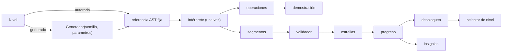
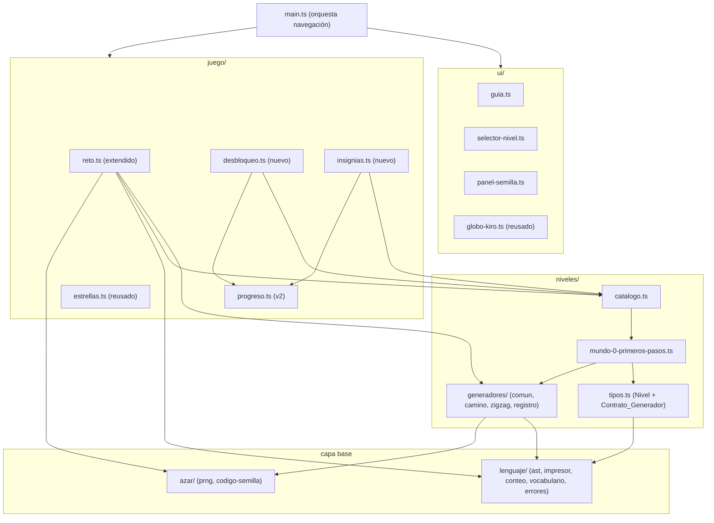

# Design Document

**KiroLogo · Spec 01 · Mundo 0 · Primeros pasos**

## Overview

### 1. Visión general y decisiones

#### 1.1 Qué construye esta spec

La spec 00 dejó jugable un solo nivel autorado (`0.1`) con toda la cadena del lenguaje, el motor, el
validador, el azar, las estrellas, el progreso y la interfaz mínima. Esta spec convierte esa rebanada
vertical en el **mundo 0 completo**, sin reescribir los cimientos:

- Añade `0.2` y `0.4` autorados y los **dos primeros generadores** (`camino` para `0.3`, `zigzag` para
  `0.5`), que fijan el patrón que reusarán las siete specs siguientes.
- Extiende `resolverReto` para la ruta **generada**, ya prevista por la unión discriminada de
  `OrigenNivel`.
- Sube el **progreso a la versión 2**, con migración desde la v1, y guarda por nivel las tres
  estrellas, el mejor conteo y la última semilla.
- Añade el **desbloqueo** de niveles y mundos, y las **insignias** (solo _Secuencia_), ambos derivados
  del progreso, sin estado propio.
- Añade tres piezas de interfaz —**guía de primeros pasos**, **selector de nivel** y **panel de
  semilla**— y hace que `main.ts` orqueste la navegación entre los cinco niveles.

El pipeline de un intento no cambia respecto de la spec 00; lo que cambia es de dónde nace el programa
de referencia (autorado o generado) y que hay cinco niveles navegables en vez de uno.



*Satisface: Requisitos 1, 5.*

#### 1.2 Qué se reusa sin tocar

Estos módulos de la spec 00 se consumen tal cual, y ninguna tarea de esta spec los modifica:

`lenguaje/` entero (lexer, parser, AST, intérprete, conteo, impresor, vocabulario), `azar/prng.ts` y
`azar/codigo-semilla.ts`, `motor/` entero (tortuga, lienzo, personajes, animador, segmentos, encuadre,
validador), `juego/estrellas.ts` y `juego/abstraccion.ts`.

Dos módulos existentes **se extienden** en puntos ya diseñados para crecer:

- `juego/reto.ts` — hoy resuelve solo autorados; se añade la rama generada. La firma pública
  `resolverReto(idNivel, semilla)` y el tipo `Reto` no cambian de forma incompatible.
- `juego/progreso.ts` — sube a v2 con migración. La interfaz `Progreso` gana `mejorConteoDe` y el
  registro por nivel gana `mejorConteo`.

Y `niveles/mundo-0-primeros-pasos.ts` pasa de un nivel a cinco; `niveles/catalogo.ts` no cambia (ya
compone `[...MUNDO_0]`).

*Satisface: Requisitos 5.6, 6, 13.1.*

#### 1.3 Módulos nuevos y su ubicación

Solo se crean rutas ya declaradas en `estructura.md`:

| Ruta nueva | Responsabilidad | Capa |
|---|---|---|
| `niveles/generadores/tipos.ts` o en `niveles/tipos.ts` | El `Contrato_Generador` y sus tipos de entrada/resultado | niveles |
| `niveles/generadores/camino.ts` (+ test) | Generador del `0.3` | niveles |
| `niveles/generadores/zigzag.ts` (+ test) | Generador del `0.5` | niveles |
| `niveles/generadores/registro.ts` (+ test) | `idGenerador` → función generadora | niveles |
| `niveles/generadores/comun.ts` (+ test) | Utilidades compartidas: lazo de reintento, encuadre, construcción de AST | niveles |
| `juego/desbloqueo.ts` (+ test) | Disponibilidad de niveles y mundos desde el Progreso | juego |
| `juego/insignias.ts` (+ test) | Otorgamiento de la insignia _Secuencia_ | juego |
| `ui/guia.ts` (+ test) | La primera experiencia del `0.1` | ui |
| `ui/selector-nivel.ts` (+ test) | Navegación entre niveles | ui |
| `ui/panel-semilla.ts` (+ test) | Código de semilla visible y compartible | ui |

**Nota sobre `comun.ts`:** `estructura.md` lista `niveles/generadores/` como «un archivo por
arquetipo». El archivo `comun.ts` no es un arquetipo sino la utilidad que los arquetipos comparten;
se justifica porque el lazo de reintento y la verificación de encuadre son idénticos en los siete
generadores futuros y el prompt pide explícitamente «fijar el patrón». La verificación de encuadre
vive en `motor/encuadre.ts`, pero `niveles/` no puede importar de `motor/`; por eso `comun.ts`
reimplementa el criterio de caja envolvente con las mismas dos constantes (400 y 200), y una prueba
ancla esas constantes contra `motor/encuadre.ts` para que no se separen (sección 4.4).

*Satisface: Requisitos 2, 3, 4, 7, 8, 9, 10, 12, 13.4.*

#### 1.4 Las cinco decisiones cerradas, concretadas

Las decisiones G1–G5 de requisitos se bajan a detalle en el diseño:

| # | Concreción en el diseño |
|---|---|
| G1 | El `Contrato_Generador` es `(entrada: EntradaGenerador) => ResultadoGeneracion`, unión discriminada por `exito`. El lazo de reintento vive en `comun.ts` y cada arquetipo solo aporta su función de candidato. Sección 4. |
| G2 | Rangos y ángulos verificados: camino `largo ∈ {80,100,120,140,160}`, `tramos ∈ [3,5]`, giros 90°; zigzag `largo ∈ {60,80,100,120}`, `tramos ∈ [4,8]`, giros **90°** (no 45°: ese ángulo es degenerado, ver §4.6). Se actualiza `niveles-y-progresion`. Secciones 4.5 y 4.6. |
| G3 | El `0.4` ofrece las tres estrellas; su referencia mínima (`AV 100 GD 90` ×4, conteo 8) gana economía. Sin caso especial en `estrellas.ts`. Sección 3.4. |
| G4 | El `Panel_Semilla` es una franja fija junto a los controles, texto de solo lectura, nunca sobre los lienzos. Sección 6.3. |
| G5 | Formato v2 con migración; `mejorConteo` por nivel; `mejorConteoDe(idNivel)` nuevo. Sección 5. |

#### 1.5 Restricciones heredadas que el diseño respeta

- **Dirección de dependencias** de `estructura.md`, con las mismas aristas prohibidas de la spec 00.
  Los generadores viven en `niveles/` y **solo** importan de `lenguaje/` y `azar/`.
- **Nada de `Math.random`.** Todo el azar de los generadores sale de `crearPrng(semilla)`.
- **Ningún presupuesto escrito a mano** en `niveles/`. El `presupuestoEstrella` se calcula en `reto.ts`.
- **Los generadores producen AST**, nunca texto ni imágenes. El impresor los pasa a texto solo para
  las pistas de esqueleto.
- **Fuentes únicas de verdad** intactas: `vocabulario.ts`, `conteo.ts`, `errores.ts`.
- **`Prng` lanza** ante argumentos inválidos (spec 00). Los generadores lo llaman siempre con rangos
  válidos, y una prueba lo confirma sobre 200 semillas; no se atrapan sus excepciones en caliente.

*Satisface: Requisitos 13.2, 13.3, 13.4, 13.5.*

## Architecture

### 2. Estructura y dependencias



Aristas nuevas y su justificación:

- `niveles/generadores/*` → `lenguaje/` y `azar/`. Igual que el resto de `niveles/`. **Prohibido** que
  toquen `motor/`, `juego/` o `ui/`; una prueba de dirección de dependencias (heredada de la spec 00)
  lo verifica leyendo los `import`.
- `reto.ts` → `niveles/generadores/registro.ts`. `juego/` puede importar de `niveles/`.
- `desbloqueo.ts` e `insignias.ts` → `catalogo.ts` y `progreso.ts`. Ambos leen el progreso y el
  catálogo; no persisten nada.

*Satisface: Requisitos 13.4.*

### 3. Los cinco niveles como datos

#### 3.1 Extensión de `niveles/tipos.ts`

`Nivel` no cambia. Se **añade** el contrato del generador (sección 4.1). La variante `generado` de
`OrigenNivel` ya existe:

```ts
| { readonly tipo: 'generado'; readonly idGenerador: string;
    readonly parametros: Readonly<Record<string, number>>; }
```

Los `parametros` transportan los rangos del nivel al generador, para que el rango viva en el dato del
nivel y no incrustado en el código del generador. Convención de claves para esta spec:

- Camino: `{ tramosMin, tramosMax, largoMin, largoMax }`.
- Zigzag: `{ tramosMin, tramosMax, largoMin, largoMax }` (giros de 90° alternados; ver §4.6).

#### 3.2 Tabla de niveles

| id | título | origen | referencia / generador | presupuesto (calculado) | normalización |
|---|---|---|---|---|---|
| `0.1` | Un paso al frente | autorado | `AV 100` | 1 | traslación y rotación libres |
| `0.2` | La primera esquina | autorado | `AV 100 GD 90 AV 100` | 3 | libres |
| `0.3` | Un camino | generado | `camino`, tramos 3–5, largo 80–160 | conteo de la referencia | libres |
| `0.4` | Cuatro paredes | autorado | `AV 100 GD 90` ×4 | 8 | libres |
| `0.5` | Zigzag | generado | `zigzag`, tramos 4–8, largo 60–120 | conteo de la referencia | libres |

Todos con `concepto: 'secuencia'`, `abstraccion: []` y sus tres pistas (sección 6.4). Ningún número de
presupuesto se escribe: la columna es informativa; `reto.ts` la calcula.

#### 3.3 Referencias autoradas como AST

Igual que el `0.1` existente, `0.2` y `0.4` se arman **nodo por nodo**, sin pasar por lexer/parser, con
`invocacionComando` y `numeroLiteral` y sus `linea`/`columna` coherentes. Ejemplo del `0.2`:

```
AVANZA 100        → invocacionComando('AVANZA', [numeroLiteral 100])
GIRADERECHA 90    → invocacionComando('GIRADERECHA', [numeroLiteral 90])
AVANZA 100        → invocacionComando('AVANZA', [numeroLiteral 100])
```

#### 3.4 El nivel 0.4 y la estrella de economía (G3)

El `0.4` es autorado con la forma mínima posible en el vocabulario del mundo 0: ocho instrucciones
(`AV 100 GD 90` cuatro veces). Su `presupuestoEstrella` es 8, exactamente lo que cuesta la solución
esperada. Por tanto:

- La estrella de economía **se ofrece** y se gana resolviéndolo con esas ocho instrucciones. No hay
  caso especial en `estrellas.ts`.
- La fricción intencional es que ocho instrucciones se sienten muchas; esa incomodidad es la que hace
  que `REPITE` se descubra como alivio en el mundo 1. La pista de esqueleto del `0.4` insinúa que
  «más adelante habrá una forma de no repetirte», sin adelantar el vocabulario.

*Satisface: Requisitos 1, 3.3, 4.3, 5.4.*

### 4. Los generadores y su contrato

#### 4.1 El `Contrato_Generador` (G1)

En `niveles/tipos.ts` (tipos) y `niveles/generadores/comun.ts` (lazo):

```ts
import type { Programa } from '../lenguaje/ast.js';
import type { ErrorKiroLogo } from '../lenguaje/errores.js';

export interface EntradaGenerador {
  readonly semilla: number;                              // inicial, dominio de semillas
  readonly parametros: Readonly<Record<string, number>>; // los del nivel
  readonly intentosMaximos: number;                      // p. ej. 200
}

export type ResultadoGeneracion =
  | { readonly exito: true;  readonly referencia: Programa;
      readonly semillaEfectiva: number; readonly descartes: number }
  | { readonly exito: false; readonly error: ErrorKiroLogo; readonly intentos: number };

export type Generador = (entrada: EntradaGenerador) => ResultadoGeneracion;
```

Decisiones de la firma, pensando en las siete reutilizaciones:

- **Función pura.** No lee azar global; el PRNG se crea dentro con la semilla del intento. Misma
  entrada → mismo resultado (requisito 2.7), verificable sin dobles.
- **Unión discriminada por `exito`.** El consumidor (`reto.ts`) trata los dos casos; TypeScript obliga.
- **El descarte es interno.** Un candidato degenerado no aparece en la salida: solo incrementa
  `descartes` y dispara el reintento. La salida solo expone el candidato aceptable o el fallo global.
- **`semillaEfectiva` viaja en el éxito.** Es la semilla que produjo el candidato aceptable; de ella
  sale el `Codigo_Semilla` (requisito 5.2).
- **`descartes` e `intentos` se exponen** para observabilidad y para las pruebas de las 200 semillas.

#### 4.2 El lazo de reintento, compartido

En `comun.ts`, para que los siete generadores lo reusen:

```ts
export interface CandidatoDe {
  /** Construye un candidato AST a partir del PRNG del intento. */
  (prng: Prng): Programa;
}

export function generarConReintento(
  entrada: EntradaGenerador,
  candidatoDe: CandidatoDe,
): ResultadoGeneracion {
  let semilla = normalizarSemilla(entrada.semilla);
  for (let intento = 0; intento < entrada.intentosMaximos; intento++) {
    const prng = crearPrng(semilla);
    const referencia = candidatoDe(prng);
    if (esAceptable(referencia)) {
      return { exito: true, referencia, semillaEfectiva: semilla, descartes: intento };
    }
    semilla = siguienteSemilla(semilla); // (semilla + 1) con envoltura al dominio
  }
  return { exito: false, error: crearError('generadorSinCandidato', {}), intentos: entrada.intentosMaximos };
}
```

`esAceptable(referencia)` ejecuta el candidato mentalmente sin el motor: como `niveles/` no puede
importar `motor/`, `comun.ts` **calcula la caja envolvente** a partir de las operaciones de la tortuga
que él mismo simula sobre el AST (una simulación pura de posición y rumbo, sin dibujar), y aplica el
criterio de encuadre y degeneración. Alternativa considerada y descartada: mover `encuadre.ts` a una
capa que `niveles/` pudiera importar rompería la regla «niveles solo importa lenguaje y azar». La
simulación pura es pequeña (avanza, retrocede, gira) y determinista.

#### 4.3 Simulación pura de la tortuga en `comun.ts`

Para decidir la aceptación sin `motor/`, `comun.ts` recorre el AST del candidato acumulando la caja
envolvente de los tramos con lápiz abajo (en el mundo 0 el lápiz siempre está abajo):

```ts
interface Caja { izq: number; der: number; ab: number; arr: number; }

function cajaDeReferencia(programa: Programa): Caja | null;   // null si no hay tramos
```

Como todos los tramos del mundo 0 nacen de `AVANZA`/`RETROCEDE` con giros de `GIRADERECHA`/
`GIRAIZQUIERDA`, la simulación es trigonometría elemental partiendo de `(0,0)` rumbo 90°. Esta
simulación **no** sustituye al intérprete: el reto real se ejecuta después con `interprete.ts`
(sección 4.7); esto es solo el filtro de aceptación del generador.

#### 4.4 Constantes de encuadre ancladas

`comun.ts` define `LIMITE_LIENZO = 400` y `DIMENSION_MINIMA = 200`, los mismos de `motor/encuadre.ts`.
Una prueba importa ambas constantes desde `motor/encuadre.ts` (que exporta o revela sus valores en su
prueba) y las compara, para que si un día cambian en el motor, la prueba del generador falle y avise.
Como `niveles/` no importa `motor/` en producción, la comparación vive en el archivo de prueba, no en
el de producción.

#### 4.5 Generador de camino (`camino.ts`) — nivel 0.3

```ts
export const generarCamino: Generador = (entrada) =>
  generarConReintento(entrada, (prng) => candidatoCamino(prng, entrada.parametros));

function candidatoCamino(prng: Prng, p: Record<string, number>): Programa {
  const tramos = prng.entero(p.tramosMin, p.tramosMax);         // 3..5
  const instrucciones: Instruccion[] = [];
  for (let i = 0; i < tramos; i++) {
    const largo = prng.multiplo(p.largoMin, p.largoMax, 20);     // 80..160, paso 20
    instrucciones.push(avanza(largo));
    if (i < tramos - 1) {
      const sentido = prng.elegir(['GIRADERECHA', 'GIRAIZQUIERDA']);
      instrucciones.push(giro(sentido, 90));
    }
  }
  return { tipo: 'programa', instrucciones };
}
```

**Rangos verificados (G2).** Los del steering (largo 40–120) producían ~98 % de descartes contra la
regla de caja ≥ 200. Medido sobre 4000 semillas: largo 80–160, tramos 3–5, da ~16 % de candidatos
aceptables de primera, y el lazo de reintento acepta en ~6 intentos de media (peor caso ~41 sobre
4000 bases). Con `intentosMaximos = 200` el fallo global es imposible en la práctica y la figura se ve
como un recorrido, no como un garabato. Se actualiza `niveles-y-progresion` con estos rangos.

#### 4.6 Generador de zigzag (`zigzag.ts`) — nivel 0.5

```ts
function candidatoZigzag(prng: Prng, p: Record<string, number>): Programa {
  const tramos = prng.entero(p.tramosMin, p.tramosMax);          // 4..8
  const instrucciones: Instruccion[] = [];
  let sentido = prng.elegir(['GIRADERECHA', 'GIRAIZQUIERDA']);
  for (let i = 0; i < tramos; i++) {
    instrucciones.push(avanza(prng.multiplo(p.largoMin, p.largoMax, 20))); // 60..120
    if (i < tramos - 1) {
      instrucciones.push(giro(sentido, 90)); // ver la nota sobre el ángulo
      sentido = sentido === 'GIRADERECHA' ? 'GIRAIZQUIERDA' : 'GIRADERECHA';
    }
  }
  return { tipo: 'programa', instrucciones };
}
```

**Ángulo verificado (G2) — corrección sobre el steering.** El steering decía «giros de 45°
alternados». Medido contra figuras reales, resulta **inviable**: la tortuga parte mirando hacia
arriba, y un zigzag de 45° alternados se dibuja como un **trazo fino en diagonal**. Su caja envolvente
alineada a los ejes es casi una línea (p. ej. 113 × 353 para la primera semilla), de modo que es
degenerado por construcción —0 % de candidatos aceptables sobre miles de semillas, el lazo nunca
encuentra uno—. Es exactamente el caso que `validacion-geometrica` llama «injusto por construcción».

Se intentó salvar el 45° midiendo una caja envolvente **rotada** (ya que el mundo 0 valida con
rotación libre), pero esa vía es incorrecta: minimizar el área de la caja encuentra la envolvente
diagonal de cualquier figura cuyos vértices caen cerca de una recta, y disculparía garabatos. El
criterio honesto de no degeneración es la caja **tal como se dibuja**, que es la de `motor/encuadre.ts`.

Resolución: el zigzag del nivel 0.5 usa **giros de 90° alternados** (una escalera). Alterna igual —
derecha, izquierda, derecha…, que es la lección: no se puede repetir el mismo giro—, pero llena el
plano en los dos ejes. Con largo 60–120 y 4–8 tramos: ~60 % aceptables de primera, lazo en ~1.7
intentos de media (peor ~12 sobre 4000 bases). `niveles-y-progresion` se actualiza para registrar que
el ángulo del 0.5 es 90°, no 45°, con esta justificación.

#### 4.7 De candidato a reto: `reto.ts` extendido

La rama generada se añade a `resolverReto` sin cambiar la firma. Donde hoy hay:

```ts
if (nivel.origen.tipo !== 'autorado') {
  return { exito: false, error: crearError('referenciaNoEjecutable', {}) };
}
```

pasa a distinguir las dos variantes:

```ts
let referencia: Programa;
let semillaEfectiva: number;
if (nivel.origen.tipo === 'autorado') {
  referencia = nivel.origen.referencia;
  semillaEfectiva = nivel.origen.semilla;              // como en la spec 00
} else {
  const generador = buscarGenerador(nivel.origen.idGenerador);
  if (!generador) return { exito: false, error: crearError('generadorDesconocido', {}) };
  const r = generador({ semilla, parametros: nivel.origen.parametros, intentosMaximos: 200 });
  if (!r.exito) return { exito: false, error: r.error };
  referencia = r.referencia;
  semillaEfectiva = r.semillaEfectiva;                  // ← la que produjo el candidato
}
// … resto idéntico: ejecutar UNA vez, extraer segmentos, contar, codigoSemilla(semillaEfectiva)
```

El resto de `resolverReto` (ejecución única, extracción de segmentos, conteo del presupuesto, código de
semilla) queda igual, así que la sincronía demostración/validación y el cálculo del presupuesto se
heredan sin cambios.

*Satisface: Requisitos 2, 3, 4, 5.*

### 5. Progreso versión 2 y migración (G5)

#### 5.1 Forma nueva del contenido

```ts
export const CLAVE = 'kirologo.progreso.v2';   // clave nueva; la v1 se lee para migrar
export const VERSION_FORMATO = 2;

interface RegistroNivel {
  estrellas: EstrellasGuardadas;               // {precision, economia, abstraccion}
  mejorConteo: number | null;                  // null hasta el primer aprobado
  ultimaSemilla: number;
}
interface Contenido {
  version: number;
  niveles: Record<string, RegistroNivel>;
  ultimoReto: RetoEnCurso | null;
  guiaVista: boolean;                          // requisito 10.5
}
```

`Progreso` gana dos métodos y conserva los demás:

```ts
export interface Progreso {
  estrellasDe(idNivel: string): EstrellasGuardadas | null;
  mejorConteoDe(idNivel: string): number | null;          // nuevo
  ultimoReto(): RetoEnCurso | null;
  guiaCompletada(): boolean;                               // nuevo (requisito 10.5)
  marcarGuiaCompletada(): void;                            // nuevo
  guardar(idNivel: string, semilla: number, calificacion: Calificacion, conteoJugador: number): void;
}
```

`guardar` gana el parámetro `conteoJugador`. Regla de `mejorConteo`: solo se actualiza cuando la
precisión se otorgó (un conteo bajo sin figura correcta no cuenta) y el nuevo conteo es menor que el
guardado o el guardado es `null`.

#### 5.2 Migración v1 → v2

En la carga, si `localStorage[CLAVE_V2]` no existe pero sí `localStorage['kirologo.progreso.v1']`:

1. Interpretar el crudo v1 con el lector tolerante existente.
2. Por cada registro v1 `{ semilla, estrellas }`, crear un registro v2
   `{ estrellas, mejorConteo: null, ultimaSemilla: semilla }`.
3. Conservar `ultimoReto` v1 tal cual; `guiaVista` arranca en `false` salvo que haya al menos un nivel
   con precisión (quien ya jugó el `0.1` no necesita la guía otra vez).
4. Escribir el contenido v2 bajo la clave nueva en el primer guardado exitoso. La clave v1 se deja
   intacta (no se borra), por si el jugador abre una versión anterior; ocupa poco y evita pérdida.

Un contenido de versión desconocida (ni 1 ni 2) degrada a progreso vacío, conservando el crudo hasta el
primer guardado, como en la spec 00.

#### 5.3 Por qué migrar ahora

El prompt lo pide: «una migración temprana es más barata que una tardía». Con siete mundos por venir,
fijar en la spec 01 la forma `{ estrellas, mejorConteo, ultimaSemilla }` y el mecanismo de migración por
versión evita una conversión masiva más adelante. Las specs siguientes solo añadirán niveles al mismo
mapa, sin cambiar la forma.

*Satisface: Requisitos 6.*

### 6. Juego: desbloqueo, insignias y las piezas de interfaz

#### 6.1 `desbloqueo.ts`

Puro y derivado del progreso. Sin estado propio:

```ts
export type EstadoNivel = 'bloqueado' | 'desbloqueado' | 'aprobado' | 'tresEstrellas';

export function estadoDeNivel(idNivel: string, progreso: Progreso): EstadoNivel;
export function nivelDesbloqueado(idNivel: string, progreso: Progreso): boolean;
export function mundoDesbloqueado(mundo: number, progreso: Progreso): boolean;
```

Reglas (requisito 7): el primer nivel del mundo 0 siempre desbloqueado; un nivel se desbloquea cuando el
anterior en el orden del catálogo está aprobado (precisión guardada); un mundo se desbloquea cuando
todos los niveles del anterior están aprobados. Como el catálogo está ordenado, «el anterior» es el
índice previo en la lista del mundo.

#### 6.2 `insignias.ts`

```ts
export type IdInsignia = 'secuencia';   // única en esta spec
export function insigniaSecuenciaOtorgada(progreso: Progreso): boolean;
export function insigniasDelMundo(mundo: number, progreso: Progreso): readonly IdInsignia[];
```

`insigniaSecuenciaOtorgada` es verdadero solo si los cinco niveles del mundo 0 tienen las tres
estrellas. Derivado del progreso, sin persistencia propia (requisito 8.4).

#### 6.3 `panel-semilla.ts` (G4)

Franja fija junto a los controles, nunca sobre los lienzos:

- Muestra el `codigoSemilla` del reto como `<output>` de solo lectura seleccionable, con nombre
  accesible en español.
- Acción **«Otro reto»**: pide a `main.ts` resolver el mismo nivel con una semilla nueva (tomada del
  PRNG sembrado con la semilla efectiva actual, o del reloj como entpropía inicial documentada). Solo
  visible en niveles generados.
- Acción **«Reproducir código»**: campo de entrada + botón; decodifica con `codigo-semilla.ts` y pide a
  `main.ts` resolver con esa semilla. Un código inválido va al globo con el error del catálogo, sin
  tocar el reto (requisito 9.4).
- En niveles autorados: muestra el código de la semilla fija, marcado por texto como no rejugable, sin
  «Otro reto».

Callbacks hacia `main.ts` (el panel no conoce el intérprete ni el reto): `pedirOtroReto()`,
`reproducirCodigo(codigo: string)`.

#### 6.4 Pistas y su relleno con parámetros reales (requisito 11)

Las pistas viven en el `Nivel` (`pistas: [conceptual, matemática, esqueleto]`), como ya hace el `0.1`.
Para los niveles **generados**, las pistas del dato son **plantillas** con marcadores, y `main.ts` las
rellena con los parámetros del reto en curso antes de pasárselas al globo:

- Marcadores: `{tramos}`, `{giro}` (p. ej. «90 grados a un lado u otro» en el camino, «90 grados alternando» en el zigzag), `{cuadros}`.
- El número de tramos se **lee del programa de referencia del reto** (contando los `AVANZA`), no del
  rango del nivel, para que la pista diga cinco cuando el reto tiene cinco y no un número del rango
  (requisito 11.4). Una función `parametrosVisiblesDelReto(reto)` extrae `{ tramos, giro }` recorriendo
  el AST de la referencia.
- La pista de **esqueleto** de un generado se construye con `impresor.ts` sobre una **forma parcial**
  (el primer tramo y el primer giro, p. ej. `AVANZA 100\nGIRADERECHA 90`), nunca sobre el programa
  completo (requisito 11.5).

El `GloboKiro` ya recibe las tres pistas en `presentarReto(IdentidadReto)`; se le pasan **ya
rellenadas**. No cambia el globo: cambia lo que `main.ts` le entrega.

#### 6.5 `guia.ts` — la primera experiencia (requisito 10)

La pieza más delicada. Diseño:

- Una **secuencia corta de pasos**, cada uno un texto breve que se publica por el `GloboKiro` (único
  canal de texto) y por tanto por la región `aria-live`.
- Pasos (borrador, se afinan en implementación, ninguno con jerga sin explicar):
  1. «Hola. Yo soy Kiro. La tortuga es esa figurita del centro: dibuja por donde camina.»
  2. «Ya dibujé la figura que hay que copiar (la línea gris). Tu tortuga tiene que hacer la misma.»
  3. «Se le dan órdenes escribiendo. Prueba esta: escribe `AVANZA 100` y pulsa Ejecutar.»
- **Avanza por acción del jugador**, no por temporizador: cada paso espera a que el jugador haga algo
  (leer y pulsar «siguiente» en el globo, o ejecutar). No bloquea el editor ni los controles
  (requisito 10.3).
- Al **primer acierto**, la guía cede a la celebración normal y se marca `guiaVista` en el progreso; no
  se vuelve a mostrar (requisitos 10.4, 10.5).
- Solo en el `0.1` (requisito 10.7). `main.ts` crea la guía únicamente cuando el nivel es `0.1` y
  `progreso.guiaCompletada()` es falso.

Interfaz:

```ts
export interface Guia {
  readonly activa: boolean;
  iniciar(): void;                 // publica el primer paso
  avanzar(): void;                 // pasa al siguiente; al final, se desactiva
  alPrimerAcierto(): void;         // cede a la celebración y marca completada
}
export function crearGuia(deps: { globo: GloboKiro; alCompletar: () => void }): Guia;
```

#### 6.6 `selector-nivel.ts` (requisito 12)

Presenta los cinco niveles en orden, cada uno con su `EstadoNivel` comunicado por texto y forma además
de color (p. ej. candado + «bloqueado», marca + «★★★»). Al elegir un nivel desbloqueado, invoca el
callback `alElegirNivel(idNivel)` de `main.ts`. Refleja la insignia _Secuencia_ por texto cuando
`insigniaSecuenciaOtorgada` es verdadero. Se integra en el orden de foco sin atraparlo.

*Satisface: Requisitos 7, 8, 9, 10, 11, 12.*

### 7. Orquestación en `main.ts`

`main.ts` deja de resolver un único reto fijo y pasa a manejar la **navegación entre niveles**:

- Al arrancar, resuelve el `ultimoReto` guardado si existe y está desbloqueado; si no, el primer nivel
  desbloqueado sin aprobar, o el `0.1`.
- Mantiene el estado del intento como hoy (`EstadoAplicacion`), más el `idNivel` en curso.
- Nueva función `cambiarANivel(idNivel, semilla?)`: verifica desbloqueo (si no, avisa por el globo y no
  entra), resuelve el reto, redibuja la referencia, reinicia el intento, actualiza panel de semilla,
  pistas rellenadas y selector.
- Tras un intento aprobado, guarda en el progreso con `conteoJugador`, recalcula desbloqueo e
  insignias, y si se desbloqueó un nivel nuevo ofrece avanzar (sin forzar).
- La guía solo se instancia y arranca en el `0.1` con `guiaCompletada() === false`.

El flujo de un intento (analizar → intérprete → segmentos → validar una vez → estrellas → guardar →
comentar) es el de la spec 00, sin cambios.

*Satisface: Requisitos 5, 7, 8, 10, 12, 13.7.*

## Components and Interfaces

### 8. Mensajes nuevos del catálogo de errores

Todos en `src/lenguaje/errores.ts`, en español, con la forma del catálogo. Nuevos `IdError`:

| id | categoría | texto (aprox.) |
|---|---|---|
| `generadorSinCandidato` | programación | El generador no encontró una figura válida tras el máximo de intentos. |
| `generadorDesconocido` | programación | No hay un generador registrado con ese identificador. |

No hay mensajes **nuevos visibles al jugador**: los dos anteriores son de programación (un nivel bien
declarado nunca los alcanza). Los mensajes del jugador para el panel de semilla ya existen en el
catálogo (`codigoSemillaLongitud`, `codigoSemillaSimbolo`, `codigoSemillaFueraDeDominio`).

### 9. Pruebas y su cobertura de los criterios

| Módulo | Pruebas clave | Requisito |
|---|---|---|
| `generadores/comun` | lazo determinista; reintento con semilla+1; constantes ancladas a `encuadre.ts` | 2.4, 2.7, 4.4 |
| `generadores/camino` | 200 semillas: éxito, encuadrado, no degenerado, 3 estrellas; forma mínima; solo nodos del mundo 0 | 3.5, 3.6, 2.5 |
| `generadores/zigzag` | 200 semillas: ídem; alternancia de sentido | 4.5, 4.6, 2.5 |
| `generadores/registro` | idGenerador conocido → función; desconocido → error | 2.8 |
| `reto` | rama generada: semilla efectiva, presupuesto calculado, ejecución única; autorado sin cambios; idGenerador desconocido → error | 5 |
| `progreso` | v2 guarda estrellas/mejorConteo/semilla; migración v1→v2 conserva estrellas; mejorConteo solo baja con precisión; guiaVista | 6 |
| `desbloqueo` | 0.1 siempre abierto; cadena de desbloqueo; mundo tras aprobar todos | 7 |
| `insignias` | Secuencia solo con 15 estrellas; falta una → sin otorgar; derivado del progreso | 8 |
| `panel-semilla` | otro reto solo en generados; código inválido → error sin cambiar reto; nombre accesible | 9 |
| `guia` | secuencia de pasos; solo 0.1; se marca completada; no vuelve a salir; publica en aria-live | 10 |
| `selector-nivel` | estados por texto y forma; elegir desbloqueado navega; refleja insignia | 12 |
| pistas (en `main` o util) | número de tramos de la pista = tramos de la referencia sobre muestra de semillas | 11.4, 11.6 |
| dirección de deps (heredada) | `niveles/` no importa `motor/`/`juego/`/`ui/`; `juego/` no importa `ui/` | 13.4 |

Las pruebas de 200 semillas de los generadores ejecutan la referencia con el **intérprete real** y la
validan con el **validador real** (importados desde la prueba, que sí puede cruzar capas), cerrando el
lazo entre «el generador dice que es aceptable» y «el validador la aprueba con tres estrellas».

*Satisface: Requisitos 2, 3, 4, 5, 6, 7, 8, 9, 10, 11, 12, 13.*

### 10. Actualización de steering

Al cerrar la implementación, se actualiza `niveles-y-progresion` con los rangos y ángulos verificados
(G2): camino largo 80–160 (era 40–120) con giros de 90°; zigzag largo 60–120 (era 40–80) y giros de
**90°** (era 45°). El cambio del ángulo del zigzag es el más importante: 45° alternados producen una
figura degenerada (un trazo fino en diagonal), inviable para el generador; 90° alternados dan una
escalera que llena el plano. El cambio se justifica como resultado de medir figuras reales contra la
regla de caja ≥ 200 de `validacion-geometrica`. El resto del steering no cambia.

*Satisface: Requisitos 3.2, 4.2.*
